# LAPORAN MAGANG
# Pengembangan Sistem Informasi Manajemen Operasional ISP
# PT. Telnet Fiber Banda Aceh

**Dibuat oleh:** [Nama Mahasiswa]  
**NIM:** [Nomor Induk Mahasiswa]  
**Program Studi:** [Program Studi]  
**Universitas:** [Nama Universitas]  
**Periode Magang:** [Tanggal Mulai] - [Tanggal Selesai]  
**Pembimbing Lapangan:** [Nama Pembimbing]  
**Versi Dokumen:** 2.0  
**Tanggal:** Januari 2026  

---

## LEMBAR PENGESAHAN

| | |
|---|---|
| **Nama Mahasiswa** | [Nama Lengkap] |
| **NIM** | [NIM] |
| **Program Studi** | [Prodi] |
| **Lokasi Magang** | PT. Telnet Fiber Banda Aceh |
| **Periode Magang** | [Tanggal Mulai] - [Tanggal Selesai] |

**Telah disetujui dan disahkan oleh:**

| Pembimbing Lapangan | Pembimbing Akademik |
|:-------------------:|:-------------------:|
| | |
| __________________ | __________________ |
| [Nama Pembimbing Lapangan] | [Nama Pembimbing Akademik] |
| Tanggal: __________ | Tanggal: __________ |

---

## KATA PENGANTAR

Puji syukur penulis panjatkan kehadirat Allah SWT atas limpahan rahmat dan karunia-Nya sehingga penulis dapat menyelesaikan laporan magang ini dengan baik.

Laporan ini disusun sebagai salah satu syarat dalam menyelesaikan program magang di PT. Telnet Fiber Banda Aceh. Selama melaksanakan magang, penulis mendapatkan banyak pengalaman berharga dalam pengembangan sistem informasi berbasis web menggunakan teknologi modern.

Penulis mengucapkan terima kasih kepada:
1. [Nama Pembimbing Lapangan] selaku Pembimbing Lapangan yang telah memberikan bimbingan dan arahan
2. [Nama Pembimbing Akademik] selaku Pembimbing Akademik
3. Seluruh tim PT. Telnet Fiber Banda Aceh yang telah menerima dan membimbing penulis selama magang
4. Keluarga dan teman-teman yang selalu memberikan dukungan

Penulis menyadari bahwa laporan ini masih jauh dari sempurna. Oleh karena itu, kritik dan saran yang membangun sangat penulis harapkan untuk perbaikan di masa mendatang.

Banda Aceh, Januari 2026

**Penulis**

---

## DAFTAR ISI

1. [BAB 1 - PENDAHULUAN](#bab-1---pendahuluan)
   - [1.1 Latar Belakang](#11-latar-belakang)
   - [1.2 Rumusan Masalah](#12-rumusan-masalah)
   - [1.3 Tujuan](#13-tujuan)
   - [1.4 Manfaat](#14-manfaat)
   - [1.5 Batasan Masalah](#15-batasan-masalah)
   - [1.6 Metodologi Pengembangan](#16-metodologi-pengembangan)
2. [BAB 2 - PROFIL PERUSAHAAN](#bab-2---profil-perusahaan)
   - [2.1 Gambaran Umum Perusahaan](#21-gambaran-umum-perusahaan)
   - [2.2 Visi dan Misi](#22-visi-dan-misi)
   - [2.3 Struktur Organisasi](#23-struktur-organisasi)
3. [BAB 3 - TEKNOLOGI YANG DIGUNAKAN](#bab-3---teknologi-yang-digunakan)
   - [3.1 Arsitektur Sistem](#31-arsitektur-sistem)
   - [3.2 Frontend Technologies](#32-frontend-technologies)
   - [3.3 Backend Technologies](#33-backend-technologies)
   - [3.4 Development Tools](#34-development-tools)
4. [BAB 4 - ANALISIS DAN PERANCANGAN](#bab-4---analisis-dan-perancangan)
   - [4.1 Analisis Sistem Berjalan](#41-analisis-sistem-berjalan)
   - [4.2 Analisis Kebutuhan](#42-analisis-kebutuhan)
   - [4.3 Perancangan Sistem](#43-perancangan-sistem)
5. [BAB 5 - SCREENSHOT APLIKASI](#bab-5---screenshot-aplikasi)
6. [BAB 6 - DIAGRAM SISTEM](#bab-6---diagram-sistem)
   - [6.1 ERD](#61-erd)
   - [6.2 Use Case Diagram](#62-use-case-diagram)
   - [6.3 Activity Diagram](#63-activity-diagram)
   - [6.4 Sequence Diagram](#64-sequence-diagram)
   - [6.5 DFD](#65-dfd)
7. [BAB 7 - IMPLEMENTASI](#bab-7---implementasi)
8. [BAB 8 - PENGUJIAN](#bab-8---pengujian)
9. [BAB 9 - KESIMPULAN DAN SARAN](#bab-9---kesimpulan-dan-saran)
10. [LAMPIRAN - DOKUMENTASI API](#lampiran---dokumentasi-api)

---

# BAB 1 - PENDAHULUAN

## 1.1 Latar Belakang

PT. Telnet Fiber merupakan perusahaan penyedia layanan internet (ISP) yang beroperasi di wilayah Banda Aceh dan sekitarnya. Seiring dengan pertumbuhan jumlah pelanggan dan kompleksitas operasional, perusahaan membutuhkan sistem informasi yang terintegrasi untuk mengelola berbagai aspek bisnis seperti:

1. **Manajemen Inventori** - Pengelolaan peralatan jaringan, kabel fiber optic, dan perlengkapan instalasi
2. **Pemasangan Sambungan Baru (PSB)** - Proses pendaftaran pelanggan baru hingga aktivasi layanan
3. **Penanganan Gangguan** - Manajemen tiket gangguan dan penugasan teknisi
4. **Manajemen Aset** - Pencatatan dan tracking aset perusahaan
5. **Pelaporan** - Laporan operasional dan analytics untuk pengambilan keputusan

Sebelumnya, proses-proses tersebut dilakukan secara manual menggunakan spreadsheet dan dokumen terpisah, yang menyebabkan:
- Kesulitan dalam melacak status order dan gangguan secara real-time
- Risiko kesalahan data karena input manual berulang
- Tidak ada single source of truth untuk data operasional
- Sulit melakukan analisis performa dan trend

Berdasarkan permasalahan tersebut, dikembangkanlah **Sistem Informasi Manajemen Operasional ISP** yang terintegrasi dan berbasis web.

## 1.2 Rumusan Masalah

Berdasarkan latar belakang di atas, rumusan masalah dalam pengembangan sistem ini adalah:

1. Bagaimana merancang dan mengembangkan sistem informasi manajemen inventori yang efisien?
2. Bagaimana mengintegrasikan modul PSB (Pemasangan Sambungan Baru) dengan workflow yang jelas?
3. Bagaimana membangun sistem ticketing untuk penanganan gangguan pelanggan?
4. Bagaimana menyediakan dashboard dan laporan yang informatif untuk manajemen?
5. Bagaimana menerapkan keamanan sistem yang memadai dengan multi-role access control?

## 1.3 Tujuan

### 1.3.1 Tujuan Umum
Mengembangkan sistem informasi manajemen operasional ISP yang terintegrasi, efisien, dan user-friendly.

### 1.3.2 Tujuan Khusus
1. Membangun modul inventori untuk pengelolaan produk dan stok
2. Mengembangkan modul PSB untuk manajemen order pemasangan baru
3. Membuat sistem ticketing untuk penanganan gangguan
4. Menyediakan dashboard analitik dan laporan
5. Mengimplementasikan sistem autentikasi dan otorisasi berbasis role
6. Menerapkan best practices dalam pengembangan web modern

## 1.4 Manfaat

### 1.4.1 Manfaat bagi Perusahaan
1. **Efisiensi Operasional** - Otomasi proses yang sebelumnya manual
2. **Akurasi Data** - Mengurangi kesalahan input dan duplikasi data
3. **Visibilitas Real-time** - Monitoring status order dan gangguan secara langsung
4. **Pengambilan Keputusan** - Data analytics untuk strategic planning
5. **Skalabilitas** - Sistem yang dapat berkembang seiring pertumbuhan bisnis

### 1.4.2 Manfaat bagi Penulis
1. Pengalaman praktis dalam pengembangan aplikasi enterprise
2. Penerapan teori yang dipelajari di kampus ke dalam proyek nyata
3. Pemahaman mendalam tentang teknologi web modern
4. Pengalaman bekerja dalam tim dan berkomunikasi dengan stakeholder

## 1.5 Batasan Masalah

Untuk memfokuskan pengembangan, sistem ini dibatasi pada:

1. **Cakupan Fungsional:**
   - Modul Inventori (Produk, Stok, Supplier)
   - Modul PSB (Order, Distribusi, Aktivasi)
   - Modul Gangguan (Ticketing)
   - Modul Aset
   - Modul User Management
   - Dashboard dan Laporan

2. **Cakupan Teknis:**
   - Platform: Web Application (Responsive)
   - Frontend: React.js dengan TypeScript
   - Backend: Node.js dengan Express
   - Database: MongoDB
   - Deployment: VPS dengan Nginx

3. **Tidak Termasuk:**
   - Integrasi dengan sistem billing
   - Mobile native application
   - Integrasi SMS/WhatsApp notification
   - Payment gateway

## 1.6 Metodologi Pengembangan

Pengembangan sistem ini menggunakan metodologi **Agile Scrum** dengan alur sebagai berikut:


### Sprint Breakdown:

| Sprint | Durasi | Fokus Pengembangan |
|--------|--------|-------------------|
| Sprint 1 | 2 minggu | Setup project, Auth module, User management |
| Sprint 2 | 2 minggu | Modul Inventori (Products, Stock) |
| Sprint 3 | 2 minggu | Modul Supplier, Stock Movement |
| Sprint 4 | 2 minggu | Modul PSB (Order, Distribution) |
| Sprint 5 | 2 minggu | Modul PSB (Activation), Interruption |
| Sprint 6 | 2 minggu | Assets, Dashboard, Reports |
| Sprint 7 | 1 minggu | Testing, Bug fixes, Deployment |

---

# BAB 2 - PROFIL PERUSAHAAN

## 2.1 Gambaran Umum Perusahaan

| Aspek | Keterangan |
|-------|------------|
| **Nama Perusahaan** | PT. Telnet Fiber |
| **Bidang Usaha** | Internet Service Provider (ISP) |
| **Alamat** | Banda Aceh, Aceh |
| **Website** | [www.telnet.co.id] |
| **Layanan** | Internet Fiber Optic, Corporate Network |

PT. Telnet Fiber adalah perusahaan penyedia layanan internet berbasis fiber optic yang melayani pelanggan residensial dan korporat di wilayah Banda Aceh dan sekitarnya. Perusahaan berfokus pada penyediaan koneksi internet berkecepatan tinggi dengan kualitas layanan premium.

## 2.2 Visi dan Misi

### Visi
Menjadi penyedia layanan internet terdepan di Aceh dengan jaringan fiber optic yang handal dan layanan pelanggan yang prima.

### Misi
1. Menyediakan koneksi internet berkecepatan tinggi dengan harga terjangkau
2. Memberikan layanan pelanggan yang responsif dan profesional
3. Terus berinovasi dalam teknologi dan layanan
4. Berkontribusi pada digitalisasi masyarakat Aceh

## 2.3 Struktur Organisasi


### Deskripsi Role dalam Sistem:

| Role | Deskripsi | Akses Sistem |
|------|-----------|--------------|
| **Super Admin** | Administrator sistem dengan akses penuh | Semua modul, konfigurasi sistem |
| **Admin** | Mengelola data inventori dan aset | Inventori, Supplier, Aset |
| **CS (Customer Service)** | Menangani order PSB dan gangguan | PSB, Interruption |
| **Technician** | Teknisi lapangan | PSB (update status), Interruption (update) |
| **User** | Staff dengan akses terbatas | View only pada inventori |

---

# BAB 3 - TEKNOLOGI YANG DIGUNAKAN

Bab ini menjelaskan secara detail teknologi dan tools yang digunakan dalam pengembangan sistem.

## 3.1 Arsitektur Sistem

### 3.1.1 Diagram Arsitektur

```mermaid
graph TB
    subgraph "Client Layer"
        C1[🖥️ Desktop Browser]
        C2[📱 Mobile Browser]
        C3[📟 Tablet]
    end
    
    subgraph "Frontend Layer"
        F1[React 18 + TypeScript]
        F2[Vite Build Tool]
        F3[Tailwind CSS]
        F4[React Query]
    end
    
    subgraph "API Layer"
        A1[REST API]
        A2[JWT Authentication]
        A3[Rate Limiting]
    end
    
    subgraph "Backend Layer"
        B1[Node.js Runtime]
        B2[Express.js Framework]
        B3[Mongoose ODM]
    end
    
    subgraph "Database Layer"
        D1[(MongoDB Database)]
    end
    
    subgraph "Security Layer"
        S1[Helmet]
        S2[CORS]
        S3[Bcrypt]
    end
    
    C1 --> F1
    C2 --> F1
    C3 --> F1
    F1 --> A1
    A1 --> B1
    B1 --> D1
    S1 --> B1
```



### 3.1.2 Technology Stack Overview


## 3.2 Frontend Technologies

### 3.2.1 Core Technologies

| Teknologi | Versi | Fungsi | Alasan Pemilihan |
|-----------|-------|--------|------------------|
| **React** | 18.3.1 | UI Library | Virtual DOM, Component-based, Large ecosystem |
| **TypeScript** | 5.8.3 | Type Safety | Static typing, Better IDE support, Catch errors early |
| **Vite** | 5.4.19 | Build Tool | Fast HMR, ESM support, Optimized builds |
| **React Router** | 6.30.1 | Client Routing | Declarative routing, Nested routes |

#### React 18 Features yang Digunakan:
```typescript
// Concurrent Features
const [isPending, startTransition] = useTransition();

// Automatic Batching
const handleClick = () => {
  setCount(c => c + 1);  // Tidak trigger re-render
  setFlag(f => !f);       // Tidak trigger re-render
  // Batched - hanya 1 re-render
};

// Suspense for Data Fetching (via React Query)
<Suspense fallback={<Loading />}>
  <ProductList />
</Suspense>
```

### 3.2.2 State Management & Data Fetching

| Library | Versi | Fungsi |
|---------|-------|--------|
| **TanStack Query** | 5.83.0 | Server state management, Caching, Background refetch |
| **React Context** | Built-in | Global state (Auth, Theme) |
| **React Hook Form** | 7.61.1 | Form state management |
| **Zod** | 3.25.76 | Schema validation |

#### React Query Implementation:
```typescript
// Custom hook untuk data fetching
const useProducts = () => {
  return useQuery({
    queryKey: ['products'],
    queryFn: fetchProducts,
    staleTime: 5 * 60 * 1000, // 5 menit
    gcTime: 30 * 60 * 1000,   // 30 menit
  });
};

// Mutation dengan optimistic update
const useUpdateProduct = () => {
  const queryClient = useQueryClient();
  
  return useMutation({
    mutationFn: updateProduct,
    onMutate: async (newProduct) => {
      await queryClient.cancelQueries(['products']);
      const previous = queryClient.getQueryData(['products']);
      queryClient.setQueryData(['products'], (old) => 
        old.map(p => p.id === newProduct.id ? newProduct : p)
      );
      return { previous };
    },
    onError: (err, newProduct, context) => {
      queryClient.setQueryData(['products'], context.previous);
    },
  });
};
```

### 3.2.3 UI Component Libraries

| Library | Versi | Komponen |
|---------|-------|----------|
| **shadcn/ui** | - | Complete component library (Dialog, Dropdown, Tabs, etc.) |
| **Radix UI** | Various | Unstyled accessible primitives |
| **Lucide React** | 0.462.0 | Icon library (400+ icons) |
| **Framer Motion** | 12.23.12 | Animations & transitions |
| **Recharts** | 2.15.4 | Charts & data visualization |

#### Component Architecture:
```
src/components/
├── ui/                    # shadcn/ui base components
│   ├── button.tsx
│   ├── dialog.tsx
│   ├── card.tsx
│   └── ...
├── dashboard/             # Dashboard-specific components
│   ├── StatsOverview.tsx
│   ├── ProductGrid.tsx
│   └── ...
├── products/              # Product module components
├── psb/                   # PSB module components
└── ...
```

### 3.2.4 Styling

| Technology | Fungsi |
|------------|--------|
| **Tailwind CSS** | Utility-first CSS framework |
| **CSS Variables** | Theme tokens (colors, spacing) |
| **clsx + tailwind-merge** | Conditional class management |

#### Design Token Implementation:
```css
/* index.css */
:root {
  --background: 0 0% 100%;
  --foreground: 222.2 84% 4.9%;
  --primary: 222.2 47.4% 11.2%;
  --primary-foreground: 210 40% 98%;
  --muted: 210 40% 96.1%;
  --accent: 210 40% 96.1%;
  --destructive: 0 84.2% 60.2%;
  --border: 214.3 31.8% 91.4%;
  --radius: 0.5rem;
}

.dark {
  --background: 222.2 84% 4.9%;
  --foreground: 210 40% 98%;
  /* ... dark theme tokens */
}
```

### 3.2.5 Utilities & Helpers

| Library | Fungsi |
|---------|--------|
| **date-fns** | Date manipulation & formatting |
| **xlsx** | Excel import/export |
| **jspdf** | PDF generation |
| **html2canvas** | Screenshot to canvas |
| **signature_pad** | Digital signature capture |

## 3.3 Backend Technologies

### 3.3.1 Core Backend Stack

| Teknologi | Versi | Fungsi |
|-----------|-------|--------|
| **Node.js** | 18+ | JavaScript runtime |
| **Express.js** | 4.18.2 | Web framework |
| **MongoDB** | 7.0+ | NoSQL database |
| **Mongoose** | 8.0.3 | MongoDB ODM |

#### Express Server Structure:
```javascript
// server.js
const express = require('express');
const cors = require('cors');
const helmet = require('helmet');
const morgan = require('morgan');
const compression = require('compression');

const app = express();

// Middleware Stack
app.use(helmet());           // Security headers
app.use(cors());             // CORS configuration
app.use(compression());      // Response compression
app.use(morgan('combined')); // Request logging
app.use(express.json());     // JSON parsing

// Routes
app.use('/api/auth', authRoutes);
app.use('/api/products', productRoutes);
app.use('/api/psb-orders', psbRoutes);
// ... more routes

// Error handling
app.use(errorHandler);
```

### 3.3.2 Authentication & Security

| Library | Fungsi |
|---------|--------|
| **jsonwebtoken** | JWT token generation & verification |
| **bcryptjs** | Password hashing (salt rounds: 12) |
| **helmet** | HTTP security headers |
| **express-rate-limit** | Rate limiting (100 req/15min) |
| **express-validator** | Input validation |

#### JWT Authentication Flow:


### 3.3.3 Database Schema (Mongoose)

#### User Model Example:
```javascript
const userSchema = new mongoose.Schema({
  username: { 
    type: String, 
    required: true, 
    unique: true,
    minlength: 3,
    maxlength: 50 
  },
  email: { 
    type: String, 
    required: true, 
    unique: true,
    lowercase: true,
    match: /^\S+@\S+\.\S+$/
  },
  password: { 
    type: String, 
    required: true,
    minlength: 8 
  },
  role: { 
    type: String, 
    enum: ['super_admin', 'admin', 'cs', 'technician', 'user'],
    default: 'user' 
  },
  isActive: { type: Boolean, default: true },
  isEmailVerified: { type: Boolean, default: false },
  lastLogin: Date,
}, { 
  timestamps: true,
  toJSON: { virtuals: true },
});

// Index untuk performa query
userSchema.index({ email: 1 });
userSchema.index({ role: 1, isActive: 1 });

// Pre-save middleware untuk hash password
userSchema.pre('save', async function(next) {
  if (!this.isModified('password')) return next();
  this.password = await bcrypt.hash(this.password, 12);
  next();
});
```

### 3.3.4 API Design Patterns

#### RESTful Conventions:
| Method | Endpoint | Action |
|--------|----------|--------|
| GET | /api/products | List all products |
| GET | /api/products/:id | Get single product |
| POST | /api/products | Create product |
| PUT | /api/products/:id | Update product |
| DELETE | /api/products/:id | Delete product |

#### Response Format:
```javascript
// Success response
{
  "success": true,
  "data": { /* payload */ },
  "meta": {
    "page": 1,
    "limit": 20,
    "total": 150
  }
}

// Error response
{
  "success": false,
  "error": {
    "code": "VALIDATION_ERROR",
    "message": "Invalid input data",
    "details": [
      { "field": "email", "message": "Email is required" }
    ]
  }
}
```

## 3.4 Development Tools

### 3.4.1 Development Environment

| Tool | Fungsi |
|------|--------|
| **VS Code** | Code editor |
| **ESLint** | Code linting |
| **Prettier** | Code formatting |
| **Nodemon** | Auto-restart server on changes |
| **PostCSS** | CSS processing |

### 3.4.2 Project Structure

```
project-root/
├── src/                          # Frontend source
│   ├── components/               # React components
│   │   ├── ui/                  # shadcn/ui components
│   │   ├── dashboard/           # Dashboard components
│   │   ├── products/            # Product components
│   │   ├── psb/                 # PSB components
│   │   ├── inventory/           # Inventory components
│   │   └── layout/              # Layout components
│   ├── pages/                   # Route pages
│   ├── hooks/                   # Custom React hooks
│   ├── services/                # API service functions
│   ├── contexts/                # React contexts
│   ├── types/                   # TypeScript types
│   ├── utils/                   # Utility functions
│   └── assets/                  # Static assets
├── backend/                      # Backend source
│   ├── models/                  # Mongoose models
│   ├── routes/                  # Express routes
│   ├── middleware/              # Express middleware
│   ├── services/                # Business logic
│   ├── config/                  # Configuration
│   └── seeds/                   # Database seeders
├── public/                       # Public static files
└── configuration files           # package.json, etc.
```

### 3.4.3 Deployment Architecture


### 3.4.4 Technology Comparison

#### Mengapa React vs Vue vs Angular?

| Kriteria | React | Vue | Angular |
|----------|-------|-----|---------|
| Learning Curve | ⭐⭐⭐ Medium | ⭐⭐ Easy | ⭐⭐⭐⭐ Hard |
| Ecosystem | ⭐⭐⭐⭐⭐ | ⭐⭐⭐⭐ | ⭐⭐⭐⭐ |
| Performance | ⭐⭐⭐⭐⭐ | ⭐⭐⭐⭐⭐ | ⭐⭐⭐⭐ |
| Community | ⭐⭐⭐⭐⭐ | ⭐⭐⭐⭐ | ⭐⭐⭐⭐ |
| Job Market | ⭐⭐⭐⭐⭐ | ⭐⭐⭐ | ⭐⭐⭐⭐ |
| **Dipilih** | ✅ | | |

**Alasan memilih React:**
1. Ecosystem yang sangat besar dengan banyak library pendukung
2. Komunitas aktif dan dokumentasi lengkap
3. Performa tinggi dengan Virtual DOM
4. Fleksibilitas dalam arsitektur aplikasi
5. Demand tinggi di job market

#### Mengapa MongoDB vs PostgreSQL vs MySQL?

| Kriteria | MongoDB | PostgreSQL | MySQL |
|----------|---------|------------|-------|
| Schema Flexibility | ⭐⭐⭐⭐⭐ | ⭐⭐⭐ | ⭐⭐ |
| Scalability | ⭐⭐⭐⭐⭐ | ⭐⭐⭐⭐ | ⭐⭐⭐ |
| JSON Support | Native | JSONB | JSON |
| Learning Curve | ⭐⭐ Easy | ⭐⭐⭐ Medium | ⭐⭐ Easy |
| Use Case | Document-based | Relational | Relational |
| **Dipilih** | ✅ | | |

**Alasan memilih MongoDB:**
1. Schema flexibility untuk rapid development
2. Native JSON support cocok dengan JavaScript stack
3. Mudah di-scale horizontal
4. Integrasi seamless dengan Node.js via Mongoose
5. Cocok untuk data yang semi-structured

---

# BAB 4 - ANALISIS DAN PERANCANGAN

## 4.1 Analisis Sistem Berjalan

### 4.1.1 Proses Bisnis Sebelumnya

Sebelum sistem dikembangkan, proses operasional dilakukan secara manual:


### 4.1.2 Permasalahan Sistem Lama

| No | Permasalahan | Dampak |
|----|--------------|--------|
| 1 | Data tersebar di banyak file Excel | Sulit melacak dan inkonsistensi data |
| 2 | Tidak ada real-time tracking | Customer tidak tahu status order |
| 3 | Koordinasi via WhatsApp | Tidak terdokumentasi, rawan hilang |
| 4 | Laporan manual | Memakan waktu, rentan human error |
| 5 | Tidak ada alert sistem | Stok habis tidak terdeteksi dini |
| 6 | Akses tidak terkontrol | Data bisa diubah siapa saja |

## 4.2 Analisis Kebutuhan

### 4.2.1 Kebutuhan Fungsional

| ID | Modul | Kebutuhan | Prioritas |
|----|-------|-----------|-----------|
| F01 | Auth | Sistem login dengan email/password | High |
| F02 | Auth | Role-based access control | High |
| F03 | Auth | Password reset via email | Medium |
| F04 | Inventory | CRUD produk | High |
| F05 | Inventory | Import/export Excel | Medium |
| F06 | Inventory | Stock movement tracking | High |
| F07 | Inventory | Low stock alerts | High |
| F08 | PSB | Create order PSB | High |
| F09 | PSB | Assign ke teknisi | High |
| F10 | PSB | Aktivasi layanan | High |
| F11 | PSB | Generate berita acara PDF | Medium |
| F12 | Gangguan | Create tiket gangguan | High |
| F13 | Gangguan | Assign ke teknisi | High |
| F14 | Gangguan | SLA monitoring | Medium |
| F15 | Assets | CRUD aset | Medium |
| F16 | Dashboard | Summary statistics | High |
| F17 | Dashboard | Charts dan visualisasi | Medium |
| F18 | Reports | Export laporan | Medium |
| F19 | Audit | Activity logging | Medium |
| F20 | System | System health monitoring | Low |

### 4.2.2 Kebutuhan Non-Fungsional

| ID | Kategori | Kebutuhan | Target |
|----|----------|-----------|--------|
| NF01 | Performance | Response time API | < 500ms |
| NF02 | Performance | Page load time | < 3 detik |
| NF03 | Security | Password encryption | bcrypt (12 rounds) |
| NF04 | Security | JWT token expiry | 24 jam |
| NF05 | Security | Rate limiting | 100 req/15 menit |
| NF06 | Availability | Uptime target | 99% |
| NF07 | Usability | Mobile responsive | Ya |
| NF08 | Usability | Dark mode support | Ya |
| NF09 | Scalability | Concurrent users | 50+ |
| NF10 | Maintainability | Code coverage | > 60% |

## 4.3 Perancangan Sistem

### 4.3.1 Use Case Overview


### 4.3.2 Database Collections

| Collection | Deskripsi | Relasi |
|------------|-----------|--------|
| users | Data pengguna sistem | - |
| products | Data produk/inventori | → suppliers |
| stock_movements | Riwayat pergerakan stok | → products, users |
| suppliers | Data supplier | → products |
| customers | Data pelanggan | → orders, psb_orders |
| psb_orders | Order pemasangan baru | → technicians |
| psb_activations | Data aktivasi PSB | → psb_orders, technicians |
| interruption_reports | Tiket gangguan | → technicians |
| assets | Data aset perusahaan | → users |
| alerts | Alert sistem (stok, dll) | → products |
| admin_activities | Audit log | → users |

---

# BAB 5 - SCREENSHOT TAMPILAN APLIKASI

Bagian ini berisi dokumentasi visual dari tampilan sistem. Screenshot menunjukkan antarmuka pengguna untuk setiap modul dalam aplikasi.

> **Catatan:** Untuk panduan lengkap mengambil screenshot, lihat file `SCREENSHOT_GUIDE.md`

---

## 5.1 Halaman Authentication

### 5.1.1 Halaman Login


*Gambar 3.4.1: Halaman login sistem dengan autentikasi email dan password*

**Fitur Utama:**
- Form login dengan email dan password
- Validasi input real-time
- Remember me option
- Responsive design untuk mobile

**Akses:** Semua pengguna (sebelum login)

---

### 5.1.2 Dialog Ganti Password


*Gambar 3.4.2: Dialog untuk mengganti password pengguna*

**Fitur Utama:**
- Input password lama untuk verifikasi
- Password baru dengan strength indicator
- Konfirmasi password baru
- Validasi kompleksitas password

**Akses:** Semua pengguna yang sudah login

---

## 5.2 Dashboard

### 5.2.1 Dashboard Super Admin


*Gambar 3.4.3: Dashboard lengkap untuk Super Admin dengan overview sistem*

**Fitur Utama:**
- Quick stats overview (Total Produk, Stok Rendah, Pergerakan Stok)
- Real-time system health monitoring
- Alert notifications
- Quick actions menu
- Analytics widgets

**Akses:** Super Admin

---

### 3.4.2.2 Dashboard User


*Gambar 3.4.4: Dashboard untuk user biasa dengan akses terbatas*

**Fitur Utama:**
- Simplified stats overview
- Produk yang sering diakses
- Recent activities
- Quick search

**Akses:** User, Admin

---

### 3.4.2.3 Dashboard Analytics


*Gambar 3.4.5: Bagian analytics dengan chart dan grafik*

**Fitur Utama:**
- Stock movement trend chart
- Category distribution pie chart
- Top products by movement
- Monthly comparison

**Akses:** Super Admin, Admin

---

### 3.4.2.4 System Health Monitor


*Gambar 3.4.6: Widget monitoring kesehatan sistem*

**Fitur Utama:**
- Database connection status
- API response time
- Memory usage
- Active users count

**Akses:** Super Admin

---

## 3.4.3 Modul Inventory

### 3.4.3.1 Daftar Produk


*Gambar 3.4.7: Halaman daftar semua produk dalam inventori*

**Fitur Utama:**
- Tabel produk dengan sorting dan filtering
- Search by SKU, nama, kategori
- Status indicator (Active, Low Stock, Out of Stock)
- Pagination
- Quick actions (Edit, Delete, View Detail)

**Akses:** Super Admin, Admin, User (read only)

---

### 3.4.3.2 Detail Produk


*Gambar 3.4.8: Modal detail produk dengan informasi lengkap*

**Fitur Utama:**
- Informasi produk lengkap
- Stock levels dengan visualisasi
- Supplier information
- Location (warehouse, rack)
- Movement history
- Product images

**Akses:** Super Admin, Admin, User

---

### 3.4.3.3 Tambah Produk


*Gambar 3.4.9: Form dialog untuk menambah produk baru*

**Fitur Utama:**
- Multi-step form
- SKU auto-generation option
- Category dropdown
- Supplier selection
- Stock level inputs
- Image upload

**Akses:** Super Admin, Admin

---

### 3.4.3.4 Import Produk dari Excel


*Gambar 3.4.10: Dialog import produk dari file Excel*

**Fitur Utama:**
- Drag & drop file upload
- Template download
- Preview data sebelum import
- Error handling dengan detail
- SKU conflict resolution

**Akses:** Super Admin, Admin

---

### 3.4.3.5 Riwayat Pergerakan Stok


*Gambar 3.4.11: Halaman riwayat pergerakan stok*

**Fitur Utama:**
- Tabel movement dengan filter tanggal
- Type filter (IN, OUT, ADJUSTMENT)
- User yang melakukan transaksi
- Reference number
- Export to Excel

**Akses:** Super Admin, Admin

---

### 3.4.3.6 Stock Opname


*Gambar 3.4.12: Halaman untuk melakukan stock opname*

**Fitur Utama:**
- Bulk stock counting
- Discrepancy highlighting
- Adjustment notes
- Batch save
- Import from Excel

**Akses:** Super Admin, Admin

---

### 3.4.3.7 Daftar Supplier


*Gambar 3.4.13: Halaman manajemen supplier*

**Fitur Utama:**
- Supplier list dengan search
- Contact information
- Products supplied
- Add/Edit/Delete supplier
- Status (Active/Inactive)

**Akses:** Super Admin, Admin

---

### 3.4.3.8 Alert Stok Rendah


*Gambar 3.4.14: Halaman notifikasi alert stok*

**Fitur Utama:**
- Critical alerts (out of stock)
- Warning alerts (low stock)
- Info alerts (approaching minimum)
- Dismiss/Resolve actions
- Alert settings

**Akses:** Super Admin, Admin

---

## 3.4.4 Modul PSB (Pemasangan Sambungan Baru)

### 3.4.4.1 Dashboard PSB


*Gambar 3.4.15: Dashboard utama modul PSB*

**Fitur Utama:**
- Order statistics by status
- Today's assignments
- Recent orders
- Quick action buttons
- Performance metrics

**Akses:** Super Admin, CS

---

### 3.4.4.2 Input Order PSB


*Gambar 3.4.16: Form input order PSB baru*

**Fitur Utama:**
- Customer information form
- Package/product selection
- Address with map integration
- Priority selection
- Notes field
- Schedule date picker

**Akses:** Super Admin, CS

---

### 3.4.4.3 Distribusi ke Teknisi


*Gambar 3.4.17: Halaman distribusi order ke teknisi*

**Fitur Utama:**
- Pending orders list
- Technician availability
- Drag & drop assignment
- Bulk assignment
- Workload balancing view

**Akses:** Super Admin, CS

---

### 3.4.4.4 Aktivasi Layanan


*Gambar 3.4.18: Halaman aktivasi layanan pelanggan*

**Fitur Utama:**
- Completed installations list
- Activation form
- Equipment serial input
- Connection test
- Customer signature capture

**Akses:** Super Admin, CS, Technician

---

### 3.4.4.5 Workflow Tracker


*Gambar 3.4.19: Visualisasi workflow order PSB*

**Fitur Utama:**
- Timeline view
- Status progression
- Timestamps per status
- Responsible person
- Notes per stage

**Akses:** Super Admin, CS

---

### 3.4.4.6 Laporan PSB


*Gambar 3.4.20: Halaman laporan PSB*

**Fitur Utama:**
- Report type selector
- Date range filter
- Summary statistics
- Detailed tables
- Export options (PDF, Excel)

**Akses:** Super Admin, CS

---

### 3.4.4.7 Analytics PSB


*Gambar 3.4.21: Dashboard analytics PSB*

**Fitur Utama:**
- Installation trends chart
- Technician performance comparison
- Average completion time
- Success rate metrics
- Geographic distribution

**Akses:** Super Admin

---

### 3.4.4.8 Berita Acara Instalasi (PDF)


*Gambar 3.4.22: PDF Berita Acara Instalasi*

**Fitur Utama:**
- Company header/logo
- Customer information
- Installation details
- Equipment list
- Digital signature
- Terms & conditions

**Akses:** Super Admin, CS, Technician

---

## 3.4.5 Modul Gangguan (Interruption)

### 3.4.5.1 Dashboard Gangguan


*Gambar 3.4.23: Dashboard modul penanganan gangguan*

**Fitur Utama:**
- Open tickets count
- Average resolution time
- Priority distribution
- Today's tickets
- Overdue alerts

**Akses:** Super Admin, CS

---

### 3.4.5.2 Buat Tiket Gangguan


*Gambar 3.4.24: Form pembuatan tiket gangguan baru*

**Fitur Utama:**
- Customer lookup
- Issue category selection
- Priority assignment
- Description field
- Attachment upload
- Auto-assign option

**Akses:** Super Admin, CS

---

### 3.4.5.3 Daftar Tiket


*Gambar 3.4.25: Daftar semua tiket gangguan*

**Fitur Utama:**
- Filter by status, priority, technician
- Search functionality
- Sortable columns
- Status badges
- Quick actions
- Pagination

**Akses:** Super Admin, CS, Technician

---

### 3.4.5.4 Detail Tiket


*Gambar 3.4.26: Modal detail tiket gangguan*

**Fitur Utama:**
- Complete ticket information
- Activity timeline
- Assigned technician
- Customer contact info
- Resolution notes
- Update status buttons

**Akses:** Super Admin, CS, Technician

---

### 3.4.5.5 Assign Teknisi


*Gambar 3.4.27: Dialog assign tiket ke teknisi*

**Fitur Utama:**
- Available technicians list
- Current workload indicator
- Skill matching
- Notes for technician
- Notification toggle

**Akses:** Super Admin, CS

---

### 3.4.5.6 Close Tiket


*Gambar 3.4.28: Dialog untuk menutup tiket*

**Fitur Utama:**
- Resolution type selection
- Resolution notes
- Customer satisfaction rating
- Follow-up required toggle
- Completion time log

**Akses:** Super Admin, CS, Technician

---

## 3.4.6 Modul Assets

### 3.4.6.1 Daftar Aset


*Gambar 3.4.29: Halaman daftar semua aset perusahaan*

**Fitur Utama:**
- Asset table with search
- Category filter
- Status filter (Available, In Use, Maintenance)
- QR code generation
- Export functionality

**Akses:** Super Admin, Admin

---

### 3.4.6.2 Tambah Aset


*Gambar 3.4.30: Form tambah aset baru*

**Fitur Utama:**
- Asset type selection
- Serial number input
- Purchase information
- Assign to user
- Warranty details
- Photo upload

**Akses:** Super Admin, Admin

---

### 3.4.6.3 Detail Aset


*Gambar 3.4.31: Modal detail informasi aset*

**Fitur Utama:**
- Complete asset information
- Assignment history
- Maintenance log
- Depreciation info
- QR code display

**Akses:** Super Admin, Admin, User (assigned)

---

### 3.4.6.4 Import Aset


*Gambar 3.4.32: Dialog import aset dari Excel*

**Fitur Utama:**
- Template download
- File upload
- Data preview
- Validation errors display
- Bulk import

**Akses:** Super Admin, Admin

---

## 3.4.7 Modul Users & Settings

### 3.4.7.1 Daftar User


*Gambar 3.4.33: Halaman manajemen pengguna*

**Fitur Utama:**
- User table with search
- Role filter
- Status filter (Active/Inactive)
- Last login info
- Quick actions

**Akses:** Super Admin

---

### 3.4.7.2 Tambah User


*Gambar 3.4.34: Form tambah user baru*

**Fitur Utama:**
- Personal information fields
- Role selection
- Initial password setup
- Email verification toggle
- Permission preview

**Akses:** Super Admin

---

### 3.4.7.3 Manajemen Role


*Gambar 3.4.35: Detail role dan permissions user*

**Fitur Utama:**
- Permission matrix
- Module access control
- Action permissions (CRUD)
- Custom role creation

**Akses:** Super Admin

---

### 3.4.7.4 Manajemen API Key


*Gambar 3.4.36: Halaman manajemen API Key*

**Fitur Utama:**
- Active API keys list
- Create new key
- Revoke key
- Usage statistics
- Scope/permissions

**Akses:** Super Admin

---

### 3.4.7.5 Pengaturan Sistem


*Gambar 3.4.37: Halaman pengaturan sistem*

**Fitur Utama:**
- Company profile
- Email configuration
- Notification settings
- Backup settings
- Theme customization

**Akses:** Super Admin

---

## 3.4.8 Modul Reports & Export

### 3.4.8.1 Laporan Stok


*Gambar 3.4.38: Halaman laporan stok*

**Fitur Utama:**
- Date range selection
- Report type options
- Summary cards
- Detailed table
- Charts/visualizations

**Akses:** Super Admin, Admin

---

### 3.4.8.2 Export ke Excel


*Gambar 3.4.39: Dialog export data ke Excel*

**Fitur Utama:**
- Column selection
- Date range filter
- File format options
- Template selection
- Preview count

**Akses:** Super Admin, Admin

---

### 3.4.8.3 Chart Laporan PSB


*Gambar 3.4.40: Visualisasi chart laporan PSB*

**Fitur Utama:**
- Monthly trend line chart
- Status distribution pie chart
- Technician performance bar chart
- Interactive tooltips

**Akses:** Super Admin, CS

---

### 3.4.8.4 Audit Log


*Gambar 3.4.41: Halaman audit log aktivitas*

**Fitur Utama:**
- Complete activity log
- User filter
- Action type filter
- Date range filter
- Detail modal
- Export functionality

**Akses:** Super Admin

---

# BAB 6 - DIAGRAM SISTEM

Bab ini menyajikan berbagai diagram untuk menggambarkan arsitektur dan alur kerja sistem.

## 6.1 Entity Relationship Diagram (ERD)

### 6.1.1 ERD Lengkap Sistem

Diagram berikut menunjukkan hubungan antar collection dalam database MongoDB:


## 4.1.1.2 Penjelasan Detail Setiap Collection

### A. Collection USERS

| Field | Tipe Data | Keterangan |
|-------|-----------|------------|
| _id | ObjectId | Primary key, auto-generated |
| username | String | Username unik untuk login |
| email | String | Email unik untuk verifikasi |
| password | String | Password terenkripsi (bcrypt) |
| role | String | Role user: super_admin, admin, cs, technician, user |
| fullName | String | Nama lengkap user |
| phone | String | Nomor telepon |
| isActive | Boolean | Status aktif/nonaktif |
| isEmailVerified | Boolean | Status verifikasi email |
| lastLogin | Date | Waktu login terakhir |
| createdAt | Date | Waktu pembuatan |
| updatedAt | Date | Waktu update terakhir |

### B. Collection PRODUCTS

| Field | Tipe Data | Keterangan |
|-------|-----------|------------|
| _id | ObjectId | Primary key |
| sku | String | Stock Keeping Unit, unik |
| name | String | Nama produk |
| description | String | Deskripsi produk |
| category | String | Kategori: ont, router, kabel, connector, splitter, dll |
| stock.current | Number | Stok saat ini |
| stock.minimum | Number | Stok minimum (trigger alert) |
| stock.maximum | Number | Stok maksimum |
| location.warehouse | String | Lokasi gudang |
| location.rack | String | Lokasi rak |
| supplier.id | ObjectId | Reference ke Supplier |
| supplier.name | String | Nama supplier (denormalized) |
| unit | String | Satuan: pcs, meter, roll, box |
| barcode | String | Kode barcode |
| images | Array | Array URL gambar |
| status | String | Status: active, inactive, discontinued |

### C. Collection PSB_ORDERS

| Field | Tipe Data | Keterangan |
|-------|-----------|------------|
| _id | ObjectId | Primary key |
| orderNo | String | Nomor order unik |
| cluster | String | Nama cluster/area |
| sto | String | Sentral Telepon Otomat |
| customerName | String | Nama pelanggan |
| address | String | Alamat lengkap |
| phone | String | Nomor telepon |
| package | String | Paket layanan |
| status | String | pending, assigned, in_progress, completed, cancelled |
| technicianId | ObjectId | Reference ke Technician |
| technicianName | String | Nama teknisi (denormalized) |
| assignedDate | Date | Tanggal ditugaskan |
| completedDate | Date | Tanggal selesai |
| coordinates.lat | Number | Latitude |
| coordinates.lng | Number | Longitude |

### D. Collection PSB_ACTIVATIONS

| Field | Tipe Data | Keterangan |
|-------|-----------|------------|
| _id | ObjectId | Primary key |
| activationId | String | ID aktivasi unik |
| orderId | ObjectId | Reference ke PSB_ORDERS |
| orderNo | String | Nomor order (denormalized) |
| customerName | String | Nama pelanggan |
| serialNumber | String | Serial number ONT/Router |
| fatCode | String | Kode FAT |
| fdtPort | String | Port FDT |
| technicianId | ObjectId | Reference ke Technician |
| status | String | pending, activated, failed |
| signatureCustomer | Object | Data tanda tangan pelanggan |
| signatureTechnician | Object | Data tanda tangan teknisi |
| photos | Array | Array foto dokumentasi |
| activationDate | Date | Tanggal aktivasi |

### E. Collection INTERRUPTION_REPORTS

| Field | Tipe Data | Keterangan |
|-------|-----------|------------|
| _id | ObjectId | Primary key |
| ticketNumber | String | Nomor tiket unik |
| customerId | String | ID pelanggan |
| customerName | String | Nama pelanggan |
| issueType | String | Jenis gangguan: no_internet, slow_speed, intermittent, dll |
| priority | String | low, medium, high, critical |
| status | String | open, assigned, in_progress, resolved, closed |
| assignedTechnicianId | ObjectId | Reference ke Technician |
| reportedAt | Date | Waktu dilaporkan |
| resolvedAt | Date | Waktu diselesaikan |
| responseTime | Number | Waktu respons (menit) |
| resolutionTime | Number | Waktu penyelesaian (menit) |
| resolution | String | Solusi yang diterapkan |

---

# BAB 6.2 - USE CASE DIAGRAM (ULTRA DETAIL)

Bagian ini menyajikan Use Case Diagram dengan tingkat detail tinggi, termasuk relasi **<<include>>** dan **<<extend>>** untuk menunjukkan hubungan antar use case.

---

## 6.2.1 Use Case Diagram - Modul Authentication (dengan Include/Extend)

```mermaid
flowchart TB
    subgraph Actors["🎭 Actors"]
        SA[("🔐 Super Admin")]
        CS[("📞 Customer Service")]
        TK[("🔧 Teknisi")]
        US[("👤 User")]
        SYS[("⚙️ System")]
    end

    subgraph "UC - Authentication Module"
        UC_LOGIN["UC-01: Login"]
        UC_LOGOUT["UC-02: Logout"]
        UC_CHANGE_PWD["UC-03: Change Password"]
        UC_VERIFY_EMAIL["UC-04: Verify Email"]
        UC_REFRESH_TOKEN["UC-05: Refresh Token"]
        UC_VALIDATE_INPUT["UC-06: Validate Input"]
        UC_CHECK_SESSION["UC-07: Check Session Limit"]
        UC_TRACK_LOGIN["UC-08: Track Login Attempt"]
        UC_DEVICE_FINGERPRINT["UC-09: Device Fingerprint"]
        UC_2FA["UC-10: Two Factor Auth"]
        UC_HASH_PASSWORD["UC-11: Hash Password"]
        UC_GENERATE_TOKEN["UC-12: Generate JWT Token"]
        UC_REVOKE_SESSION["UC-13: Revoke Session"]
        UC_CHECK_RATE_LIMIT["UC-14: Check Rate Limit"]
    end

    SA --> UC_LOGIN
    CS --> UC_LOGIN
    TK --> UC_LOGIN
    US --> UC_LOGIN
    
    SA --> UC_LOGOUT
    CS --> UC_LOGOUT
    TK --> UC_LOGOUT
    US --> UC_LOGOUT
    
    SA --> UC_CHANGE_PWD
    CS --> UC_CHANGE_PWD
    TK --> UC_CHANGE_PWD
    US --> UC_CHANGE_PWD

    UC_LOGIN -.->|"&lt;&lt;include&gt;&gt;"| UC_VALIDATE_INPUT
    UC_LOGIN -.->|"&lt;&lt;include&gt;&gt;"| UC_CHECK_SESSION
    UC_LOGIN -.->|"&lt;&lt;include&gt;&gt;"| UC_TRACK_LOGIN
    UC_LOGIN -.->|"&lt;&lt;include&gt;&gt;"| UC_CHECK_RATE_LIMIT
    UC_LOGIN -.->|"&lt;&lt;include&gt;&gt;"| UC_GENERATE_TOKEN
    UC_LOGIN -.->|"&lt;&lt;extend&gt;&gt;"| UC_DEVICE_FINGERPRINT
    UC_LOGIN -.->|"&lt;&lt;extend&gt;&gt;"| UC_2FA
    UC_LOGIN -.->|"&lt;&lt;extend&gt;&gt;"| UC_VERIFY_EMAIL
    
    UC_CHANGE_PWD -.->|"&lt;&lt;include&gt;&gt;"| UC_VALIDATE_INPUT
    UC_CHANGE_PWD -.->|"&lt;&lt;include&gt;&gt;"| UC_HASH_PASSWORD
    
    UC_CHECK_SESSION -.->|"&lt;&lt;extend&gt;&gt;"| UC_REVOKE_SESSION
    
    SYS --> UC_REFRESH_TOKEN
    UC_REFRESH_TOKEN -.->|"&lt;&lt;include&gt;&gt;"| UC_GENERATE_TOKEN
```



### Deskripsi Relasi:

| Use Case | Tipe Relasi | Target | Keterangan |
|----------|-------------|--------|------------|
| UC-01: Login | <<include>> | Validate Input | Wajib validasi format email/password |
| UC-01: Login | <<include>> | Check Session Limit | Wajib cek jumlah session aktif |
| UC-01: Login | <<include>> | Track Login Attempt | Wajib log setiap percobaan login |
| UC-01: Login | <<include>> | Check Rate Limit | Wajib cek batasan request |
| UC-01: Login | <<extend>> | Device Fingerprint | Opsional untuk trusted device |
| UC-01: Login | <<extend>> | Two Factor Auth | Opsional jika 2FA aktif |
| UC-01: Login | <<extend>> | Verify Email | Diperlukan jika email belum terverifikasi |
| UC-03: Change Password | <<include>> | Hash Password | Wajib hash password baru dengan bcrypt |
| UC-07: Check Session | <<extend>> | Revoke Session | Jika melebihi batas session |

---

## 6.2.2 Use Case Diagram - Modul Product Management (dengan Include/Extend)

```mermaid
flowchart TB
    subgraph Actors["🎭 Actors"]
        SA[("🔐 Super Admin")]
        AD[("👨‍💼 Admin")]
        US[("👤 User")]
        SYS[("⚙️ System")]
    end

    subgraph "UC - Product Management"
        UC_VIEW_PRODUCTS["UC-20: View Products"]
        UC_SEARCH_PRODUCT["UC-21: Search Product"]
        UC_FILTER_PRODUCT["UC-22: Filter by Category"]
        UC_SORT_PRODUCT["UC-23: Sort Products"]
        UC_ADD_PRODUCT["UC-24: Add Product"]
        UC_EDIT_PRODUCT["UC-25: Edit Product"]
        UC_DELETE_PRODUCT["UC-26: Delete Product"]
        UC_IMPORT_EXCEL["UC-27: Import from Excel"]
        UC_EXPORT_EXCEL["UC-28: Export to Excel"]
        UC_UPLOAD_IMAGE["UC-29: Upload Product Image"]
        UC_VALIDATE_SKU["UC-30: Validate SKU Unique"]
        UC_CHECK_DUPLICATE["UC-31: Check Duplicate Product"]
        UC_GENERATE_BARCODE["UC-32: Generate Barcode"]
        UC_ARCHIVE_PRODUCT["UC-33: Archive Product"]
        UC_RESTORE_PRODUCT["UC-34: Restore Product"]
        UC_VIEW_DETAIL["UC-35: View Product Detail"]
        UC_VIEW_HISTORY["UC-36: View Movement History"]
        UC_VALIDATE_DATA["UC-37: Validate Product Data"]
        UC_LOG_ACTIVITY["UC-38: Log Admin Activity"]
        UC_REFRESH_CACHE["UC-39: Refresh Product Cache"]
    end

    SA --> UC_VIEW_PRODUCTS
    SA --> UC_ADD_PRODUCT
    SA --> UC_EDIT_PRODUCT
    SA --> UC_DELETE_PRODUCT
    SA --> UC_IMPORT_EXCEL
    SA --> UC_EXPORT_EXCEL
    
    AD --> UC_VIEW_PRODUCTS
    AD --> UC_ADD_PRODUCT
    AD --> UC_EDIT_PRODUCT
    AD --> UC_IMPORT_EXCEL
    AD --> UC_EXPORT_EXCEL
    
    US --> UC_VIEW_PRODUCTS
    US --> UC_VIEW_DETAIL

    UC_VIEW_PRODUCTS -.->|"&lt;&lt;extend&gt;&gt;"| UC_SEARCH_PRODUCT
    UC_VIEW_PRODUCTS -.->|"&lt;&lt;extend&gt;&gt;"| UC_FILTER_PRODUCT
    UC_VIEW_PRODUCTS -.->|"&lt;&lt;extend&gt;&gt;"| UC_SORT_PRODUCT
    
    UC_ADD_PRODUCT -.->|"&lt;&lt;include&gt;&gt;"| UC_VALIDATE_DATA
    UC_ADD_PRODUCT -.->|"&lt;&lt;include&gt;&gt;"| UC_VALIDATE_SKU
    UC_ADD_PRODUCT -.->|"&lt;&lt;include&gt;&gt;"| UC_CHECK_DUPLICATE
    UC_ADD_PRODUCT -.->|"&lt;&lt;include&gt;&gt;"| UC_LOG_ACTIVITY
    UC_ADD_PRODUCT -.->|"&lt;&lt;extend&gt;&gt;"| UC_UPLOAD_IMAGE
    UC_ADD_PRODUCT -.->|"&lt;&lt;extend&gt;&gt;"| UC_GENERATE_BARCODE
    
    UC_EDIT_PRODUCT -.->|"&lt;&lt;include&gt;&gt;"| UC_VALIDATE_DATA
    UC_EDIT_PRODUCT -.->|"&lt;&lt;include&gt;&gt;"| UC_LOG_ACTIVITY
    UC_EDIT_PRODUCT -.->|"&lt;&lt;extend&gt;&gt;"| UC_UPLOAD_IMAGE
    UC_EDIT_PRODUCT -.->|"&lt;&lt;include&gt;&gt;"| UC_REFRESH_CACHE
    
    UC_DELETE_PRODUCT -.->|"&lt;&lt;extend&gt;&gt;"| UC_ARCHIVE_PRODUCT
    UC_DELETE_PRODUCT -.->|"&lt;&lt;include&gt;&gt;"| UC_LOG_ACTIVITY
    
    UC_ARCHIVE_PRODUCT -.->|"&lt;&lt;extend&gt;&gt;"| UC_RESTORE_PRODUCT
    
    UC_IMPORT_EXCEL -.->|"&lt;&lt;include&gt;&gt;"| UC_VALIDATE_SKU
    UC_IMPORT_EXCEL -.->|"&lt;&lt;include&gt;&gt;"| UC_CHECK_DUPLICATE
    UC_IMPORT_EXCEL -.->|"&lt;&lt;include&gt;&gt;"| UC_VALIDATE_DATA
    UC_IMPORT_EXCEL -.->|"&lt;&lt;include&gt;&gt;"| UC_LOG_ACTIVITY
    
    UC_VIEW_DETAIL -.->|"&lt;&lt;extend&gt;&gt;"| UC_VIEW_HISTORY
    
    SYS --> UC_REFRESH_CACHE
```



### Deskripsi Relasi Product Management:

| Use Case | Tipe | Target | Keterangan |
|----------|------|--------|------------|
| Add Product | <<include>> | Validate SKU | Wajib cek SKU unik sebelum simpan |
| Add Product | <<include>> | Check Duplicate | Wajib cek nama produk tidak duplikat |
| Add Product | <<include>> | Log Activity | Wajib catat aktivitas admin |
| Add Product | <<extend>> | Upload Image | Opsional upload gambar produk |
| Add Product | <<extend>> | Generate Barcode | Opsional generate barcode otomatis |
| Import Excel | <<include>> | Validate SKU | Wajib validasi setiap baris |
| Delete Product | <<extend>> | Archive Product | Opsi soft delete daripada hard delete |

---

## 6.2.3 Use Case Diagram - Modul Stock Management (dengan Include/Extend)

```mermaid
flowchart TB
    subgraph Actors["🎭 Actors"]
        SA[("🔐 Super Admin")]
        AD[("👨‍💼 Admin")]
        SYS[("⚙️ System")]
    end

    subgraph "UC - Stock Movement"
        UC_STOCK_IN["UC-40: Stock In"]
        UC_STOCK_OUT["UC-41: Stock Out"]
        UC_STOCK_ADJUST["UC-42: Stock Adjustment"]
        UC_STOCK_TRANSFER["UC-43: Stock Transfer"]
        UC_STOCK_RETURN["UC-44: Stock Return"]
        UC_STOCK_DAMAGE["UC-45: Report Damage"]
        UC_VIEW_MOVEMENT["UC-46: View Stock Movement"]
        UC_EXPORT_MOVEMENT["UC-47: Export Movement Report"]
    end
    
    subgraph "UC - Stock Opname"
        UC_START_OPNAME["UC-50: Start Stock Opname"]
        UC_INPUT_COUNT["UC-51: Input Actual Count"]
        UC_IMPORT_COUNT["UC-52: Import Count from Excel"]
        UC_CALC_DIFF["UC-53: Calculate Discrepancy"]
        UC_PREVIEW_DIFF["UC-54: Preview Discrepancy"]
        UC_APPROVE_ADJ["UC-55: Approve Adjustment"]
        UC_REJECT_ADJ["UC-56: Reject Adjustment"]
        UC_GEN_OPNAME_REPORT["UC-57: Generate Opname Report"]
    end
    
    subgraph "UC - Internal Processes"
        UC_VALIDATE_QTY["UC-60: Validate Quantity"]
        UC_CHECK_STOCK["UC-61: Check Available Stock"]
        UC_CALC_NEW_STOCK["UC-62: Calculate New Stock"]
        UC_UPDATE_PRODUCT["UC-63: Update Product Stock"]
        UC_CREATE_MOVEMENT["UC-64: Create Movement Record"]
        UC_LOG_ACTIVITY["UC-65: Log Admin Activity"]
        UC_CHECK_THRESHOLD["UC-66: Check Stock Threshold"]
        UC_CREATE_ALERT["UC-67: Create Stock Alert"]
        UC_NOTIFY_ADMIN["UC-68: Notify Admin"]
    end

    SA --> UC_STOCK_IN
    SA --> UC_STOCK_OUT
    SA --> UC_STOCK_ADJUST
    SA --> UC_START_OPNAME
    SA --> UC_VIEW_MOVEMENT
    
    AD --> UC_STOCK_IN
    AD --> UC_STOCK_OUT
    AD --> UC_VIEW_MOVEMENT

    %% Stock In relations
    UC_STOCK_IN -.->|"&lt;&lt;include&gt;&gt;"| UC_VALIDATE_QTY
    UC_STOCK_IN -.->|"&lt;&lt;include&gt;&gt;"| UC_CALC_NEW_STOCK
    UC_STOCK_IN -.->|"&lt;&lt;include&gt;&gt;"| UC_UPDATE_PRODUCT
    UC_STOCK_IN -.->|"&lt;&lt;include&gt;&gt;"| UC_CREATE_MOVEMENT
    UC_STOCK_IN -.->|"&lt;&lt;include&gt;&gt;"| UC_LOG_ACTIVITY
    
    %% Stock Out relations
    UC_STOCK_OUT -.->|"&lt;&lt;include&gt;&gt;"| UC_VALIDATE_QTY
    UC_STOCK_OUT -.->|"&lt;&lt;include&gt;&gt;"| UC_CHECK_STOCK
    UC_STOCK_OUT -.->|"&lt;&lt;include&gt;&gt;"| UC_CALC_NEW_STOCK
    UC_STOCK_OUT -.->|"&lt;&lt;include&gt;&gt;"| UC_UPDATE_PRODUCT
    UC_STOCK_OUT -.->|"&lt;&lt;include&gt;&gt;"| UC_CREATE_MOVEMENT
    UC_STOCK_OUT -.->|"&lt;&lt;include&gt;&gt;"| UC_LOG_ACTIVITY
    UC_STOCK_OUT -.->|"&lt;&lt;extend&gt;&gt;"| UC_CHECK_THRESHOLD
    
    %% Threshold check relations
    UC_CHECK_THRESHOLD -.->|"&lt;&lt;extend&gt;&gt;"| UC_CREATE_ALERT
    UC_CREATE_ALERT -.->|"&lt;&lt;include&gt;&gt;"| UC_NOTIFY_ADMIN
    
    %% Stock Opname relations
    UC_START_OPNAME -.->|"&lt;&lt;extend&gt;&gt;"| UC_INPUT_COUNT
    UC_START_OPNAME -.->|"&lt;&lt;extend&gt;&gt;"| UC_IMPORT_COUNT
    UC_INPUT_COUNT -.->|"&lt;&lt;include&gt;&gt;"| UC_CALC_DIFF
    UC_IMPORT_COUNT -.->|"&lt;&lt;include&gt;&gt;"| UC_CALC_DIFF
    UC_CALC_DIFF -.->|"&lt;&lt;include&gt;&gt;"| UC_PREVIEW_DIFF
    UC_PREVIEW_DIFF -.->|"&lt;&lt;extend&gt;&gt;"| UC_APPROVE_ADJ
    UC_PREVIEW_DIFF -.->|"&lt;&lt;extend&gt;&gt;"| UC_REJECT_ADJ
    UC_APPROVE_ADJ -.->|"&lt;&lt;include&gt;&gt;"| UC_STOCK_ADJUST
    UC_APPROVE_ADJ -.->|"&lt;&lt;include&gt;&gt;"| UC_GEN_OPNAME_REPORT
    
    SYS --> UC_CHECK_THRESHOLD
```



### Deskripsi Relasi Stock Management:

| Use Case | Tipe | Target | Keterangan |
|----------|------|--------|------------|
| Stock In | <<include>> | Validate Quantity | Wajib validasi quantity > 0 |
| Stock In | <<include>> | Calculate New Stock | Wajib hitung stok baru = current + qty |
| Stock In | <<include>> | Update Product | Wajib update stok produk |
| Stock In | <<include>> | Create Movement | Wajib buat record movement |
| Stock Out | <<include>> | Check Available Stock | Wajib cek stok cukup |
| Stock Out | <<extend>> | Check Threshold | Cek jika stok di bawah minimum |
| Check Threshold | <<extend>> | Create Alert | Jika stok < minimum, buat alert |
| Create Alert | <<include>> | Notify Admin | Wajib kirim notifikasi |
| Stock Opname | <<extend>> | Input Count | Pilihan input manual |
| Stock Opname | <<extend>> | Import Count | Pilihan import Excel |
| Preview Discrepancy | <<extend>> | Approve Adjustment | Jika ada selisih dan disetujui |
| Approve Adjustment | <<include>> | Stock Adjust | Wajib buat adjustment |

## 6.2.4 Use Case Diagram - Modul PSB Order (dengan Include/Extend)

```mermaid
flowchart TB
    subgraph Actors["🎭 Actors"]
        SA[("🔐 Super Admin")]
        CS[("📞 Customer Service")]
        TK[("🔧 Teknisi")]
        SYS[("⚙️ System")]
    end

    subgraph "UC - Order Input"
        UC_VIEW_ORDERS["UC-70: View All Orders"]
        UC_SEARCH_ORDER["UC-71: Search Order"]
        UC_FILTER_ORDER["UC-72: Filter Orders"]
        UC_INPUT_ORDER["UC-73: Input PSB Order"]
        UC_EDIT_ORDER["UC-74: Edit Order"]
        UC_DELETE_ORDER["UC-75: Delete Order"]
        UC_CANCEL_ORDER["UC-76: Cancel Order"]
        UC_IMPORT_ORDERS["UC-77: Import Orders Excel"]
        UC_EXPORT_ORDERS["UC-78: Export Orders"]
    end
    
    subgraph "UC - Order Validation"
        UC_VALIDATE_ORDER["UC-80: Validate Order Data"]
        UC_CHECK_DUPLICATE_ORDER["UC-81: Check Duplicate Order No"]
        UC_CHECK_COVERAGE["UC-82: Check Coverage Area"]
        UC_AUTO_ASSIGN_CLUSTER["UC-83: Auto Assign Cluster"]
        UC_GEN_ORDER_NO["UC-84: Generate Order Number"]
        UC_LOG_ACTIVITY["UC-85: Log Activity"]
    end
    
    subgraph "UC - Distribution"
        UC_VIEW_PENDING["UC-90: View Pending Distribution"]
        UC_ASSIGN_TECH["UC-91: Assign to Technician"]
        UC_VIEW_TECH_WORKLOAD["UC-92: View Tech Workload"]
        UC_CHECK_TERRITORY["UC-93: Check Tech Territory"]
        UC_BULK_ASSIGN["UC-94: Bulk Assign Orders"]
        UC_REASSIGN["UC-95: Reassign Order"]
        UC_NOTIFY_TECH["UC-96: Notify Technician"]
        UC_UPDATE_STATUS_ASSIGNED["UC-97: Update Status Assigned"]
    end
    
    subgraph "UC - Field Work (Teknisi)"
        UC_VIEW_MY_ORDERS["UC-100: View My Assigned Orders"]
        UC_ACCEPT_ORDER["UC-101: Accept Order"]
        UC_REJECT_ORDER["UC-102: Reject Order"]
        UC_START_SURVEY["UC-103: Start Survey"]
        UC_UPLOAD_SURVEY_PHOTO["UC-104: Upload Survey Photo"]
        UC_CHECK_ODP["UC-105: Check ODP Status"]
        UC_START_INSTALL["UC-106: Start Installation"]
        UC_CONFIG_ONT["UC-107: Configure ONT"]
        UC_RUN_SPEED_TEST["UC-108: Run Speed Test"]
        UC_QUALITY_CHECK["UC-109: Quality Check"]
        UC_CAPTURE_SIGNATURE["UC-110: Capture Customer Signature"]
        UC_COMPLETE_ORDER["UC-111: Complete Order"]
        UC_REPORT_FAILURE["UC-112: Report Failure"]
        UC_GPS_TRACK["UC-113: GPS Location Tracking"]
        UC_UPDATE_PROGRESS["UC-114: Update Progress Notes"]
    end

    %% Actor connections
    SA --> UC_VIEW_ORDERS
    SA --> UC_INPUT_ORDER
    SA --> UC_EDIT_ORDER
    SA --> UC_DELETE_ORDER
    SA --> UC_ASSIGN_TECH
    
    CS --> UC_VIEW_ORDERS
    CS --> UC_INPUT_ORDER
    CS --> UC_EDIT_ORDER
    CS --> UC_IMPORT_ORDERS
    CS --> UC_ASSIGN_TECH
    CS --> UC_BULK_ASSIGN
    
    TK --> UC_VIEW_MY_ORDERS
    TK --> UC_ACCEPT_ORDER
    TK --> UC_START_SURVEY
    TK --> UC_START_INSTALL
    TK --> UC_COMPLETE_ORDER

    %% View Orders relations
    UC_VIEW_ORDERS -.->|"&lt;&lt;extend&gt;&gt;"| UC_SEARCH_ORDER
    UC_VIEW_ORDERS -.->|"&lt;&lt;extend&gt;&gt;"| UC_FILTER_ORDER
    
    %% Input Order relations
    UC_INPUT_ORDER -.->|"&lt;&lt;include&gt;&gt;"| UC_VALIDATE_ORDER
    UC_INPUT_ORDER -.->|"&lt;&lt;include&gt;&gt;"| UC_CHECK_DUPLICATE_ORDER
    UC_INPUT_ORDER -.->|"&lt;&lt;include&gt;&gt;"| UC_GEN_ORDER_NO
    UC_INPUT_ORDER -.->|"&lt;&lt;include&gt;&gt;"| UC_LOG_ACTIVITY
    UC_INPUT_ORDER -.->|"&lt;&lt;extend&gt;&gt;"| UC_CHECK_COVERAGE
    UC_INPUT_ORDER -.->|"&lt;&lt;extend&gt;&gt;"| UC_AUTO_ASSIGN_CLUSTER
    
    %% Import relations
    UC_IMPORT_ORDERS -.->|"&lt;&lt;include&gt;&gt;"| UC_VALIDATE_ORDER
    UC_IMPORT_ORDERS -.->|"&lt;&lt;include&gt;&gt;"| UC_CHECK_DUPLICATE_ORDER
    UC_IMPORT_ORDERS -.->|"&lt;&lt;include&gt;&gt;"| UC_LOG_ACTIVITY
    
    %% Distribution relations
    UC_ASSIGN_TECH -.->|"&lt;&lt;include&gt;&gt;"| UC_VIEW_TECH_WORKLOAD
    UC_ASSIGN_TECH -.->|"&lt;&lt;include&gt;&gt;"| UC_CHECK_TERRITORY
    UC_ASSIGN_TECH -.->|"&lt;&lt;include&gt;&gt;"| UC_UPDATE_STATUS_ASSIGNED
    UC_ASSIGN_TECH -.->|"&lt;&lt;include&gt;&gt;"| UC_NOTIFY_TECH
    UC_ASSIGN_TECH -.->|"&lt;&lt;include&gt;&gt;"| UC_LOG_ACTIVITY
    
    UC_BULK_ASSIGN -.->|"&lt;&lt;include&gt;&gt;"| UC_ASSIGN_TECH
    
    %% Field Work relations
    UC_ACCEPT_ORDER -.->|"&lt;&lt;extend&gt;&gt;"| UC_REJECT_ORDER
    UC_ACCEPT_ORDER -.->|"&lt;&lt;include&gt;&gt;"| UC_LOG_ACTIVITY
    
    UC_START_SURVEY -.->|"&lt;&lt;include&gt;&gt;"| UC_GPS_TRACK
    UC_START_SURVEY -.->|"&lt;&lt;extend&gt;&gt;"| UC_UPLOAD_SURVEY_PHOTO
    UC_START_SURVEY -.->|"&lt;&lt;include&gt;&gt;"| UC_CHECK_ODP
    UC_START_SURVEY -.->|"&lt;&lt;include&gt;&gt;"| UC_UPDATE_PROGRESS
    
    UC_START_INSTALL -.->|"&lt;&lt;include&gt;&gt;"| UC_CONFIG_ONT
    UC_START_INSTALL -.->|"&lt;&lt;include&gt;&gt;"| UC_RUN_SPEED_TEST
    UC_START_INSTALL -.->|"&lt;&lt;extend&gt;&gt;"| UC_GPS_TRACK
    UC_START_INSTALL -.->|"&lt;&lt;include&gt;&gt;"| UC_UPDATE_PROGRESS
    
    UC_COMPLETE_ORDER -.->|"&lt;&lt;include&gt;&gt;"| UC_QUALITY_CHECK
    UC_COMPLETE_ORDER -.->|"&lt;&lt;include&gt;&gt;"| UC_CAPTURE_SIGNATURE
    UC_COMPLETE_ORDER -.->|"&lt;&lt;include&gt;&gt;"| UC_LOG_ACTIVITY
    UC_COMPLETE_ORDER -.->|"&lt;&lt;extend&gt;&gt;"| UC_REPORT_FAILURE
    
    SYS --> UC_NOTIFY_TECH
    SYS --> UC_GEN_ORDER_NO
```



### Deskripsi Relasi PSB Order:

| Use Case | Tipe | Target | Keterangan |
|----------|------|--------|------------|
| Input Order | <<include>> | Validate Order | Wajib validasi data lengkap |
| Input Order | <<include>> | Check Duplicate | Wajib cek order number unik |
| Input Order | <<include>> | Generate Order No | Wajib generate nomor auto |
| Input Order | <<extend>> | Check Coverage | Opsional cek area coverage |
| Assign Technician | <<include>> | View Workload | Wajib lihat beban teknisi |
| Assign Technician | <<include>> | Check Territory | Wajib cek wilayah teknisi |
| Assign Technician | <<include>> | Notify Technician | Wajib kirim notifikasi |
| Start Survey | <<include>> | GPS Track | Wajib rekam lokasi |
| Start Survey | <<include>> | Check ODP | Wajib cek status ODP |
| Start Survey | <<extend>> | Upload Photo | Opsional upload foto |
| Start Install | <<include>> | Config ONT | Wajib konfigurasi ONT |
| Start Install | <<include>> | Speed Test | Wajib tes kecepatan |
| Complete Order | <<include>> | Quality Check | Wajib quality check |
| Complete Order | <<include>> | Capture Signature | Wajib tanda tangan |
| Complete Order | <<extend>> | Report Failure | Jika gagal instalasi |

---

## 6.2.5 Use Case Diagram - Modul PSB Activation (dengan Include/Extend)

```mermaid
flowchart TB
    subgraph Actors["🎭 Actors"]
        SA[("🔐 Super Admin")]
        CS[("📞 Customer Service")]
        TK[("🔧 Teknisi")]
        SYS[("⚙️ System")]
    end

    subgraph "UC - Activation Input"
        UC_VIEW_COMPLETED["UC-120: View Completed Orders"]
        UC_INPUT_ACTIVATION["UC-121: Input Activation Data"]
        UC_INPUT_SN["UC-122: Input Service Number"]
        UC_INPUT_PPPOE["UC-123: Input PPPoE Credentials"]
        UC_INPUT_OLT["UC-124: Input OLT Information"]
        UC_INPUT_SIGNAL["UC-125: Input Signal Level"]
        UC_ADD_NOTES["UC-126: Add Activation Notes"]
    end
    
    subgraph "UC - Validation"
        UC_VALIDATE_SIGNAL["UC-130: Validate Signal Level"]
        UC_VALIDATE_PPPOE["UC-131: Validate PPPoE Format"]
        UC_CHECK_SN_UNIQUE["UC-132: Check SN Unique"]
        UC_CHECK_PPPOE_UNIQUE["UC-133: Check PPPoE Unique"]
        UC_VALIDATE_ALL["UC-134: Validate All Fields"]
    end
    
    subgraph "UC - Signature & Documentation"
        UC_CAPTURE_CUST_SIG["UC-140: Capture Customer Signature"]
        UC_CAPTURE_TECH_SIG["UC-141: Capture Technician Signature"]
        UC_UPLOAD_PHOTOS["UC-142: Upload Installation Photos"]
        UC_VALIDATE_SIGNATURE["UC-143: Validate Signature"]
    end
    
    subgraph "UC - Report Generation"
        UC_SUBMIT_ACTIVATION["UC-150: Submit Activation"]
        UC_GENERATE_BA["UC-151: Generate Berita Acara"]
        UC_EXPORT_PDF["UC-152: Export to PDF"]
        UC_PREVIEW_REPORT["UC-153: Preview Report"]
        UC_DIGITAL_SIGN["UC-154: Apply Digital Signature"]
        UC_UPDATE_ORDER_STATUS["UC-155: Update Order Status"]
        UC_UPDATE_TECH_PERF["UC-156: Update Technician Performance"]
        UC_LOG_ACTIVITY["UC-157: Log Activity"]
    end

    %% Actor connections
    SA --> UC_VIEW_COMPLETED
    SA --> UC_INPUT_ACTIVATION
    SA --> UC_GENERATE_BA
    
    CS --> UC_VIEW_COMPLETED
    CS --> UC_INPUT_ACTIVATION
    CS --> UC_GENERATE_BA
    
    TK --> UC_INPUT_ACTIVATION
    TK --> UC_CAPTURE_CUST_SIG
    TK --> UC_CAPTURE_TECH_SIG
    TK --> UC_GENERATE_BA

    %% Input Activation relations
    UC_INPUT_ACTIVATION -.->|"&lt;&lt;include&gt;&gt;"| UC_INPUT_SN
    UC_INPUT_ACTIVATION -.->|"&lt;&lt;include&gt;&gt;"| UC_INPUT_PPPOE
    UC_INPUT_ACTIVATION -.->|"&lt;&lt;include&gt;&gt;"| UC_INPUT_OLT
    UC_INPUT_ACTIVATION -.->|"&lt;&lt;include&gt;&gt;"| UC_INPUT_SIGNAL
    UC_INPUT_ACTIVATION -.->|"&lt;&lt;extend&gt;&gt;"| UC_ADD_NOTES
    
    %% Validation relations
    UC_INPUT_SIGNAL -.->|"&lt;&lt;include&gt;&gt;"| UC_VALIDATE_SIGNAL
    UC_INPUT_PPPOE -.->|"&lt;&lt;include&gt;&gt;"| UC_VALIDATE_PPPOE
    UC_INPUT_SN -.->|"&lt;&lt;include&gt;&gt;"| UC_CHECK_SN_UNIQUE
    UC_INPUT_PPPOE -.->|"&lt;&lt;include&gt;&gt;"| UC_CHECK_PPPOE_UNIQUE
    
    %% Signature relations
    UC_CAPTURE_CUST_SIG -.->|"&lt;&lt;include&gt;&gt;"| UC_VALIDATE_SIGNATURE
    UC_CAPTURE_TECH_SIG -.->|"&lt;&lt;include&gt;&gt;"| UC_VALIDATE_SIGNATURE
    
    %% Submit relations
    UC_SUBMIT_ACTIVATION -.->|"&lt;&lt;include&gt;&gt;"| UC_VALIDATE_ALL
    UC_SUBMIT_ACTIVATION -.->|"&lt;&lt;include&gt;&gt;"| UC_CAPTURE_CUST_SIG
    UC_SUBMIT_ACTIVATION -.->|"&lt;&lt;include&gt;&gt;"| UC_CAPTURE_TECH_SIG
    UC_SUBMIT_ACTIVATION -.->|"&lt;&lt;include&gt;&gt;"| UC_UPDATE_ORDER_STATUS
    UC_SUBMIT_ACTIVATION -.->|"&lt;&lt;include&gt;&gt;"| UC_UPDATE_TECH_PERF
    UC_SUBMIT_ACTIVATION -.->|"&lt;&lt;include&gt;&gt;"| UC_LOG_ACTIVITY
    UC_SUBMIT_ACTIVATION -.->|"&lt;&lt;extend&gt;&gt;"| UC_UPLOAD_PHOTOS
    UC_SUBMIT_ACTIVATION -.->|"&lt;&lt;extend&gt;&gt;"| UC_GENERATE_BA
    
    %% Report Generation relations
    UC_GENERATE_BA -.->|"&lt;&lt;include&gt;&gt;"| UC_DIGITAL_SIGN
    UC_GENERATE_BA -.->|"&lt;&lt;include&gt;&gt;"| UC_EXPORT_PDF
    UC_GENERATE_BA -.->|"&lt;&lt;extend&gt;&gt;"| UC_PREVIEW_REPORT
    
    SYS --> UC_UPDATE_ORDER_STATUS
    SYS --> UC_UPDATE_TECH_PERF
```



### Deskripsi Relasi PSB Activation:

| Use Case | Tipe | Target | Keterangan |
|----------|------|--------|------------|
| Input Activation | <<include>> | Input Service Number | Wajib input nomor layanan |
| Input Activation | <<include>> | Input PPPoE | Wajib input kredensial PPPoE |
| Input Activation | <<include>> | Input Signal Level | Wajib input level sinyal |
| Input Signal | <<include>> | Validate Signal | Wajib validasi range sinyal (-8 s/d -25 dBm) |
| Input PPPoE | <<include>> | Validate PPPoE | Wajib validasi format PPPoE |
| Input PPPoE | <<include>> | Check PPPoE Unique | Wajib cek username unik |
| Submit Activation | <<include>> | Validate All | Wajib validasi semua field |
| Submit Activation | <<include>> | Capture Signature | Wajib tanda tangan |
| Submit Activation | <<include>> | Update Order Status | Wajib update status order |
| Submit Activation | <<include>> | Update Tech Performance | Wajib update statistik teknisi |
| Submit Activation | <<extend>> | Generate BA | Opsional generate berita acara |
| Generate BA | <<include>> | Digital Sign | Wajib tanda tangan digital |
| Generate BA | <<include>> | Export PDF | Wajib export ke PDF |

## 6.2.6 Use Case Diagram - Modul Gangguan/Interruption (dengan Include/Extend)

```mermaid
flowchart TB
    subgraph Actors["🎭 Actors"]
        SA[("🔐 Super Admin")]
        CS[("📞 Customer Service")]
        TK[("🔧 Teknisi")]
        SYS[("⚙️ System")]
        CUST[("👤 Customer")]
    end

    subgraph "UC - Ticket Creation"
        UC_RECEIVE_COMPLAINT["UC-160: Receive Customer Complaint"]
        UC_CREATE_TICKET["UC-161: Create Interruption Ticket"]
        UC_SEARCH_CUSTOMER["UC-162: Search Customer by SN"]
        UC_AUTOFILL_DATA["UC-163: Auto-fill Customer Data"]
        UC_MANUAL_INPUT["UC-164: Manual Input Customer"]
        UC_SELECT_TYPE["UC-165: Select Interruption Type"]
        UC_SET_PRIORITY["UC-166: Set Priority Level"]
        UC_ADD_DESCRIPTION["UC-167: Add Issue Description"]
        UC_GENERATE_TICKET_NO["UC-168: Generate Ticket Number"]
        UC_SET_REPORTED_TIME["UC-169: Set Reported Time"]
    end
    
    subgraph "UC - Ticket Management"
        UC_VIEW_TICKETS["UC-170: View All Tickets"]
        UC_FILTER_TICKETS["UC-171: Filter Tickets"]
        UC_SEARCH_TICKETS["UC-172: Search Tickets"]
        UC_EDIT_TICKET["UC-173: Edit Ticket"]
        UC_DELETE_TICKET["UC-174: Delete Ticket"]
        UC_VIEW_DETAIL["UC-175: View Ticket Detail"]
        UC_VIEW_TIMELINE["UC-176: View Activity Timeline"]
        UC_EXPORT_TICKETS["UC-177: Export Tickets Report"]
    end
    
    subgraph "UC - Assignment"
        UC_ASSIGN_TECH["UC-180: Assign Technician"]
        UC_CHECK_AVAILABILITY["UC-181: Check Technician Availability"]
        UC_CHECK_WORKLOAD["UC-182: Check Current Workload"]
        UC_CHECK_SKILLS["UC-183: Check Technician Skills"]
        UC_NOTIFY_TECH["UC-184: Notify Technician"]
        UC_SET_ASSIGNED_TIME["UC-185: Set Assigned Time"]
        UC_REASSIGN["UC-186: Reassign Ticket"]
        UC_AUTO_ASSIGN["UC-187: Auto-Assign Based on Area"]
    end
    
    subgraph "UC - Field Handling"
        UC_VIEW_MY_TICKETS["UC-190: View My Assigned Tickets"]
        UC_ACCEPT_TICKET["UC-191: Accept Ticket"]
        UC_REJECT_TICKET["UC-192: Reject Ticket"]
        UC_START_HANDLING["UC-193: Start Handling"]
        UC_DIAGNOSE["UC-194: Diagnose Problem"]
        UC_INPUT_CAUSE["UC-195: Input Interruption Cause"]
        UC_INPUT_ACTION["UC-196: Input Action Taken"]
        UC_UPDATE_PROGRESS["UC-197: Update Progress Notes"]
        UC_RESOLVE_TICKET["UC-198: Mark as Resolved"]
        UC_SET_RESOLVED_TIME["UC-199: Set Resolved Time"]
        UC_ESCALATE["UC-200: Escalate Ticket"]
    end
    
    subgraph "UC - Closure & Metrics"
        UC_VIEW_RESOLVED["UC-210: View Resolved Tickets"]
        UC_CLOSE_TICKET["UC-211: Close Ticket"]
        UC_REOPEN_TICKET["UC-212: Reopen Ticket"]
        UC_CALC_RESPONSE_TIME["UC-213: Calculate Response Time"]
        UC_CALC_TTR["UC-214: Calculate Time to Resolve"]
        UC_CALC_PERFORMANCE["UC-215: Calculate Performance Rating"]
        UC_UPDATE_TECH_STATS["UC-216: Update Technician Stats"]
        UC_CHECK_SLA["UC-217: Check SLA Compliance"]
        UC_ALERT_SLA_BREACH["UC-218: Alert SLA Breach"]
        UC_LOG_ACTIVITY["UC-219: Log Activity"]
    end

    %% Customer to CS
    CUST -.->|"Reports Issue"| CS
    CS --> UC_RECEIVE_COMPLAINT
    
    %% Actor connections
    SA --> UC_VIEW_TICKETS
    SA --> UC_CREATE_TICKET
    SA --> UC_ASSIGN_TECH
    SA --> UC_CLOSE_TICKET
    
    CS --> UC_CREATE_TICKET
    CS --> UC_VIEW_TICKETS
    CS --> UC_ASSIGN_TECH
    CS --> UC_CLOSE_TICKET
    
    TK --> UC_VIEW_MY_TICKETS
    TK --> UC_ACCEPT_TICKET
    TK --> UC_START_HANDLING
    TK --> UC_RESOLVE_TICKET

    %% Create Ticket relations
    UC_CREATE_TICKET -.->|"&lt;&lt;include&gt;&gt;"| UC_SEARCH_CUSTOMER
    UC_CREATE_TICKET -.->|"&lt;&lt;include&gt;&gt;"| UC_SELECT_TYPE
    UC_CREATE_TICKET -.->|"&lt;&lt;include&gt;&gt;"| UC_ADD_DESCRIPTION
    UC_CREATE_TICKET -.->|"&lt;&lt;include&gt;&gt;"| UC_GENERATE_TICKET_NO
    UC_CREATE_TICKET -.->|"&lt;&lt;include&gt;&gt;"| UC_SET_REPORTED_TIME
    UC_CREATE_TICKET -.->|"&lt;&lt;include&gt;&gt;"| UC_LOG_ACTIVITY
    UC_CREATE_TICKET -.->|"&lt;&lt;extend&gt;&gt;"| UC_SET_PRIORITY
    UC_CREATE_TICKET -.->|"&lt;&lt;extend&gt;&gt;"| UC_AUTO_ASSIGN
    
    UC_SEARCH_CUSTOMER -.->|"&lt;&lt;extend&gt;&gt;"| UC_AUTOFILL_DATA
    UC_SEARCH_CUSTOMER -.->|"&lt;&lt;extend&gt;&gt;"| UC_MANUAL_INPUT
    
    %% View Tickets relations
    UC_VIEW_TICKETS -.->|"&lt;&lt;extend&gt;&gt;"| UC_FILTER_TICKETS
    UC_VIEW_TICKETS -.->|"&lt;&lt;extend&gt;&gt;"| UC_SEARCH_TICKETS
    UC_VIEW_DETAIL -.->|"&lt;&lt;extend&gt;&gt;"| UC_VIEW_TIMELINE
    
    %% Assignment relations
    UC_ASSIGN_TECH -.->|"&lt;&lt;include&gt;&gt;"| UC_CHECK_AVAILABILITY
    UC_ASSIGN_TECH -.->|"&lt;&lt;include&gt;&gt;"| UC_CHECK_WORKLOAD
    UC_ASSIGN_TECH -.->|"&lt;&lt;include&gt;&gt;"| UC_NOTIFY_TECH
    UC_ASSIGN_TECH -.->|"&lt;&lt;include&gt;&gt;"| UC_SET_ASSIGNED_TIME
    UC_ASSIGN_TECH -.->|"&lt;&lt;include&gt;&gt;"| UC_LOG_ACTIVITY
    UC_ASSIGN_TECH -.->|"&lt;&lt;extend&gt;&gt;"| UC_CHECK_SKILLS
    
    %% Field Handling relations
    UC_ACCEPT_TICKET -.->|"&lt;&lt;include&gt;&gt;"| UC_LOG_ACTIVITY
    UC_ACCEPT_TICKET -.->|"&lt;&lt;extend&gt;&gt;"| UC_REJECT_TICKET
    
    UC_START_HANDLING -.->|"&lt;&lt;include&gt;&gt;"| UC_DIAGNOSE
    UC_START_HANDLING -.->|"&lt;&lt;include&gt;&gt;"| UC_UPDATE_PROGRESS
    
    UC_RESOLVE_TICKET -.->|"&lt;&lt;include&gt;&gt;"| UC_INPUT_CAUSE
    UC_RESOLVE_TICKET -.->|"&lt;&lt;include&gt;&gt;"| UC_INPUT_ACTION
    UC_RESOLVE_TICKET -.->|"&lt;&lt;include&gt;&gt;"| UC_SET_RESOLVED_TIME
    UC_RESOLVE_TICKET -.->|"&lt;&lt;include&gt;&gt;"| UC_LOG_ACTIVITY
    UC_RESOLVE_TICKET -.->|"&lt;&lt;extend&gt;&gt;"| UC_ESCALATE
    
    %% Closure relations
    UC_CLOSE_TICKET -.->|"&lt;&lt;include&gt;&gt;"| UC_CALC_RESPONSE_TIME
    UC_CLOSE_TICKET -.->|"&lt;&lt;include&gt;&gt;"| UC_CALC_TTR
    UC_CLOSE_TICKET -.->|"&lt;&lt;include&gt;&gt;"| UC_CALC_PERFORMANCE
    UC_CLOSE_TICKET -.->|"&lt;&lt;include&gt;&gt;"| UC_UPDATE_TECH_STATS
    UC_CLOSE_TICKET -.->|"&lt;&lt;include&gt;&gt;"| UC_CHECK_SLA
    UC_CLOSE_TICKET -.->|"&lt;&lt;include&gt;&gt;"| UC_LOG_ACTIVITY
    UC_CLOSE_TICKET -.->|"&lt;&lt;extend&gt;&gt;"| UC_REOPEN_TICKET
    
    UC_CHECK_SLA -.->|"&lt;&lt;extend&gt;&gt;"| UC_ALERT_SLA_BREACH
    
    SYS --> UC_CALC_TTR
    SYS --> UC_CHECK_SLA
    SYS --> UC_ALERT_SLA_BREACH
```



### Deskripsi Relasi Interruption Module:

| Use Case | Tipe | Target | Keterangan |
|----------|------|--------|------------|
| Create Ticket | <<include>> | Search Customer | Wajib cari data customer |
| Create Ticket | <<include>> | Select Type | Wajib pilih jenis gangguan |
| Create Ticket | <<include>> | Generate Ticket No | Wajib generate nomor tiket |
| Create Ticket | <<extend>> | Set Priority | Opsional set prioritas (default: normal) |
| Create Ticket | <<extend>> | Auto Assign | Opsional auto assign berdasarkan area |
| Search Customer | <<extend>> | Autofill Data | Jika customer ditemukan |
| Search Customer | <<extend>> | Manual Input | Jika customer tidak ditemukan |
| Assign Tech | <<include>> | Check Availability | Wajib cek ketersediaan |
| Assign Tech | <<include>> | Check Workload | Wajib cek beban kerja |
| Assign Tech | <<include>> | Notify Tech | Wajib kirim notifikasi |
| Resolve Ticket | <<include>> | Input Cause | Wajib input penyebab |
| Resolve Ticket | <<include>> | Input Action | Wajib input tindakan |
| Close Ticket | <<include>> | Calc Response Time | Wajib hitung response time |
| Close Ticket | <<include>> | Calc TTR | Wajib hitung time to resolve |
| Close Ticket | <<include>> | Calc Performance | Wajib hitung rating performa |
| Close Ticket | <<include>> | Update Tech Stats | Wajib update statistik teknisi |
| Close Ticket | <<include>> | Check SLA | Wajib cek kepatuhan SLA |
| Check SLA | <<extend>> | Alert SLA Breach | Jika melanggar SLA, kirim alert |

---

## 6.2.7 Use Case Diagram - User & System Management (dengan Include/Extend)

```mermaid
flowchart TB
    subgraph Actors["🎭 Actors"]
        SA[("🔐 Super Admin")]
        SYS[("⚙️ System")]
    end

    subgraph "UC - User Management"
        UC_VIEW_USERS["UC-220: View All Users"]
        UC_SEARCH_USERS["UC-221: Search Users"]
        UC_FILTER_USERS["UC-222: Filter by Role/Status"]
        UC_ADD_USER["UC-223: Add New User"]
        UC_VALIDATE_EMAIL["UC-224: Validate Email Unique"]
        UC_VALIDATE_USERNAME["UC-225: Validate Username Unique"]
        UC_HASH_PASSWORD["UC-226: Hash Password"]
        UC_ASSIGN_ROLE["UC-227: Assign Role"]
        UC_SET_PERMISSIONS["UC-228: Set Custom Permissions"]
        UC_EDIT_USER["UC-229: Edit User"]
        UC_DEACTIVATE_USER["UC-230: Deactivate User"]
        UC_ACTIVATE_USER["UC-231: Activate User"]
        UC_DELETE_USER["UC-232: Delete User"]
        UC_RESET_PASSWORD["UC-233: Reset User Password"]
        UC_VIEW_SESSIONS["UC-234: View User Sessions"]
        UC_REVOKE_SESSION["UC-235: Revoke User Session"]
        UC_BULK_OPERATIONS["UC-236: Bulk User Operations"]
        UC_EXPORT_USERS["UC-237: Export User List"]
        UC_SEND_WELCOME_EMAIL["UC-238: Send Welcome Email"]
        UC_LOG_ACTIVITY["UC-239: Log Activity"]
    end
    
    subgraph "UC - Technician Management"
        UC_REG_TECH["UC-240: Register Technician"]
        UC_SET_TERRITORY["UC-241: Set Territory/Area"]
        UC_SET_SKILLS["UC-242: Set Skills"]
        UC_SET_AVAILABILITY["UC-243: Set Availability"]
        UC_VIEW_WORKLOAD["UC-244: View Workload"]
        UC_VIEW_PERFORMANCE["UC-245: View Performance Stats"]
        UC_TRACK_LOCATION["UC-246: Track Location History"]
        UC_UPDATE_RATING["UC-247: Update Rating"]
    end
    
    subgraph "UC - System Administration"
        UC_VIEW_AUDIT["UC-250: View Audit Log"]
        UC_FILTER_AUDIT["UC-251: Filter Audit Log"]
        UC_EXPORT_AUDIT["UC-252: Export Audit Log"]
        UC_SYSTEM_CONFIG["UC-253: System Configuration"]
        UC_EMAIL_CONFIG["UC-254: Email Configuration"]
        UC_BACKUP_CONFIG["UC-255: Backup Configuration"]
        UC_API_MANAGEMENT["UC-256: API Key Management"]
        UC_CREATE_API_KEY["UC-257: Create API Key"]
        UC_REVOKE_API_KEY["UC-258: Revoke API Key"]
        UC_VIEW_API_USAGE["UC-259: View API Usage"]
        UC_VIEW_HEALTH["UC-260: View System Health"]
        UC_DB_MANAGEMENT["UC-261: Database Management"]
        UC_SECURITY_SETTINGS["UC-262: Security Settings"]
    end

    %% Actor connections
    SA --> UC_VIEW_USERS
    SA --> UC_ADD_USER
    SA --> UC_EDIT_USER
    SA --> UC_DELETE_USER
    SA --> UC_REG_TECH
    SA --> UC_VIEW_AUDIT
    SA --> UC_SYSTEM_CONFIG
    SA --> UC_API_MANAGEMENT
    SA --> UC_VIEW_HEALTH

    %% View Users relations
    UC_VIEW_USERS -.->|"&lt;&lt;extend&gt;&gt;"| UC_SEARCH_USERS
    UC_VIEW_USERS -.->|"&lt;&lt;extend&gt;&gt;"| UC_FILTER_USERS
    
    %% Add User relations
    UC_ADD_USER -.->|"&lt;&lt;include&gt;&gt;"| UC_VALIDATE_EMAIL
    UC_ADD_USER -.->|"&lt;&lt;include&gt;&gt;"| UC_VALIDATE_USERNAME
    UC_ADD_USER -.->|"&lt;&lt;include&gt;&gt;"| UC_HASH_PASSWORD
    UC_ADD_USER -.->|"&lt;&lt;include&gt;&gt;"| UC_ASSIGN_ROLE
    UC_ADD_USER -.->|"&lt;&lt;include&gt;&gt;"| UC_LOG_ACTIVITY
    UC_ADD_USER -.->|"&lt;&lt;extend&gt;&gt;"| UC_SET_PERMISSIONS
    UC_ADD_USER -.->|"&lt;&lt;extend&gt;&gt;"| UC_SEND_WELCOME_EMAIL
    
    %% Edit User relations
    UC_EDIT_USER -.->|"&lt;&lt;include&gt;&gt;"| UC_LOG_ACTIVITY
    UC_EDIT_USER -.->|"&lt;&lt;extend&gt;&gt;"| UC_RESET_PASSWORD
    
    %% Delete/Deactivate relations
    UC_DELETE_USER -.->|"&lt;&lt;extend&gt;&gt;"| UC_DEACTIVATE_USER
    UC_DEACTIVATE_USER -.->|"&lt;&lt;extend&gt;&gt;"| UC_ACTIVATE_USER
    UC_DELETE_USER -.->|"&lt;&lt;include&gt;&gt;"| UC_LOG_ACTIVITY
    
    %% Session management
    UC_VIEW_SESSIONS -.->|"&lt;&lt;extend&gt;&gt;"| UC_REVOKE_SESSION
    
    %% Register Technician relations
    UC_REG_TECH -.->|"&lt;&lt;include&gt;&gt;"| UC_ADD_USER
    UC_REG_TECH -.->|"&lt;&lt;include&gt;&gt;"| UC_SET_TERRITORY
    UC_REG_TECH -.->|"&lt;&lt;include&gt;&gt;"| UC_LOG_ACTIVITY
    UC_REG_TECH -.->|"&lt;&lt;extend&gt;&gt;"| UC_SET_SKILLS
    UC_REG_TECH -.->|"&lt;&lt;extend&gt;&gt;"| UC_SET_AVAILABILITY
    
    %% Performance relations
    UC_VIEW_PERFORMANCE -.->|"&lt;&lt;extend&gt;&gt;"| UC_UPDATE_RATING
    UC_VIEW_PERFORMANCE -.->|"&lt;&lt;extend&gt;&gt;"| UC_TRACK_LOCATION
    
    %% Audit log relations
    UC_VIEW_AUDIT -.->|"&lt;&lt;extend&gt;&gt;"| UC_FILTER_AUDIT
    UC_VIEW_AUDIT -.->|"&lt;&lt;extend&gt;&gt;"| UC_EXPORT_AUDIT
    
    %% API Management relations
    UC_API_MANAGEMENT -.->|"&lt;&lt;extend&gt;&gt;"| UC_CREATE_API_KEY
    UC_API_MANAGEMENT -.->|"&lt;&lt;extend&gt;&gt;"| UC_REVOKE_API_KEY
    UC_API_MANAGEMENT -.->|"&lt;&lt;extend&gt;&gt;"| UC_VIEW_API_USAGE
    
    UC_CREATE_API_KEY -.->|"&lt;&lt;include&gt;&gt;"| UC_LOG_ACTIVITY
    UC_REVOKE_API_KEY -.->|"&lt;&lt;include&gt;&gt;"| UC_LOG_ACTIVITY
    
    SYS --> UC_VIEW_HEALTH
    SYS --> UC_LOG_ACTIVITY
```



### Deskripsi Relasi User Management:

| Use Case | Tipe | Target | Keterangan |
|----------|------|--------|------------|
| Add User | <<include>> | Validate Email | Wajib validasi email unik |
| Add User | <<include>> | Validate Username | Wajib validasi username unik |
| Add User | <<include>> | Hash Password | Wajib hash password dengan bcrypt |
| Add User | <<include>> | Assign Role | Wajib assign role |
| Add User | <<extend>> | Set Permissions | Opsional custom permissions |
| Add User | <<extend>> | Send Welcome Email | Opsional kirim email selamat datang |
| Register Technician | <<include>> | Add User | Wajib buat user terlebih dahulu |
| Register Technician | <<include>> | Set Territory | Wajib set wilayah kerja |
| Register Technician | <<extend>> | Set Skills | Opsional set keahlian |
| Delete User | <<extend>> | Deactivate User | Alternatif soft delete |
| API Management | <<extend>> | Create API Key | Opsi buat key baru |
| API Management | <<extend>> | Revoke API Key | Opsi revoke key |

---

## 6.2.8 Use Case Diagram - Asset Management (dengan Include/Extend)

```mermaid
flowchart TB
    subgraph Actors["🎭 Actors"]
        SA[("🔐 Super Admin")]
        AD[("👨‍💼 Admin")]
        US[("👤 User")]
        SYS[("⚙️ System")]
    end

    subgraph "UC - Asset CRUD"
        UC_VIEW_ASSETS["UC-270: View All Assets"]
        UC_SEARCH_ASSETS["UC-271: Search Assets"]
        UC_FILTER_ASSETS["UC-272: Filter by Category/Status"]
        UC_ADD_ASSET["UC-273: Add Asset"]
        UC_VALIDATE_CODE["UC-274: Validate Asset Code Unique"]
        UC_CALC_DEPRECIATION["UC-275: Calculate Depreciation"]
        UC_EDIT_ASSET["UC-276: Edit Asset"]
        UC_DELETE_ASSET["UC-277: Delete Asset"]
        UC_VIEW_DETAIL["UC-278: View Asset Detail"]
        UC_VIEW_HISTORY["UC-279: View Assignment History"]
        UC_IMPORT_ASSETS["UC-280: Import Assets Excel"]
        UC_EXPORT_ASSETS["UC-281: Export Assets Report"]
        UC_UPLOAD_IMAGE["UC-282: Upload Asset Image"]
        UC_UPLOAD_DOC["UC-283: Upload Asset Document"]
        UC_GENERATE_QR["UC-284: Generate QR Code"]
        UC_LOG_ACTIVITY["UC-285: Log Activity"]
    end
    
    subgraph "UC - Assignment"
        UC_ASSIGN_PIC["UC-290: Assign PIC (Person in Charge)"]
        UC_CHECK_AVAILABILITY["UC-291: Check Asset Availability"]
        UC_UPDATE_STATUS["UC-292: Update Asset Status"]
        UC_RETURN_ASSET["UC-293: Return Asset"]
        UC_BORROW_ASSET["UC-294: Borrow Asset"]
        UC_SET_LOAN_PERIOD["UC-295: Set Loan Period"]
        UC_NOTIFY_BORROWER["UC-296: Notify Borrower"]
        UC_NOTIFY_OVERDUE["UC-297: Notify Overdue"]
    end
    
    subgraph "UC - Maintenance"
        UC_SCHEDULE_MAINT["UC-300: Schedule Maintenance"]
        UC_RECORD_MAINT["UC-301: Record Maintenance"]
        UC_UPDATE_CONDITION["UC-302: Update Condition"]
        UC_WRITE_OFF["UC-303: Write Off Asset"]
        UC_DISPOSE_ASSET["UC-304: Dispose Asset"]
    end

    %% Actor connections
    SA --> UC_VIEW_ASSETS
    SA --> UC_ADD_ASSET
    SA --> UC_EDIT_ASSET
    SA --> UC_DELETE_ASSET
    SA --> UC_ASSIGN_PIC
    SA --> UC_SCHEDULE_MAINT
    SA --> UC_WRITE_OFF
    
    AD --> UC_VIEW_ASSETS
    AD --> UC_ADD_ASSET
    AD --> UC_EDIT_ASSET
    AD --> UC_ASSIGN_PIC
    AD --> UC_BORROW_ASSET
    
    US --> UC_VIEW_ASSETS
    US --> UC_VIEW_DETAIL
    US --> UC_BORROW_ASSET

    %% View Assets relations
    UC_VIEW_ASSETS -.->|"&lt;&lt;extend&gt;&gt;"| UC_SEARCH_ASSETS
    UC_VIEW_ASSETS -.->|"&lt;&lt;extend&gt;&gt;"| UC_FILTER_ASSETS
    
    %% Add Asset relations
    UC_ADD_ASSET -.->|"&lt;&lt;include&gt;&gt;"| UC_VALIDATE_CODE
    UC_ADD_ASSET -.->|"&lt;&lt;include&gt;&gt;"| UC_CALC_DEPRECIATION
    UC_ADD_ASSET -.->|"&lt;&lt;include&gt;&gt;"| UC_LOG_ACTIVITY
    UC_ADD_ASSET -.->|"&lt;&lt;extend&gt;&gt;"| UC_UPLOAD_IMAGE
    UC_ADD_ASSET -.->|"&lt;&lt;extend&gt;&gt;"| UC_UPLOAD_DOC
    UC_ADD_ASSET -.->|"&lt;&lt;extend&gt;&gt;"| UC_GENERATE_QR
    
    %% View Detail relations
    UC_VIEW_DETAIL -.->|"&lt;&lt;extend&gt;&gt;"| UC_VIEW_HISTORY
    
    %% Import relations
    UC_IMPORT_ASSETS -.->|"&lt;&lt;include&gt;&gt;"| UC_VALIDATE_CODE
    UC_IMPORT_ASSETS -.->|"&lt;&lt;include&gt;&gt;"| UC_LOG_ACTIVITY
    
    %% Assignment relations
    UC_ASSIGN_PIC -.->|"&lt;&lt;include&gt;&gt;"| UC_CHECK_AVAILABILITY
    UC_ASSIGN_PIC -.->|"&lt;&lt;include&gt;&gt;"| UC_UPDATE_STATUS
    UC_ASSIGN_PIC -.->|"&lt;&lt;include&gt;&gt;"| UC_LOG_ACTIVITY
    UC_ASSIGN_PIC -.->|"&lt;&lt;extend&gt;&gt;"| UC_NOTIFY_BORROWER
    
    UC_BORROW_ASSET -.->|"&lt;&lt;include&gt;&gt;"| UC_CHECK_AVAILABILITY
    UC_BORROW_ASSET -.->|"&lt;&lt;include&gt;&gt;"| UC_SET_LOAN_PERIOD
    UC_BORROW_ASSET -.->|"&lt;&lt;include&gt;&gt;"| UC_UPDATE_STATUS
    UC_BORROW_ASSET -.->|"&lt;&lt;include&gt;&gt;"| UC_LOG_ACTIVITY
    
    UC_RETURN_ASSET -.->|"&lt;&lt;include&gt;&gt;"| UC_UPDATE_STATUS
    UC_RETURN_ASSET -.->|"&lt;&lt;include&gt;&gt;"| UC_UPDATE_CONDITION
    UC_RETURN_ASSET -.->|"&lt;&lt;include&gt;&gt;"| UC_LOG_ACTIVITY
    
    %% Maintenance relations
    UC_SCHEDULE_MAINT -.->|"&lt;&lt;include&gt;&gt;"| UC_UPDATE_STATUS
    UC_SCHEDULE_MAINT -.->|"&lt;&lt;include&gt;&gt;"| UC_LOG_ACTIVITY
    
    UC_RECORD_MAINT -.->|"&lt;&lt;include&gt;&gt;"| UC_UPDATE_CONDITION
    UC_RECORD_MAINT -.->|"&lt;&lt;include&gt;&gt;"| UC_LOG_ACTIVITY
    
    UC_WRITE_OFF -.->|"&lt;&lt;include&gt;&gt;"| UC_UPDATE_STATUS
    UC_WRITE_OFF -.->|"&lt;&lt;extend&gt;&gt;"| UC_DISPOSE_ASSET
    
    SYS --> UC_NOTIFY_OVERDUE
    SYS --> UC_CALC_DEPRECIATION
```



### Ringkasan Total Use Case dengan Include/Extend:

| Modul | Jumlah Use Case | Include Relations | Extend Relations |
|-------|-----------------|-------------------|------------------|
| Authentication | 14 | 8 | 5 |
| Product Management | 20 | 12 | 8 |
| Stock Management | 29 | 18 | 10 |
| PSB Order | 45 | 25 | 12 |
| PSB Activation | 38 | 22 | 10 |
| Interruption | 60 | 35 | 15 |
| User Management | 43 | 18 | 16 |
| Asset Management | 35 | 20 | 14 |
| **TOTAL** | **284** | **158** | **90** |

---

# BAB 6.3 - ACTIVITY DIAGRAM (ULTRA DETAIL)

Bagian ini menyajikan Activity Diagram dengan **swimlanes** untuk menunjukkan peran masing-masing aktor dan komponen sistem dalam setiap proses.

---

## 6.3.1 Activity Diagram - Login dengan Swimlanes


### Penjelasan Flow Login:

| Step | Aktor | Aksi | Keterangan |
|------|-------|------|------------|
| 1 | User | Input credentials | Email dan password |
| 2 | Frontend | Validate format | Cek format email, password min 6 char |
| 3 | Frontend | Generate fingerprint | Untuk device recognition |
| 4 | Backend | Rate limit check | Max 100 request/15 menit |
| 5 | Backend | Find user | Query MongoDB by email |
| 6 | Backend | Check email verified | Jika belum, minta verifikasi |
| 7 | Backend | Check active status | Akun harus aktif |
| 8 | Backend | Compare password | bcrypt.compare() |
| 9 | Backend | Check sessions | Max 3 session per user |
| 10 | Backend | Generate JWT | 24 jam expiry |
| 11 | Frontend | Store token | SecureStorage/localStorage |
| 12 | Frontend | Redirect | Dashboard sesuai role |

## 4.1.3.2 Activity Diagram - Logout


## 4.1.3.3 Activity Diagram - CRUD Produk


## 4.1.3.4 Activity Diagram - Stock Movement (In/Out/Adjustment)

```mermaid
flowchart TD
    Start([Start]) --> A[User Akses Stock Movement]
    A --> B[Pilih Tipe Movement]
    
    B -->|Stock In| C[Pilih Produk]
    B -->|Stock Out| C
    B -->|Adjustment| C
    
    C --> D[Load Current Stock]
    D --> E[Input Quantity]
    E --> F[Input Reason/Reference]
    F --> G[Input Notes Optional]
    G --> H{Validasi Input}
    
    H -->|Invalid| I[Tampilkan Error]
    I --> E
    
    H -->|Valid untuk Stock Out| J{Quantity <= Current Stock?}
    J -->|Tidak| K[Error: Stok tidak cukup]
    K --> E
    J -->|Ya| L[Proceed]
    
    H -->|Valid untuk Stock In/Adj| L
    
    L --> M[Kirim POST /api/stock-movement]
    M --> N[Backend: Calculate New Stock]
    N --> O[Backend: Update Product Stock]
    O --> P[Backend: Create StockMovement Record]
    P --> Q{Check Alert Threshold}
    
    Q -->|Stock < Minimum| R[Create Stock Alert]
    R --> S[Log Admin Activity]
    
    Q -->|Stock OK| S
    
    S --> T[Return Success Response]
    T --> U[Tampilkan Success Message]
    U --> V[Refresh Stock Data]
    V --> End([End])
```

## 4.1.3.5 Activity Diagram - Stock Opname

```mermaid
flowchart TD
    Start([Start]) --> A[User Akses Stock Opname]
    A --> B{Pilih Metode Input}
    
    B -->|Manual| C[Pilih Produk]
    C --> D[Input Quantity Aktual]
    D --> E[Input ke Form]
    E --> F{Tambah Produk Lain?}
    F -->|Ya| C
    F -->|Tidak| G[Review Data Opname]
    
    B -->|Import Excel| H[Download Template Excel]
    H --> I[User Isi Template]
    I --> J[Upload File Excel]
    J --> K[Parse & Validate Data]
    K --> L{Data Valid?}
    L -->|Error| M[Tampilkan Error Rows]
    M --> J
    L -->|Valid| G
    
    G --> N[Sistem Hitung Selisih per Produk]
    N --> O[Tampilkan Preview Selisih]
    O --> P{Ada Selisih?}
    
    P -->|Tidak| Q[Opname Complete - No Adjustment]
    Q --> End([End])
    
    P -->|Ya| R[Review Selisih Details]
    R --> S{Approve Adjustment?}
    
    S -->|Reject| T[Cancel Opname]
    T --> End
    
    S -->|Approve| U[Untuk Setiap Produk dengan Selisih]
    U --> V[Create Stock Movement - Adjustment]
    V --> W[Update Product Stock]
    W --> X{Produk Selanjutnya?}
    X -->|Ya| U
    X -->|Tidak| Y[Log Admin Activity - Opname]
    Y --> Z[Generate Opname Report]
    Z --> End
```

## 4.1.3.6 Activity Diagram - Input Order PSB

```mermaid
flowchart TD
    Start([Start]) --> A[CS Akses PSB Input Data]
    A --> B{Pilih Metode Input}
    
    B -->|Manual| C[Klik Add New Order]
    C --> D[Isi Form Order]
    D --> E[Input Order No]
    E --> F[Input Cluster & STO]
    F --> G[Input Customer Name]
    G --> H[Input Address]
    H --> I[Input Phone]
    I --> J[Input Package]
    J --> K{Validasi Form}
    K -->|Invalid| L[Tampilkan Error]
    L --> D
    K -->|Valid| M[Kirim POST /api/psb-orders]
    M --> N[Save to Database]
    N --> O[Log Admin Activity]
    O --> P[Tampilkan Success]
    P --> Q[Refresh Order List]
    Q --> End([End])
    
    B -->|Import Excel| R[Download Template]
    R --> S[User Isi Template dengan Data]
    S --> T[Upload File Excel]
    T --> U[Parse Excel File]
    U --> V[Validate Each Row]
    V --> W{All Rows Valid?}
    W -->|Error| X[Tampilkan Invalid Rows]
    X --> Y[User Fix/Skip Errors]
    Y --> V
    W -->|Valid| Z[Preview Valid Data]
    Z --> AA{Confirm Import?}
    AA -->|No| End
    AA -->|Yes| AB[Batch Insert Orders]
    AB --> AC[Log Admin Activity]
    AC --> P
```

## 4.1.3.7 Activity Diagram - Distribusi Order ke Teknisi

```mermaid
flowchart TD
    Start([Start]) --> A[CS Akses PSB Distribution]
    A --> B[Load Pending Orders]
    B --> C[Load Available Technicians]
    C --> D{Single atau Bulk Assign?}
    
    D -->|Single| E[Pilih 1 Order]
    E --> F[View Order Details]
    F --> G[Pilih Teknisi]
    G --> H[Confirm Assignment]
    H --> I[Kirim PUT /api/psb-orders/:id/assign]
    I --> J[Update Order Status = assigned]
    J --> K[Update Order technicianId]
    K --> L[Update Order assignedDate]
    L --> M[Log Admin Activity]
    M --> N[Send Notification to Teknisi]
    N --> O[Refresh Order List]
    O --> End([End])
    
    D -->|Bulk| P[Select Multiple Orders]
    P --> Q[Pilih Teknisi untuk Bulk]
    Q --> R[Review Selected Orders]
    R --> S{Confirm Bulk Assign?}
    S -->|No| O
    S -->|Yes| T[For Each Selected Order]
    T --> U[Assign to Technician]
    U --> V{More Orders?}
    V -->|Yes| T
    V -->|No| W[Log Bulk Activity]
    W --> N
```

## 4.1.3.8 Activity Diagram - Update Status oleh Teknisi

```mermaid
flowchart TD
    Start([Start]) --> A[Teknisi Login]
    A --> B[Akses My Assignments]
    B --> C[Load Assigned Orders]
    C --> D[Pilih Order untuk Update]
    D --> E[View Order Details]
    E --> F{Pilih Status Baru}
    
    F -->|In Progress| G[Update Status = in_progress]
    G --> H[Optional: Add Notes]
    H --> I[Kirim PUT /api/psb-orders/:id/status]
    I --> J[Save to Database]
    J --> K[Log Activity]
    K --> L[Refresh My Orders]
    L --> End([End])
    
    F -->|Completed| M[Redirect to Activation Form]
    M --> End
    
    F -->|Failed| N[Input Reason for Failure]
    N --> O[Update Status = failed]
    O --> H
    
    F -->|Reschedule| P[Select New Date]
    P --> Q[Add Reschedule Notes]
    Q --> I
```

## 4.1.3.9 Activity Diagram - Aktivasi Layanan PSB

```mermaid
flowchart TD
    Start([Start]) --> A[Teknisi Pilih Order Completed]
    A --> B[Akses Form Aktivasi]
    B --> C[Load Order Data]
    C --> D[Auto-fill Customer Info]
    D --> E[Input Serial Number ONT]
    E --> F[Input FAT Code]
    F --> G[Input FDT Port]
    G --> H[Optional: Add Notes]
    H --> I[Capture Customer Signature]
    I --> J{Signature Captured?}
    J -->|No| K[Show Error: Signature Required]
    K --> I
    J -->|Yes| L[Capture Technician Signature]
    L --> M{Signature Captured?}
    M -->|No| N[Show Error: Signature Required]
    N --> L
    M -->|Yes| O[Take Photos Optional]
    O --> P[Review All Data]
    P --> Q{Submit Activation?}
    Q -->|No| R[Edit Data]
    R --> E
    Q -->|Yes| S[Kirim POST /api/psb-activations]
    S --> T[Create Activation Record]
    T --> U[Update PSB Order Status = activated]
    U --> V[Log Activity]
    V --> W[Show Success Message]
    W --> X{Generate PDF Report?}
    X -->|No| End([End])
    X -->|Yes| Y[Generate Installation Report PDF]
    Y --> Z[Download/View PDF]
    Z --> End
```

## 4.1.3.10 Activity Diagram - Create Tiket Gangguan

```mermaid
flowchart TD
    Start([Start]) --> A[CS Akses Interruption Module]
    A --> B[Klik Create New Ticket]
    B --> C[Customer Telepon Melaporkan Gangguan]
    C --> D[Input Customer ID/Name]
    D --> E{Lookup Customer?}
    
    E -->|Yes| F[Kirim GET /api/customers/:id]
    F --> G{Customer Found?}
    G -->|No| H[Manual Input Customer Data]
    G -->|Yes| I[Auto-fill Customer Info]
    I --> J[Continue Form]
    H --> J
    
    E -->|No - New Customer| H
    
    J --> K[Select Issue Type]
    K --> L[Input Description]
    L --> M[Select Priority]
    M --> N{Validasi Form}
    N -->|Invalid| O[Show Errors]
    O --> K
    N -->|Valid| P[Generate Ticket Number]
    P --> Q[Kirim POST /api/interruption-reports]
    Q --> R[Create Ticket - Status: open]
    R --> S[Set reportedAt = now]
    S --> T[Log Activity]
    T --> U[Show Success + Ticket Number]
    U --> V{Assign Teknisi Sekarang?}
    V -->|No| End([End])
    V -->|Yes| W[Go to Assignment Flow]
    W --> End
```

## 4.1.3.11 Activity Diagram - Handle Tiket oleh Teknisi

```mermaid
flowchart TD
    Start([Start]) --> A[Teknisi View Assigned Tickets]
    A --> B[Pilih Ticket to Handle]
    B --> C[View Ticket Details]
    C --> D{Accept Ticket?}
    
    D -->|No| End1([Return to List])
    
    D -->|Yes| E[Update Status = in_progress]
    E --> F[Set assignedAt = now if null]
    F --> G[Calculate Response Time]
    G --> H[Teknisi Pergi ke Lokasi]
    H --> I[Diagnosa Masalah]
    I --> J[Update Progress Notes]
    J --> K[Perbaiki Masalah]
    K --> L{Masalah Teratasi?}
    
    L -->|No| M[Escalate/Add Notes]
    M --> N[Update Ticket Notes]
    N --> O{Perlu Reschedule?}
    O -->|Yes| P[Set New Schedule]
    P --> End2([Wait for Schedule])
    O -->|No| K
    
    L -->|Yes| Q[Input Resolution Details]
    Q --> R[Update Status = resolved]
    R --> S[Set resolvedAt = now]
    S --> T[Calculate Resolution Time]
    T --> U[Kirim PUT /api/interruption-reports/:id]
    U --> V[Log Activity]
    V --> W[Notify CS for Closure]
    W --> End([End])
```

## 4.1.3.12 Activity Diagram - Close Tiket dan Auto-Calculate

```mermaid
flowchart TD
    Start([Start]) --> A[CS View Resolved Tickets]
    A --> B[Select Ticket to Close]
    B --> C[Review Resolution Details]
    C --> D{Approve Closure?}
    
    D -->|Reopen| E[Update Status = in_progress]
    E --> F[Add Reopen Notes]
    F --> G[Notify Technician]
    G --> End1([Back to List])
    
    D -->|Approve| H[Update Status = closed]
    H --> I[Set closedAt = now]
    I --> J[Auto-Calculate Metrics]
    
    J --> K[Response Time = assignedAt - reportedAt]
    K --> L[Resolution Time = resolvedAt - reportedAt]
    L --> M[Update Ticket with Metrics]
    M --> N[Update Technician Performance Stats]
    N --> O[Increment totalJobs]
    O --> P[Increment completedJobs]
    P --> Q[Recalculate Rating if needed]
    Q --> R[Log Admin Activity]
    R --> S[Show Closure Summary]
    S --> End([End])
```

## 4.1.3.13 Activity Diagram - Export Data ke Excel

```mermaid
flowchart TD
    Start([Start]) --> A[User Akses Data Page]
    A --> B[Apply Filters if needed]
    B --> C[Klik Export to Excel]
    C --> D{Select Export Options}
    
    D -->|All Data| E[Fetch All Records]
    D -->|Filtered Data| F[Fetch Filtered Records]
    D -->|Date Range| G[Fetch by Date Range]
    
    E --> H[Prepare Data Array]
    F --> H
    G --> H
    
    H --> I[Create Workbook with xlsx]
    I --> J[Create Worksheet]
    J --> K[Add Headers Row]
    K --> L[Map Data to Rows]
    L --> M[Apply Column Widths]
    M --> N[Apply Styling Optional]
    N --> O[Generate Blob]
    O --> P[Trigger Download]
    P --> Q[Log Export Activity]
    Q --> End([End])
```

## 4.1.3.14 Activity Diagram - Import Data dari Excel

```mermaid
flowchart TD
    Start([Start]) --> A[User Akses Import Feature]
    A --> B[Download Template Excel]
    B --> C[User Fill Template dengan Data]
    C --> D[User Upload Excel File]
    D --> E[Read File dengan FileReader]
    E --> F[Parse dengan xlsx library]
    F --> G[Extract Headers dari Row 1]
    G --> H[Map Headers to Field Names]
    H --> I[For Each Data Row]
    I --> J[Extract Cell Values]
    J --> K[Apply Type Conversions]
    K --> L[Validate Required Fields]
    L --> M{Row Valid?}
    
    M -->|No| N[Add to Error Array]
    N --> O{More Rows?}
    
    M -->|Yes| P[Add to Valid Array]
    P --> O
    
    O -->|Yes| I
    O -->|No| Q[Show Preview]
    
    Q --> R[Display Valid Count]
    R --> S[Display Error Count]
    S --> T{Any Valid Rows?}
    
    T -->|No| U[Show All Errors - Cannot Proceed]
    U --> End1([End])
    
    T -->|Yes| V{User Confirm Import?}
    V -->|No| End1
    V -->|Yes| W[Batch Insert Valid Records]
    W --> X[For Each Record]
    X --> Y[POST to API]
    Y --> Z{Success?}
    Z -->|No| AA[Add to Failed Array]
    Z -->|Yes| AB[Add to Success Array]
    AB --> AC{More Records?}
    AA --> AC
    AC -->|Yes| X
    AC -->|No| AD[Show Import Summary]
    AD --> AE[Log Admin Activity]
    AE --> AF[Refresh Data List]
    AF --> End([End])
```

## 4.1.3.15 Activity Diagram - Generate Installation Report PDF

```mermaid
flowchart TD
    Start([Start]) --> A[User Select Activation Record]
    A --> B[Klik Generate PDF]
    B --> C[Fetch Activation Details]
    C --> D[Fetch Order Details]
    D --> E[Fetch Customer Info]
    E --> F[Fetch Technician Info]
    F --> G[Initialize jsPDF]
    G --> H[Add Company Logo]
    H --> I[Add Report Header]
    I --> J[Add Report Title]
    J --> K[Add Customer Section]
    K --> L[Add Installation Details]
    L --> M[Add Technical Details]
    M --> N[Add Serial Number]
    N --> O[Add FAT/FDT Info]
    O --> P[Add Signatures Section]
    P --> Q[Convert Signature to Image]
    Q --> R[Add Customer Signature]
    R --> S[Add Technician Signature]
    S --> T[Add Photos if any]
    T --> U[Add Footer with Date]
    U --> V[Generate PDF Blob]
    V --> W{View or Download?}
    W -->|View| X[Open in New Tab]
    W -->|Download| Y[Trigger File Download]
    X --> End([End])
    Y --> End
```

---

# BAB 6.4 - SEQUENCE DIAGRAM (ULTRA DETAIL)

Bagian ini menyajikan Sequence Diagram dengan tingkat detail tinggi, termasuk **alt/opt/loop/par** fragments untuk menunjukkan logika kondisional dan paralel.

---

## 6.4.1 Sequence Diagram - Login Authentication (dengan Alt/Opt Fragments)

```mermaid
sequenceDiagram
    autonumber
    actor U as User
    participant FE as Frontend<br/>(React)
    participant MW as Middleware<br/>(Rate Limit/Validator)
    participant API as API Server<br/>(Express)
    participant DB as MongoDB
    participant CACHE as Redis Cache
    participant JWT as JWT Service
    participant LOG as Activity Logger

    Note over U,LOG: === AUTHENTICATION FLOW ===

    U->>FE: Enter Email & Password
    FE->>FE: Client-side Validation
    FE->>FE: Generate Device Fingerprint
    
    FE->>MW: POST /api/auth/login<br/>{email, password, deviceFingerprint}
    
    MW->>MW: Check Rate Limit
    
    alt Rate Limit Exceeded (>100 req/15min)
        MW-->>FE: 429 Too Many Requests
        FE-->>U: Show "Terlalu banyak percobaan"
    end

    MW->>MW: Validate Input Schema (Zod)
    
    alt Validation Failed
        MW-->>FE: 400 Bad Request
        FE-->>U: Show Validation Errors
    end

    MW->>API: Forward Valid Request
    
    API->>DB: User.findOne({email})
    
    alt User Not Found
        DB-->>API: null
        API->>LOG: Log Failed Attempt (INVALID_EMAIL)
        API-->>FE: 401 {error: "Invalid credentials"}
        FE-->>U: "Email atau password salah"
    end

    DB-->>API: User Document
    
    alt Email Not Verified
        API-->>FE: 401 {error: "Email not verified", code: "EMAIL_NOT_VERIFIED"}
        FE-->>U: Show Verification Dialog
        opt User Clicks Resend
            U->>FE: Click "Kirim Ulang Email"
            FE->>API: POST /api/auth/resend-verification
            API-->>FE: Email sent
        end
    end

    alt Account Inactive
        API-->>FE: 401 {error: "Account inactive"}
        FE-->>U: "Akun dinonaktifkan, hubungi admin"
    end

    API->>API: bcrypt.compare(password, hashedPassword)
    
    alt Password Mismatch
        API->>DB: LoginAttempt.create({email, success: false, reason: "WRONG_PASSWORD"})
        API->>DB: User.incrementFailedAttempts()
        
        alt failedAttempts >= 5
            API->>DB: User.lockUntil(now + 15min)
            API-->>FE: 401 {error: "Account locked", lockUntil: timestamp}
            FE-->>U: "Akun dikunci selama 15 menit"
        else failedAttempts < 5
            API-->>FE: 401 {error: "Invalid credentials", attemptsRemaining: X}
            FE-->>U: "Email atau password salah"
        end
    end

    API->>DB: DeviceSession.count({userId, isActive: true})
    
    alt Active Sessions >= 3
        opt Has Device Fingerprint
            API->>DB: DeviceSession.findByFingerprint(fingerprint)
            alt Existing Device Found
                Note right of API: Allow login, reuse session
            else New Device
                API->>DB: DeviceSession.revokeOldest(userId)
            end
        else No Fingerprint
            API-->>FE: 429 {error: "Max sessions reached"}
            FE-->>U: "Terlalu banyak perangkat aktif"
        end
    end

    par Generate Tokens
        API->>JWT: generateAccessToken(user, "24h")
        JWT-->>API: accessToken
    and
        API->>JWT: generateRefreshToken(user, "7d")
        JWT-->>API: refreshToken
    end
    
    par Update Records
        API->>DB: User.updateOne({lastLogin: now, failedAttempts: 0})
    and
        API->>DB: DeviceSession.create({userId, fingerprint, userAgent})
    and
        API->>LOG: LogActivity("LOGIN_SUCCESS", {userId, ip, userAgent})
    end

    API-->>FE: 200 {user, accessToken, refreshToken, deviceSession}
    
    FE->>FE: SecureStorage.setToken(accessToken)
    FE->>FE: SecureStorage.setRefreshToken(refreshToken)
    FE->>FE: AuthContext.setUser(user)
    
    alt Role = super_admin
        FE-->>U: Redirect to /dashboard (Super Admin)
    else Role = cs
        FE-->>U: Redirect to /psb/dashboard
    else Role = technician
        FE-->>U: Redirect to /technician/dashboard
    else Role = user
        FE-->>U: Redirect to /dashboard (User)
    end
```

### Penjelasan Alt/Opt/Par Fragments:

| Fragment | Tipe | Kondisi | Keterangan |
|----------|------|---------|------------|
| Rate Limit | alt | >100 req/15min | Blokir request |
| Validation Failed | alt | Schema invalid | Return 400 |
| User Not Found | alt | email tidak ada | Return 401 |
| Email Not Verified | alt | isEmailVerified=false | Minta verifikasi |
| Resend Email | opt | User klik resend | Opsional |
| Account Inactive | alt | isActive=false | Blokir login |
| Password Mismatch | alt | bcrypt false | Log failed attempt |
| Account Lock | alt | >=5 failed attempts | Lock 15 menit |
| Max Sessions | alt | >=3 active sessions | Cek device |
| Generate Tokens | par | Selalu | Parallel generation |
| Update Records | par | Selalu | Parallel database updates |
| Role Redirect | alt | berdasarkan role | Redirect berbeda |

## 4.1.4.2 Sequence Diagram - Token Refresh

```mermaid
sequenceDiagram
    autonumber
    participant Browser
    participant AuthContext
    participant API as API Client
    participant Backend
    participant JWT
    participant MongoDB

    Note over Browser: Access token expired (401 response)
    
    Browser->>API: Original request returns 401
    API->>AuthContext: Token expired detected
    AuthContext->>API: POST /api/auth/refresh
    Note right of API: Body: {refreshToken}
    
    API->>Backend: Refresh token request
    Backend->>JWT: Verify refresh token
    
    alt Invalid/Expired refresh token
        JWT-->>Backend: Invalid token error
        Backend-->>API: 401 {error: "Refresh token invalid"}
        API-->>AuthContext: Refresh failed
        AuthContext->>Browser: Clear auth state
        AuthContext->>Browser: Redirect to login
    else Valid refresh token
        JWT-->>Backend: Decoded token payload
        Backend->>MongoDB: Find user by id
        MongoDB-->>Backend: User document
        Backend->>Backend: Check user still active
        Backend->>JWT: Generate new access token
        JWT-->>Backend: New accessToken
        Backend->>JWT: Generate new refresh token
        JWT-->>Backend: New refreshToken
        Backend->>MongoDB: Update refresh token record
        Backend-->>API: 200 {accessToken, refreshToken}
        API->>Browser: Update stored tokens
        API->>Backend: Retry original request with new token
        Backend-->>API: Original request response
        API-->>Browser: Return response to caller
    end
```

## 4.1.4.3 Sequence Diagram - Logout

```mermaid
sequenceDiagram
    autonumber
    actor User
    participant Browser
    participant AuthContext
    participant API as API Client
    participant Backend
    participant MongoDB

    User->>Browser: Klik Logout button
    Browser->>AuthContext: handleLogout()
    AuthContext->>API: POST /api/auth/logout
    Note right of API: Headers: Authorization: Bearer {token}
    
    API->>Backend: Logout request
    Backend->>Backend: Extract user from token
    Backend->>MongoDB: Invalidate refresh token
    Backend->>MongoDB: Update DeviceSession (isActive: false)
    Backend->>MongoDB: Log admin activity (logout)
    Backend-->>API: 200 {message: "Logout successful"}
    
    API-->>AuthContext: Logout success
    AuthContext->>Browser: localStorage.removeItem("token")
    AuthContext->>Browser: localStorage.removeItem("refreshToken")
    AuthContext->>Browser: setUser(null)
    AuthContext->>Browser: Navigate to /login
    Browser-->>User: Tampilkan halaman login
```

## 4.1.4.4 Sequence Diagram - Get Products List

```mermaid
sequenceDiagram
    autonumber
    participant Browser
    participant ProductContext
    participant API as API Client
    participant Backend
    participant MongoDB
    participant Cache

    Browser->>ProductContext: useProducts()
    ProductContext->>ProductContext: Check local cache
    
    alt Cache valid
        ProductContext-->>Browser: Return cached products
    else Cache expired/empty
        ProductContext->>API: GET /api/products
        Note right of API: Query params: page, limit, category, status, search
        
        API->>Backend: Request dengan auth token
        Backend->>Backend: Verify JWT token
        Backend->>Cache: Check server cache
        
        alt Server cache hit
            Cache-->>Backend: Cached products
            Backend-->>API: 200 {products, pagination}
        else Server cache miss
            Backend->>MongoDB: Product.find(filters).sort().skip().limit()
            MongoDB-->>Backend: Products array
            Backend->>MongoDB: Product.countDocuments(filters)
            MongoDB-->>Backend: Total count
            Backend->>Cache: Store in cache (5 min TTL)
            Backend-->>API: 200 {products, pagination}
        end
        
        API-->>ProductContext: Products data
        ProductContext->>ProductContext: Update local cache
        ProductContext-->>Browser: Return products
    end
    
    Browser->>Browser: Render ProductTable
```

## 4.1.4.5 Sequence Diagram - Create Stock Movement

```mermaid
sequenceDiagram
    autonumber
    actor User
    participant Browser
    participant StockForm
    participant API as API Client
    participant Backend
    participant MongoDB

    User->>Browser: Open Stock Movement Form
    Browser->>StockForm: Render form
    User->>StockForm: Select Product
    StockForm->>API: GET /api/products/:id
    API->>Backend: Fetch product
    Backend->>MongoDB: Product.findById(id)
    MongoDB-->>Backend: Product with current stock
    Backend-->>API: Product data
    API-->>StockForm: Display current stock
    
    User->>StockForm: Select type (in/out/adjustment)
    User->>StockForm: Input quantity
    User->>StockForm: Input reason & notes
    User->>StockForm: Submit form
    
    StockForm->>StockForm: Validate inputs
    
    alt Validation failed
        StockForm-->>User: Show validation errors
    else Validation passed
        StockForm->>API: POST /api/stock-movement
        Note right of API: Body: {productId, type, quantity, reason, notes}
        
        API->>Backend: Create movement request
        Backend->>Backend: Verify authorization
        Backend->>MongoDB: Find product
        MongoDB-->>Backend: Current product state
        
        Backend->>Backend: Calculate new stock
        Note right of Backend: in: current + qty<br/>out: current - qty<br/>adj: qty (replace)
        
        alt Stock Out & quantity > current
            Backend-->>API: 400 {error: "Insufficient stock"}
            API-->>StockForm: Error response
            StockForm-->>User: Show error message
        else Valid operation
            Backend->>MongoDB: Create StockMovement document
            MongoDB-->>Backend: Movement created
            Backend->>MongoDB: Update Product.stock.current
            MongoDB-->>Backend: Product updated
            
            Backend->>Backend: Check stock threshold
            alt stock < minimum
                Backend->>MongoDB: Create Alert (low_stock)
            end
            
            Backend->>MongoDB: Log AdminActivity
            Backend-->>API: 201 {movement, updatedProduct}
            API-->>StockForm: Success response
            StockForm-->>User: Show success message
            StockForm->>Browser: Refresh stock data
        end
    end
```

## 4.1.4.6 Sequence Diagram - Create PSB Order

```mermaid
sequenceDiagram
    autonumber
    actor CS as Customer Service
    participant Browser
    participant OrderForm
    participant API as API Client
    participant Backend
    participant MongoDB

    CS->>Browser: Akses PSB Input Data
    Browser->>OrderForm: Render add order form
    
    CS->>OrderForm: Fill order details
    Note right of CS: orderNo, cluster, sto,<br/>customerName, address,<br/>phone, package
    
    CS->>OrderForm: Submit form
    OrderForm->>OrderForm: Validate required fields
    
    alt Validation failed
        OrderForm-->>CS: Show validation errors
    else Validation passed
        OrderForm->>API: POST /api/psb-orders
        API->>Backend: Create order request
        
        Backend->>Backend: Verify CS/Admin role
        Backend->>MongoDB: Check duplicate orderNo
        MongoDB-->>Backend: Existing order or null
        
        alt Duplicate orderNo
            Backend-->>API: 409 {error: "Order number already exists"}
            API-->>OrderForm: Conflict error
            OrderForm-->>CS: Show duplicate error
        else Unique orderNo
            Backend->>MongoDB: Create PSBOrder document
            Note right of Backend: status: 'pending'<br/>createdAt: now
            MongoDB-->>Backend: Order created
            Backend->>MongoDB: Log AdminActivity
            Backend-->>API: 201 {order}
            API-->>OrderForm: Success
            OrderForm-->>CS: Show success message
            OrderForm->>Browser: Navigate to order list
        end
    end
```

## 4.1.4.7 Sequence Diagram - Assign Technician to PSB Order

```mermaid
sequenceDiagram
    autonumber
    actor CS as Customer Service
    participant Browser
    participant Distribution
    participant API as API Client
    participant Backend
    participant MongoDB

    CS->>Browser: Akses PSB Distribution
    Browser->>Distribution: Load pending orders
    Distribution->>API: GET /api/psb-orders?status=pending
    API->>Backend: Fetch pending orders
    Backend->>MongoDB: PSBOrder.find({status: 'pending'})
    MongoDB-->>Backend: Pending orders
    Backend-->>API: Orders list
    API-->>Distribution: Display orders
    
    Distribution->>API: GET /api/technicians?status=available
    API->>Backend: Fetch technicians
    Backend->>MongoDB: Technician.find({status: 'available'})
    MongoDB-->>Backend: Available technicians
    Backend-->>API: Technicians list
    API-->>Distribution: Display technicians dropdown
    
    CS->>Distribution: Select order
    CS->>Distribution: Select technician
    CS->>Distribution: Confirm assignment
    
    Distribution->>API: PUT /api/psb-orders/:id/assign
    Note right of API: Body: {technicianId}
    
    API->>Backend: Assignment request
    Backend->>MongoDB: Find order
    MongoDB-->>Backend: Order document
    
    alt Order not pending
        Backend-->>API: 400 {error: "Order not in pending status"}
        API-->>Distribution: Error
        Distribution-->>CS: Show error
    else Order is pending
        Backend->>MongoDB: Find technician
        MongoDB-->>Backend: Technician document
        
        Backend->>MongoDB: Update order
        Note right of Backend: status: 'assigned'<br/>technicianId<br/>technicianName<br/>assignedDate: now
        MongoDB-->>Backend: Updated order
        
        Backend->>MongoDB: Log AdminActivity
        Backend-->>API: 200 {order}
        API-->>Distribution: Success
        Distribution-->>CS: Show success message
        Distribution->>Browser: Refresh order list
    end
```

## 4.1.4.8 Sequence Diagram - Technician Updates Order Status

```mermaid
sequenceDiagram
    autonumber
    actor Tech as Teknisi
    participant Browser
    participant MyOrders
    participant API as API Client
    participant Backend
    participant MongoDB

    Tech->>Browser: Akses My Assignments
    Browser->>MyOrders: Load assigned orders
    MyOrders->>API: GET /api/psb-orders?technicianId={myId}
    API->>Backend: Fetch my orders
    Backend->>Backend: Extract technicianId from token
    Backend->>MongoDB: PSBOrder.find({technicianId})
    MongoDB-->>Backend: Technician's orders
    Backend-->>API: Orders list
    API-->>MyOrders: Display my orders
    
    Tech->>MyOrders: Select order to update
    Tech->>MyOrders: Select new status
    Tech->>MyOrders: Optional: add notes
    Tech->>MyOrders: Confirm update
    
    MyOrders->>API: PUT /api/psb-orders/:id/status
    Note right of API: Body: {status, notes}
    
    API->>Backend: Status update request
    Backend->>MongoDB: Find order
    MongoDB-->>Backend: Order document
    
    Backend->>Backend: Validate status transition
    Note right of Backend: assigned -> in_progress ✓<br/>in_progress -> completed ✓<br/>in_progress -> failed ✓
    
    alt Invalid transition
        Backend-->>API: 400 {error: "Invalid status transition"}
        API-->>MyOrders: Error
        MyOrders-->>Tech: Show error
    else Valid transition
        Backend->>MongoDB: Update order status
        Note right of Backend: status: newStatus<br/>notes: append<br/>completedDate if completed
        MongoDB-->>Backend: Updated order
        
        Backend->>MongoDB: Log Activity
        Backend-->>API: 200 {order}
        API-->>MyOrders: Success
        MyOrders-->>Tech: Show success
        MyOrders->>Browser: Refresh order list
    end
```

## 4.1.4.9 Sequence Diagram - Create PSB Activation

```mermaid
sequenceDiagram
    autonumber
    actor Tech as Teknisi
    participant Browser
    participant ActivationForm
    participant SignaturePad
    participant API as API Client
    participant Backend
    participant MongoDB

    Tech->>Browser: Select completed order
    Browser->>ActivationForm: Load activation form
    ActivationForm->>API: GET /api/psb-orders/:id
    API->>Backend: Fetch order details
    Backend->>MongoDB: PSBOrder.findById(id)
    MongoDB-->>Backend: Order with customer info
    Backend-->>API: Order data
    API-->>ActivationForm: Auto-fill customer info
    
    Tech->>ActivationForm: Input serial number
    Tech->>ActivationForm: Input FAT code
    Tech->>ActivationForm: Input FDT port
    Tech->>ActivationForm: Add notes
    
    Tech->>SignaturePad: Customer signs
    SignaturePad-->>ActivationForm: Customer signature data (base64)
    
    Tech->>SignaturePad: Technician signs
    SignaturePad-->>ActivationForm: Technician signature data (base64)
    
    Tech->>ActivationForm: Optional: upload photos
    Tech->>ActivationForm: Submit activation
    
    ActivationForm->>API: POST /api/psb-activations
    Note right of API: Body: {orderId, serialNumber,<br/>fatCode, fdtPort, notes,<br/>signatureCustomer,<br/>signatureTechnician, photos}
    
    API->>Backend: Create activation request
    Backend->>Backend: Validate required fields
    Backend->>Backend: Generate activationId
    
    Backend->>MongoDB: Create PSBActivation
    MongoDB-->>Backend: Activation created
    
    Backend->>MongoDB: Update PSBOrder status = 'activated'
    MongoDB-->>Backend: Order updated
    
    Backend->>MongoDB: Update Technician performance
    Note right of Backend: increment totalJobs<br/>increment completedJobs
    MongoDB-->>Backend: Technician updated
    
    Backend->>MongoDB: Log Activity
    Backend-->>API: 201 {activation}
    API-->>ActivationForm: Success
    ActivationForm-->>Tech: Show success
    ActivationForm->>Browser: Option to generate PDF
```

## 4.1.4.10 Sequence Diagram - Customer Lookup for Interruption

```mermaid
sequenceDiagram
    autonumber
    actor CS as Customer Service
    participant Browser
    participant TicketForm
    participant API as API Client
    participant Backend
    participant MongoDB

    CS->>Browser: Create new interruption ticket
    Browser->>TicketForm: Render ticket form
    
    CS->>TicketForm: Enter customer ID or name
    CS->>TicketForm: Click lookup button
    
    TicketForm->>API: GET /api/customers/lookup?q={searchTerm}
    API->>Backend: Customer lookup request
    
    Backend->>MongoDB: Customer.find({$or: [{customerId: q}, {name: regex}]})
    MongoDB-->>Backend: Matching customers
    
    alt No customers found
        Backend-->>API: 200 {customers: []}
        API-->>TicketForm: Empty results
        TicketForm-->>CS: "Customer tidak ditemukan"
        TicketForm->>TicketForm: Enable manual input mode
    else Customers found
        Backend-->>API: 200 {customers: [...]}
        API-->>TicketForm: Customer list
        TicketForm-->>CS: Display customer suggestions
        
        CS->>TicketForm: Select customer
        TicketForm->>TicketForm: Auto-fill customer fields
        Note right of TicketForm: customerId<br/>customerName<br/>customerAddress<br/>customerPhone<br/>package
        
        TicketForm-->>CS: Form filled with customer data
    end
```

## 4.1.4.11 Sequence Diagram - Create Interruption Report

```mermaid
sequenceDiagram
    autonumber
    actor CS as Customer Service
    participant Browser
    participant TicketForm
    participant API as API Client
    participant Backend
    participant MongoDB

    Note over CS,TicketForm: Customer data already filled (from lookup or manual)
    
    CS->>TicketForm: Select issue type
    Note right of CS: no_internet, slow_speed,<br/>intermittent, hardware, other
    
    CS->>TicketForm: Enter description
    CS->>TicketForm: Select priority
    Note right of CS: low, medium, high, critical
    
    CS->>TicketForm: Submit ticket
    
    TicketForm->>TicketForm: Validate form
    TicketForm->>API: POST /api/interruption-reports
    Note right of API: Body: {customerId, customerName,<br/>customerAddress, customerPhone,<br/>package, issueType, description,<br/>priority}
    
    API->>Backend: Create ticket request
    Backend->>Backend: Verify CS/Admin role
    
    Backend->>Backend: Generate ticketNumber
    Note right of Backend: Format: TKT-YYYYMMDD-XXXX
    
    Backend->>MongoDB: Create InterruptionReport
    Note right of Backend: status: 'open'<br/>reportedAt: now
    MongoDB-->>Backend: Ticket created
    
    Backend->>MongoDB: Log AdminActivity
    Backend-->>API: 201 {ticket}
    API-->>TicketForm: Success response
    TicketForm-->>CS: Show ticket number
    
    alt Immediate assignment needed
        CS->>Browser: Proceed to assign technician
    else Wait for assignment
        TicketForm->>Browser: Navigate to ticket list
    end
```

## 4.1.4.12 Sequence Diagram - Close Interruption with Auto-Calculate

```mermaid
sequenceDiagram
    autonumber
    actor CS as Customer Service
    participant Browser
    participant TicketList
    participant API as API Client
    participant Backend
    participant MongoDB

    CS->>Browser: View resolved tickets
    Browser->>TicketList: Load resolved tickets
    TicketList->>API: GET /api/interruption-reports?status=resolved
    API->>Backend: Fetch resolved tickets
    Backend->>MongoDB: Find resolved tickets
    MongoDB-->>Backend: Resolved tickets
    Backend-->>API: Tickets list
    API-->>TicketList: Display tickets
    
    CS->>TicketList: Select ticket to close
    CS->>TicketList: Review resolution details
    CS->>TicketList: Confirm close
    
    TicketList->>API: PUT /api/interruption-reports/:id/close
    API->>Backend: Close ticket request
    
    Backend->>MongoDB: Find ticket
    MongoDB-->>Backend: Ticket with timestamps
    
    Backend->>Backend: Calculate metrics
    Note right of Backend: closedAt = now<br/><br/>responseTime = assignedAt - reportedAt<br/>(in minutes)<br/><br/>resolutionTime = resolvedAt - reportedAt<br/>(in minutes)
    
    Backend->>MongoDB: Update ticket
    Note right of Backend: status: 'closed'<br/>closedAt: now<br/>responseTime: calculated<br/>resolutionTime: calculated
    MongoDB-->>Backend: Ticket updated
    
    Backend->>MongoDB: Find assigned technician
    MongoDB-->>Backend: Technician document
    
    Backend->>MongoDB: Update technician performance
    Note right of Backend: performance.totalJobs++<br/>performance.completedJobs++<br/>Recalculate rating
    MongoDB-->>Backend: Technician updated
    
    Backend->>MongoDB: Log AdminActivity
    Backend-->>API: 200 {ticket, metrics}
    API-->>TicketList: Success with metrics
    TicketList-->>CS: Show closure summary
    Note right of CS: Ticket #XXX closed<br/>Response time: X min<br/>Resolution time: Y min
    
    TicketList->>Browser: Refresh ticket list
```

---

# BAB 6.5 - DATA FLOW DIAGRAM (DFD) - ULTRA DETAIL

Bagian ini menyajikan Data Flow Diagram dari Level 0 (Context Diagram) hingga Level 2 untuk setiap proses utama.

---

## 6.5.1 DFD Level 0 - Context Diagram

Context Diagram menunjukkan sistem sebagai satu proses dengan semua external entities dan aliran data utama.

```mermaid
flowchart TB
    subgraph External["🌐 External Entities"]
        SA[("🔐 Super Admin")]
        AD[("👨‍💼 Admin")]
        CS[("📞 Customer Service")]
        TK[("🔧 Teknisi")]
        US[("👤 User")]
        CUST[("👥 Customer/Pelanggan")]
        SUP[("📦 Supplier")]
        MAIL[("📧 Email Service")]
    end

    subgraph Core["🎯 SISTEM INFORMASI MANAJEMEN OPERASIONAL ISP"]
        SYS((("0<br/>SIMO<br/>Telnet<br/>Banda Aceh")))
    end

    %% Super Admin flows
    SA -->|"1. Login Credentials"| SYS
    SA -->|"2. User Management Data"| SYS
    SA -->|"3. System Configuration"| SYS
    SYS -->|"4. Dashboard & Analytics"| SA
    SYS -->|"5. Audit Log"| SA
    SYS -->|"6. All Reports"| SA

    %% Admin flows
    AD -->|"7. Login Credentials"| SYS
    AD -->|"8. Product Data"| SYS
    AD -->|"9. Stock Transactions"| SYS
    AD -->|"10. Asset Data"| SYS
    SYS -->|"11. Inventory Reports"| AD
    SYS -->|"12. Stock Alerts"| AD

    %% CS flows
    CS -->|"13. Login Credentials"| SYS
    CS -->|"14. PSB Order Data"| SYS
    CS -->|"15. Interruption Ticket"| SYS
    CS -->|"16. Technician Assignment"| SYS
    SYS -->|"17. Order Status"| CS
    SYS -->|"18. Ticket Status"| CS
    SYS -->|"19. PSB Reports"| CS

    %% Technician flows
    TK -->|"20. Login Credentials"| SYS
    TK -->|"21. Status Updates"| SYS
    TK -->|"22. Activation Data"| SYS
    TK -->|"23. Field Reports"| SYS
    SYS -->|"24. Assigned Orders"| TK
    SYS -->|"25. Assigned Tickets"| TK
    SYS -->|"26. Work Instructions"| TK

    %% User flows
    US -->|"27. Login Credentials"| SYS
    SYS -->|"28. Product List (Read)"| US
    SYS -->|"29. Stock Levels (Read)"| US

    %% Customer flows
    CUST -.->|"30. Service Request"| CS
    CUST -.->|"31. Complaint"| CS
    CS -.->|"32. Status Update"| CUST
    SYS -->|"33. Installation Report (BA)"| CUST

    %% Supplier flows
    SUP -.->|"34. Product Supply"| SYS
    SUP -.->|"35. Invoice"| SYS
    SYS -.->|"36. Purchase Order"| SUP

    %% Email Service
    SYS -->|"37. Verification Email"| MAIL
    SYS -->|"38. Notification Email"| MAIL
    MAIL -.->|"39. Delivery Status"| SYS
```

### Penjelasan Aliran Data Level 0:

| No | Dari | Ke | Deskripsi Data |
|----|------|-----|----------------|
| 1-3 | Super Admin | Sistem | Credentials, User data, Config |
| 4-6 | Sistem | Super Admin | Dashboard, Audit, Reports |
| 7-10 | Admin | Sistem | Products, Stock, Assets |
| 11-12 | Sistem | Admin | Inventory reports, Alerts |
| 13-16 | CS | Sistem | Orders, Tickets, Assignments |
| 17-19 | Sistem | CS | Status updates, Reports |
| 20-23 | Teknisi | Sistem | Updates, Activations |
| 24-26 | Sistem | Teknisi | Assignments, Instructions |
| 27-29 | User | Sistem | Read-only product access |
| 30-33 | Customer | CS/Sistem | Service requests, Reports |
| 34-36 | Supplier | Sistem | Supply chain |
| 37-39 | Sistem | Email | Notifications |

## 6.5.2 DFD Level 1 - Main Processes

DFD Level 1 memecah sistem menjadi proses-proses utama dengan data stores.

```mermaid
flowchart TB
    subgraph External["🌐 External Entities"]
        SA[("🔐 Super Admin")]
        AD[("👨‍💼 Admin")]
        CS[("📞 CS")]
        TK[("🔧 Teknisi")]
        US[("👤 User")]
    end

    subgraph Processes["⚙️ Main Processes"]
        P1["1.0<br/>Authentication<br/>& Authorization"]
        P2["2.0<br/>Product<br/>Management"]
        P3["3.0<br/>Stock<br/>Management"]
        P4["4.0<br/>PSB Order<br/>Management"]
        P5["5.0<br/>PSB<br/>Activation"]
        P6["6.0<br/>Interruption<br/>Management"]
        P7["7.0<br/>Asset<br/>Management"]
        P8["8.0<br/>Reporting &<br/>Analytics"]
        P9["9.0<br/>System<br/>Administration"]
    end

    subgraph DataStores["💾 Data Stores"]
        D1[("D1: Users")]
        D2[("D2: Products")]
        D3[("D3: Stock<br/>Movements")]
        D4[("D4: PSB<br/>Orders")]
        D5[("D5: PSB<br/>Activations")]
        D6[("D6: Interruption<br/>Reports")]
        D7[("D7: Technicians")]
        D8[("D8: Assets")]
        D9[("D9: Alerts")]
        D10[("D10: Admin<br/>Activities")]
        D11[("D11: Device<br/>Sessions")]
        D12[("D12: API Keys")]
    end

    %% Authentication Process
    SA & AD & CS & TK & US -->|"Credentials"| P1
    P1 <-->|"User Data"| D1
    P1 -->|"Sessions"| D11
    P1 -->|"Activity Log"| D10
    P1 -->|"Token, User Info"| SA & AD & CS & TK & US

    %% Product Management
    SA & AD -->|"CRUD Products"| P2
    P2 <-->|"Products"| D2
    P2 -->|"Activity"| D10
    US -->|"View Request"| P2
    P2 -->|"Product List"| US

    %% Stock Management
    SA & AD -->|"Stock Transactions"| P3
    P3 <-->|"Products"| D2
    P3 -->|"Movements"| D3
    P3 -->|"Low Stock Alerts"| D9
    P3 -->|"Activity"| D10

    %% PSB Order Management
    SA & CS -->|"Orders"| P4
    P4 <-->|"Orders"| D4
    P4 <-->|"Technicians"| D7
    P4 -->|"Activity"| D10
    TK -->|"Status Updates"| P4
    P4 -->|"Assignments"| TK

    %% PSB Activation
    SA & CS & TK -->|"Activation Data"| P5
    P5 <-->|"Activations"| D5
    P5 -->|"Update Order"| D4
    P5 -->|"Update Tech Stats"| D7
    P5 -->|"Activity"| D10

    %% Interruption Management
    SA & CS -->|"Tickets"| P6
    P6 <-->|"Tickets"| D6
    P6 <-->|"Technicians"| D7
    TK -->|"Handle Tickets"| P6
    P6 -->|"Activity"| D10

    %% Asset Management
    SA & AD -->|"Assets"| P7
    P7 <-->|"Assets"| D8
    P7 -->|"Activity"| D10

    %% Reporting
    SA & AD & CS -->|"Report Request"| P8
    P8 -->|"Read All"| D2 & D3 & D4 & D5 & D6 & D7 & D8 & D10
    P8 -->|"Reports"| SA & AD & CS

    %% System Administration
    SA -->|"Config"| P9
    P9 <-->|"Users"| D1
    P9 <-->|"API Keys"| D12
    P9 -->|"Audit"| D10
```

---

## 6.5.3 DFD Level 2 - Proses 1.0 Authentication & Authorization

```mermaid
flowchart TB
    subgraph External["🌐 External"]
        U[("👤 All Users")]
    end

    subgraph "Process 1.0 - Authentication & Authorization"
        P1_1["1.1<br/>Validate<br/>Input"]
        P1_2["1.2<br/>Check<br/>Rate Limit"]
        P1_3["1.3<br/>Verify<br/>Credentials"]
        P1_4["1.4<br/>Check Email<br/>Verified"]
        P1_5["1.5<br/>Check<br/>Account Status"]
        P1_6["1.6<br/>Compare<br/>Password"]
        P1_7["1.7<br/>Manage<br/>Sessions"]
        P1_8["1.8<br/>Generate<br/>JWT Token"]
        P1_9["1.9<br/>Track Login<br/>Attempts"]
        P1_10["1.10<br/>Logout"]
        P1_11["1.11<br/>Refresh<br/>Token"]
        P1_12["1.12<br/>Change<br/>Password"]
    end

    subgraph DataStores["💾 Data Stores"]
        D1[("D1: Users")]
        D1_1[("D1.1: Login<br/>Attempts")]
        D1_2[("D1.2: Device<br/>Sessions")]
        D1_3[("D1.3: Refresh<br/>Tokens")]
        D10[("D10: Admin<br/>Activities")]
    end

    U -->|"Email, Password"| P1_1
    P1_1 -->|"Valid Input"| P1_2
    P1_1 -->|"Invalid"| U
    
    P1_2 <-->|"Check/Update"| D1_1
    P1_2 -->|"Within Limit"| P1_3
    P1_2 -->|"Rate Exceeded"| U
    
    P1_3 <-->|"Find User"| D1
    P1_3 -->|"User Found"| P1_4
    P1_3 -->|"Not Found"| P1_9
    
    P1_4 -->|"Verified"| P1_5
    P1_4 -->|"Not Verified"| U
    
    P1_5 -->|"Active"| P1_6
    P1_5 -->|"Inactive"| U
    
    P1_6 -->|"Match"| P1_7
    P1_6 -->|"Mismatch"| P1_9
    
    P1_7 <-->|"Manage"| D1_2
    P1_7 -->|"OK"| P1_8
    P1_7 -->|"Max Sessions"| U
    
    P1_8 -->|"JWT Token"| U
    P1_8 -->|"Update lastLogin"| D1
    P1_8 -->|"Store Refresh"| D1_3
    
    P1_9 -->|"Log Attempt"| D1_1
    P1_9 -->|"Log Activity"| D10
    P1_9 -->|"Error"| U
    
    U -->|"Logout Request"| P1_10
    P1_10 -->|"Invalidate"| D1_2
    P1_10 -->|"Clear Token"| D1_3
    P1_10 -->|"Log"| D10
    P1_10 -->|"Confirm"| U
    
    U -->|"Refresh Token"| P1_11
    P1_11 <-->|"Verify"| D1_3
    P1_11 -->|"New Token"| U
    
    U -->|"Change Password"| P1_12
    P1_12 <-->|"Verify & Update"| D1
    P1_12 -->|"Log"| D10
    P1_12 -->|"Confirm"| U
```

---

## 6.5.4 DFD Level 2 - Proses 3.0 Stock Management

```mermaid
flowchart TB
    subgraph External["🌐 External"]
        SA[("🔐 Super Admin")]
        AD[("👨‍💼 Admin")]
    end

    subgraph "Process 3.0 - Stock Management"
        P3_1["3.1<br/>Validate<br/>Transaction"]
        P3_2["3.2<br/>Get Current<br/>Stock"]
        P3_3["3.3<br/>Process<br/>Stock In"]
        P3_4["3.4<br/>Process<br/>Stock Out"]
        P3_5["3.5<br/>Process<br/>Adjustment"]
        P3_6["3.6<br/>Calculate<br/>New Stock"]
        P3_7["3.7<br/>Update<br/>Product Stock"]
        P3_8["3.8<br/>Create<br/>Movement Record"]
        P3_9["3.9<br/>Check<br/>Threshold"]
        P3_10["3.10<br/>Create<br/>Alert"]
        P3_11["3.11<br/>Log<br/>Activity"]
    end

    subgraph DataStores["💾 Data Stores"]
        D2[("D2: Products")]
        D3[("D3: Stock<br/>Movements")]
        D9[("D9: Alerts")]
        D10[("D10: Admin<br/>Activities")]
    end

    SA & AD -->|"Transaction Request"| P3_1
    P3_1 -->|"Valid"| P3_2
    P3_1 -->|"Invalid"| SA & AD
    
    P3_2 <-->|"Get Stock"| D2
    P3_2 -->|"Stock In"| P3_3
    P3_2 -->|"Stock Out"| P3_4
    P3_2 -->|"Adjustment"| P3_5
    
    P3_3 --> P3_6
    P3_4 --> P3_6
    P3_5 --> P3_6
    
    P3_6 --> P3_7
    P3_7 -->|"Update"| D2
    P3_7 --> P3_8
    
    P3_8 -->|"Save"| D3
    P3_8 --> P3_9
    
    P3_9 -->|"Below Min"| P3_10
    P3_9 -->|"OK"| P3_11
    
    P3_10 -->|"Create Alert"| D9
    P3_10 --> P3_11
    
    P3_11 -->|"Log"| D10
    P3_11 -->|"Success"| SA & AD
```

---

## 6.5.5 DFD Level 2 - Proses 4.0 PSB Order Management

```mermaid
flowchart TB
    subgraph External["🌐 External"]
        SA[("🔐 Super Admin")]
        CS[("📞 CS")]
        TK[("🔧 Teknisi")]
    end

    subgraph "Process 4.0 - PSB Order Management"
        P4_1["4.1<br/>Input<br/>Order"]
        P4_2["4.2<br/>Validate<br/>Order"]
        P4_3["4.3<br/>Generate<br/>Order No"]
        P4_4["4.4<br/>View Pending<br/>Orders"]
        P4_5["4.5<br/>Check Tech<br/>Workload"]
        P4_6["4.6<br/>Assign<br/>Technician"]
        P4_7["4.7<br/>Notify<br/>Technician"]
        P4_8["4.8<br/>View My<br/>Orders"]
        P4_9["4.9<br/>Update<br/>Status"]
        P4_10["4.10<br/>Log Status<br/>History"]
        P4_11["4.11<br/>Log<br/>Activity"]
    end

    subgraph DataStores["💾 Data Stores"]
        D4[("D4: PSB<br/>Orders")]
        D4_1[("D4.1: Status<br/>History")]
        D7[("D7: Technicians")]
        D10[("D10: Admin<br/>Activities")]
    end

    SA & CS -->|"Order Data"| P4_1
    P4_1 --> P4_2
    P4_2 -->|"Invalid"| SA & CS
    P4_2 -->|"Valid"| P4_3
    P4_3 -->|"Create Order"| D4
    P4_3 --> P4_11
    
    SA & CS -->|"View Pending"| P4_4
    P4_4 <-->|"Read"| D4
    P4_4 --> P4_5
    
    P4_5 <-->|"Check"| D7
    P4_5 --> P4_6
    
    SA & CS -->|"Assign"| P4_6
    P4_6 -->|"Update"| D4
    P4_6 --> P4_7
    P4_7 -->|"Notify"| TK
    P4_7 --> P4_11
    
    TK -->|"My Orders"| P4_8
    P4_8 <-->|"Read by Tech"| D4
    P4_8 -->|"Orders"| TK
    
    TK -->|"Status Update"| P4_9
    P4_9 -->|"Update"| D4
    P4_9 --> P4_10
    P4_10 -->|"Save"| D4_1
    P4_10 --> P4_11
    
    P4_11 -->|"Log"| D10
    P4_11 -->|"Success"| SA & CS & TK
```

---

## 6.5.6 DFD Level 2 - Proses 6.0 Interruption Management

```mermaid
flowchart TB
    subgraph External["🌐 External"]
        SA[("🔐 Super Admin")]
        CS[("📞 CS")]
        TK[("🔧 Teknisi")]
    end

    subgraph "Process 6.0 - Interruption Management"
        P6_1["6.1<br/>Lookup<br/>Customer"]
        P6_2["6.2<br/>Create<br/>Ticket"]
        P6_3["6.3<br/>Generate<br/>Ticket No"]
        P6_4["6.4<br/>View Open<br/>Tickets"]
        P6_5["6.5<br/>Assign<br/>Technician"]
        P6_6["6.6<br/>View My<br/>Tickets"]
        P6_7["6.7<br/>Update<br/>Progress"]
        P6_8["6.8<br/>Resolve<br/>Ticket"]
        P6_9["6.9<br/>Close<br/>Ticket"]
        P6_10["6.10<br/>Calculate<br/>Metrics"]
        P6_11["6.11<br/>Update Tech<br/>Performance"]
        P6_12["6.12<br/>Check SLA"]
        P6_13["6.13<br/>Log<br/>Activity"]
    end

    subgraph DataStores["💾 Data Stores"]
        D6[("D6: Interruption<br/>Reports")]
        D6_1[("D6.1: Customers")]
        D7[("D7: Technicians")]
        D10[("D10: Admin<br/>Activities")]
    end

    CS -->|"Customer ID"| P6_1
    P6_1 <-->|"Lookup"| D6_1
    P6_1 -->|"Customer Data"| P6_2
    
    SA & CS -->|"Ticket Data"| P6_2
    P6_2 --> P6_3
    P6_3 -->|"Create"| D6
    P6_3 --> P6_13
    
    SA & CS -->|"View Open"| P6_4
    P6_4 <-->|"Read"| D6
    P6_4 --> P6_5
    
    SA & CS -->|"Assign"| P6_5
    P6_5 <-->|"Check Availability"| D7
    P6_5 -->|"Update"| D6
    P6_5 -->|"Notify"| TK
    P6_5 --> P6_13
    
    TK -->|"My Tickets"| P6_6
    P6_6 <-->|"Read by Tech"| D6
    P6_6 -->|"Tickets"| TK
    
    TK -->|"Progress"| P6_7
    P6_7 -->|"Update"| D6
    P6_7 --> P6_13
    
    TK -->|"Resolution"| P6_8
    P6_8 -->|"Update"| D6
    P6_8 --> P6_13
    
    SA & CS -->|"Close Request"| P6_9
    P6_9 --> P6_10
    P6_10 -->|"Update Metrics"| D6
    P6_10 --> P6_11
    P6_11 -->|"Update Stats"| D7
    P6_11 --> P6_12
    P6_12 -->|"Check"| D6
    P6_12 --> P6_13
    
    P6_13 -->|"Log"| D10
    P6_13 -->|"Success"| SA & CS & TK
```

## 4.1.5.4 DFD Level 2 - Proses 2.0 Manajemen Inventory

```mermaid
flowchart TB
    subgraph External
        SA[👤 Super Admin]
        AD[👤 Admin]
        US[👤 User]
    end

    subgraph "Process 2.0 - Manajemen Inventory"
        P2_1["2.1<br/>Kelola<br/>Produk"]
        P2_2["2.2<br/>Stock<br/>Movement"]
        P2_3["2.3<br/>Stock<br/>Opname"]
        P2_4["2.4<br/>Kelola<br/>Supplier"]
        P2_5["2.5<br/>Kelola<br/>Asset"]
        P2_6["2.6<br/>Monitor<br/>Alert"]
    end

    subgraph DataStores
        D2[(D2: Products)]
        D3[(D3: StockMovements)]
        D2_1[(D2.1: Suppliers)]
        D2_2[(D2.2: Assets)]
        D2_3[(D2.3: Alerts)]
        D8[(D8: AdminActivities)]
    end

    %% Product Management
    SA & AD -->|CRUD Product| P2_1
    P2_1 -->|Read/Write| D2
    P2_1 -->|Log Activity| D8
    US -->|View Request| P2_1
    P2_1 -->|Product List| US

    %% Stock Movement
    SA & AD -->|Stock In/Out/Adjustment| P2_2
    P2_2 -->|Update Stock| D2
    P2_2 -->|Create Record| D3
    P2_2 -->|Check Threshold| P2_6
    P2_2 -->|Log Activity| D8

    %% Stock Opname
    SA & AD -->|Opname Data| P2_3
    P2_3 -->|Compare with| D2
    P2_3 -->|Create Adjustments| P2_2
    P2_3 -->|Log Activity| D8

    %% Supplier Management
    SA & AD -->|CRUD Supplier| P2_4
    P2_4 -->|Read/Write| D2_1
    P2_4 -->|Link to Products| D2
    P2_4 -->|Log Activity| D8

    %% Asset Management
    SA & AD -->|CRUD Asset| P2_5
    P2_5 -->|Read/Write| D2_2
    P2_5 -->|Log Activity| D8

    %% Alert Monitoring
    P2_2 -->|Low Stock Trigger| P2_6
    P2_6 -->|Create/Update| D2_3
    SA & AD -->|View/Resolve| P2_6
    P2_6 -->|Alert Data| SA & AD
```

## 4.1.5.5 DFD Level 2 - Proses 3.0 Manajemen PSB

```mermaid
flowchart TB
    subgraph External
        SA[👤 Super Admin]
        CS[👤 Customer Service]
        TK[👤 Teknisi]
    end

    subgraph "Process 3.0 - Manajemen PSB"
        P3_1["3.1<br/>Input<br/>Order"]
        P3_2["3.2<br/>Distribusi<br/>Teknisi"]
        P3_3["3.3<br/>Update<br/>Status"]
        P3_4["3.4<br/>Aktivasi<br/>Layanan"]
        P3_5["3.5<br/>Generate<br/>Report"]
    end

    subgraph DataStores
        D4[(D4: PSBOrders)]
        D5[(D5: PSBActivations)]
        D7[(D7: Technicians)]
        D8[(D8: AdminActivities)]
    end

    %% Input Order
    SA & CS -->|Order Data| P3_1
    P3_1 -->|Create Order| D4
    P3_1 -->|Log Activity| D8

    %% Distribusi
    SA & CS -->|Assign Request| P3_2
    P3_2 -->|Read Pending| D4
    P3_2 -->|Read Available| D7
    P3_2 -->|Update Assignment| D4
    P3_2 -->|Log Activity| D8

    %% Update Status
    TK -->|Status Update| P3_3
    P3_3 -->|Read My Orders| D4
    D4 -->|Assigned Orders| TK
    P3_3 -->|Update Status| D4
    P3_3 -->|Trigger if Completed| P3_4
    P3_3 -->|Log Activity| D8

    %% Aktivasi
    TK -->|Activation Data| P3_4
    P3_4 -->|Create Activation| D5
    P3_4 -->|Update Order Status| D4
    P3_4 -->|Update Performance| D7
    P3_4 -->|Log Activity| D8

    %% Generate Report
    SA & CS & TK -->|Request Report| P3_5
    P3_5 -->|Read| D4 & D5
    P3_5 -->|PDF Report| SA & CS & TK
```

## 4.1.5.6 DFD Level 2 - Proses 4.0 Manajemen Gangguan

```mermaid
flowchart TB
    subgraph External
        SA[👤 Super Admin]
        CS[👤 Customer Service]
        TK[👤 Teknisi]
    end

    subgraph "Process 4.0 - Manajemen Gangguan"
        P4_1["4.1<br/>Create<br/>Tiket"]
        P4_2["4.2<br/>Assign<br/>Teknisi"]
        P4_3["4.3<br/>Handle<br/>Tiket"]
        P4_4["4.4<br/>Close &<br/>Calculate"]
    end

    subgraph DataStores
        D6[(D6: InterruptionReports)]
        D7[(D7: Technicians)]
        D2_4[(D2.4: Customers)]
        D8[(D8: AdminActivities)]
    end

    %% Create Ticket
    SA & CS -->|Ticket Data| P4_1
    P4_1 -->|Lookup| D2_4
    D2_4 -->|Customer Info| P4_1
    P4_1 -->|Create Ticket| D6
    P4_1 -->|Log Activity| D8

    %% Assign Technician
    SA & CS -->|Assignment| P4_2
    P4_2 -->|Read Open Tickets| D6
    P4_2 -->|Read Available| D7
    P4_2 -->|Update Assignment| D6
    P4_2 -->|Log Activity| D8

    %% Handle Ticket
    TK -->|Progress Update| P4_3
    P4_3 -->|Read My Tickets| D6
    D6 -->|Assigned Tickets| TK
    P4_3 -->|Update Progress| D6
    P4_3 -->|Mark Resolved| D6
    P4_3 -->|Log Activity| D8

    %% Close & Calculate
    SA & CS -->|Close Request| P4_4
    P4_4 -->|Read Resolved| D6
    P4_4 -->|Calculate Metrics| P4_4
    P4_4 -->|Update with Metrics| D6
    P4_4 -->|Update Performance| D7
    P4_4 -->|Log Activity| D8
    P4_4 -->|Closure Summary| SA & CS
```

## 4.1.5.7 DFD Level 2 - Proses 5.0 Reporting & Analytics

```mermaid
flowchart TB
    subgraph External
        SA[👤 Super Admin]
        AD[👤 Admin]
        CS[👤 Customer Service]
    end

    subgraph "Process 5.0 - Reporting & Analytics"
        P5_1["5.1<br/>Dashboard<br/>Overview"]
        P5_2["5.2<br/>Inventory<br/>Reports"]
        P5_3["5.3<br/>PSB<br/>Reports"]
        P5_4["5.4<br/>Gangguan<br/>Reports"]
        P5_5["5.5<br/>Performance<br/>Analytics"]
        P5_6["5.6<br/>Audit<br/>Log"]
    end

    subgraph DataStores
        D2[(D2: Products)]
        D3[(D3: StockMovements)]
        D4[(D4: PSBOrders)]
        D5[(D5: PSBActivations)]
        D6[(D6: InterruptionReports)]
        D7[(D7: Technicians)]
        D8[(D8: AdminActivities)]
    end

    %% Dashboard
    SA & AD & CS -->|View Dashboard| P5_1
    P5_1 -->|Aggregate| D2 & D3 & D4 & D5 & D6 & D7
    P5_1 -->|Stats, Charts| SA & AD & CS

    %% Inventory Reports
    SA & AD -->|Inventory Report| P5_2
    P5_2 -->|Read| D2 & D3
    P5_2 -->|Stock Report, Movement Report| SA & AD

    %% PSB Reports
    SA & CS -->|PSB Report| P5_3
    P5_3 -->|Read| D4 & D5
    P5_3 -->|Order Report, Activation Report| SA & CS

    %% Gangguan Reports
    SA & CS -->|Gangguan Report| P5_4
    P5_4 -->|Read| D6
    P5_4 -->|Ticket Report, SLA Report| SA & CS

    %% Performance Analytics
    SA -->|Performance Analytics| P5_5
    P5_5 -->|Read| D7 & D4 & D5 & D6
    P5_5 -->|Technician Performance| SA

    %% Audit Log
    SA -->|View Audit Log| P5_6
    P5_6 -->|Read| D8
    P5_6 -->|Activity Log| SA
```

---

# BAB 4.2 - Dokumentasi API

## 4.2.1 Informasi Umum API

### Base URL
```
Production: https://api.telnet-isp.com
Development: http://localhost:5000
```

### Authentication
Semua endpoint (kecuali login) memerlukan JWT token di header:
```
Authorization: Bearer <access_token>
```

### Response Format
```json
{
  "success": true,
  "data": { ... },
  "message": "Operation successful",
  "pagination": {
    "page": 1,
    "limit": 10,
    "total": 100,
    "totalPages": 10
  }
}
```

### Error Response Format
```json
{
  "success": false,
  "error": "Error message",
  "code": "ERROR_CODE",
  "details": { ... }
}
```

---

## 4.2.2 Authentication API

### POST /api/auth/login
**Deskripsi:** Login user dan mendapatkan access token

**Request Body:**
```json
{
  "username": "admin",
  "password": "password123"
}
```

**Success Response (200):**
```json
{
  "success": true,
  "data": {
    "user": {
      "_id": "507f1f77bcf86cd799439011",
      "username": "admin",
      "email": "admin@telnet.com",
      "role": "super_admin",
      "fullName": "Administrator",
      "isActive": true,
      "isEmailVerified": true,
      "lastLogin": "2026-01-03T10:30:00.000Z"
    },
    "accessToken": "eyJhbGciOiJIUzI1NiIsInR5cCI6IkpXVCJ9...",
    "refreshToken": "eyJhbGciOiJIUzI1NiIsInR5cCI6IkpXVCJ9...",
    "expiresIn": 3600
  },
  "message": "Login successful"
}
```

**Error Response (401):**
```json
{
  "success": false,
  "error": "Invalid credentials",
  "code": "INVALID_CREDENTIALS"
}
```

---

### POST /api/auth/refresh
**Deskripsi:** Refresh access token menggunakan refresh token

**Request Body:**
```json
{
  "refreshToken": "eyJhbGciOiJIUzI1NiIsInR5cCI6IkpXVCJ9..."
}
```

**Success Response (200):**
```json
{
  "success": true,
  "data": {
    "accessToken": "eyJhbGciOiJIUzI1NiIsInR5cCI6IkpXVCJ9...",
    "refreshToken": "eyJhbGciOiJIUzI1NiIsInR5cCI6IkpXVCJ9...",
    "expiresIn": 3600
  }
}
```

---

### POST /api/auth/logout
**Deskripsi:** Logout dan invalidate token

**Headers:**
```
Authorization: Bearer <access_token>
```

**Success Response (200):**
```json
{
  "success": true,
  "message": "Logout successful"
}
```

---

### PUT /api/auth/change-password
**Deskripsi:** Ubah password user

**Headers:**
```
Authorization: Bearer <access_token>
```

**Request Body:**
```json
{
  "currentPassword": "oldpassword123",
  "newPassword": "newpassword456",
  "confirmPassword": "newpassword456"
}
```

**Success Response (200):**
```json
{
  "success": true,
  "message": "Password changed successfully"
}
```

---

## 4.2.3 Users API

### GET /api/users
**Deskripsi:** Mendapatkan daftar semua user (Super Admin only)

**Headers:**
```
Authorization: Bearer <access_token>
```

**Query Parameters:**
| Parameter | Type | Description |
|-----------|------|-------------|
| page | number | Halaman (default: 1) |
| limit | number | Jumlah per halaman (default: 10) |
| role | string | Filter by role |
| isActive | boolean | Filter by status aktif |
| search | string | Cari by username/email/fullName |

**Success Response (200):**
```json
{
  "success": true,
  "data": {
    "users": [
      {
        "_id": "507f1f77bcf86cd799439011",
        "username": "john_doe",
        "email": "john@telnet.com",
        "role": "admin",
        "fullName": "John Doe",
        "phone": "08123456789",
        "isActive": true,
        "isEmailVerified": true,
        "lastLogin": "2026-01-03T08:00:00.000Z",
        "createdAt": "2025-06-15T10:00:00.000Z"
      }
    ]
  },
  "pagination": {
    "page": 1,
    "limit": 10,
    "total": 25,
    "totalPages": 3
  }
}
```

---

### POST /api/users
**Deskripsi:** Membuat user baru (Super Admin only)

**Request Body:**
```json
{
  "username": "new_user",
  "email": "newuser@telnet.com",
  "password": "securepassword123",
  "role": "cs",
  "fullName": "New User",
  "phone": "08123456789"
}
```

**Success Response (201):**
```json
{
  "success": true,
  "data": {
    "user": {
      "_id": "507f1f77bcf86cd799439012",
      "username": "new_user",
      "email": "newuser@telnet.com",
      "role": "cs",
      "fullName": "New User",
      "phone": "08123456789",
      "isActive": true,
      "isEmailVerified": false,
      "createdAt": "2026-01-03T12:00:00.000Z"
    }
  },
  "message": "User created successfully"
}
```

---

### PUT /api/users/:id
**Deskripsi:** Update data user

**Request Body:**
```json
{
  "fullName": "Updated Name",
  "phone": "08987654321",
  "role": "admin",
  "isActive": true
}
```

**Success Response (200):**
```json
{
  "success": true,
  "data": {
    "user": {
      "_id": "507f1f77bcf86cd799439012",
      "username": "new_user",
      "email": "newuser@telnet.com",
      "role": "admin",
      "fullName": "Updated Name",
      "phone": "08987654321",
      "isActive": true,
      "updatedAt": "2026-01-03T14:00:00.000Z"
    }
  },
  "message": "User updated successfully"
}
```

---

### DELETE /api/users/:id
**Deskripsi:** Hapus user (Super Admin only)

**Success Response (200):**
```json
{
  "success": true,
  "message": "User deleted successfully"
}
```

---

## 4.2.4 Products API

### GET /api/products
**Deskripsi:** Mendapatkan daftar produk

**Query Parameters:**
| Parameter | Type | Description |
|-----------|------|-------------|
| page | number | Halaman (default: 1) |
| limit | number | Jumlah per halaman (default: 10) |
| category | string | Filter by kategori |
| status | string | Filter by status (active/inactive) |
| search | string | Cari by name/sku |
| lowStock | boolean | Filter produk dengan stok rendah |
| sortBy | string | Field untuk sorting |
| sortOrder | string | asc atau desc |

**Success Response (200):**
```json
{
  "success": true,
  "data": {
    "products": [
      {
        "_id": "507f1f77bcf86cd799439013",
        "sku": "ONT-ZTE-001",
        "name": "ONT ZTE F670L",
        "description": "ONT GPON 4 Port",
        "category": "ont",
        "stock": {
          "current": 150,
          "minimum": 20,
          "maximum": 500
        },
        "location": {
          "warehouse": "Gudang Utama",
          "rack": "R-A-01"
        },
        "supplier": {
          "id": "507f1f77bcf86cd799439014",
          "name": "PT. ZTE Indonesia"
        },
        "unit": "pcs",
        "barcode": "8991234567890",
        "images": ["https://storage.telnet.com/products/ont-zte.jpg"],
        "status": "active",
        "createdAt": "2025-01-15T10:00:00.000Z",
        "updatedAt": "2026-01-02T15:30:00.000Z"
      }
    ]
  },
  "pagination": {
    "page": 1,
    "limit": 10,
    "total": 150,
    "totalPages": 15
  }
}
```

---

### GET /api/products/:id
**Deskripsi:** Mendapatkan detail produk by ID

**Success Response (200):**
```json
{
  "success": true,
  "data": {
    "product": {
      "_id": "507f1f77bcf86cd799439013",
      "sku": "ONT-ZTE-001",
      "name": "ONT ZTE F670L",
      "description": "ONT GPON 4 Port dengan WiFi 6",
      "category": "ont",
      "stock": {
        "current": 150,
        "minimum": 20,
        "maximum": 500
      },
      "location": {
        "warehouse": "Gudang Utama",
        "rack": "R-A-01"
      },
      "supplier": {
        "id": "507f1f77bcf86cd799439014",
        "name": "PT. ZTE Indonesia"
      },
      "unit": "pcs",
      "barcode": "8991234567890",
      "images": ["https://storage.telnet.com/products/ont-zte.jpg"],
      "status": "active",
      "createdAt": "2025-01-15T10:00:00.000Z",
      "updatedAt": "2026-01-02T15:30:00.000Z"
    },
    "recentMovements": [
      {
        "_id": "507f1f77bcf86cd799439015",
        "type": "in",
        "quantity": 50,
        "previousStock": 100,
        "newStock": 150,
        "reason": "purchase",
        "createdAt": "2026-01-02T15:30:00.000Z"
      }
    ]
  }
}
```

---

### POST /api/products
**Deskripsi:** Membuat produk baru

**Request Body:**
```json
{
  "sku": "RTR-TPLINK-001",
  "name": "Router TP-Link Archer AX50",
  "description": "Router WiFi 6 Dual Band",
  "category": "router",
  "stock": {
    "current": 100,
    "minimum": 15,
    "maximum": 300
  },
  "location": {
    "warehouse": "Gudang Utama",
    "rack": "R-B-02"
  },
  "supplier": {
    "id": "507f1f77bcf86cd799439016",
    "name": "PT. TP-Link Indonesia"
  },
  "unit": "pcs",
  "barcode": "8991234567891"
}
```

**Success Response (201):**
```json
{
  "success": true,
  "data": {
    "product": {
      "_id": "507f1f77bcf86cd799439017",
      "sku": "RTR-TPLINK-001",
      "name": "Router TP-Link Archer AX50",
      "status": "active",
      "createdAt": "2026-01-03T12:00:00.000Z"
    }
  },
  "message": "Product created successfully"
}
```

---

### PUT /api/products/:id
**Deskripsi:** Update data produk

**Request Body:**
```json
{
  "name": "Router TP-Link Archer AX50 V2",
  "description": "Router WiFi 6 Dual Band - Updated Version",
  "stock": {
    "minimum": 20,
    "maximum": 350
  }
}
```

**Success Response (200):**
```json
{
  "success": true,
  "data": {
    "product": {
      "_id": "507f1f77bcf86cd799439017",
      "name": "Router TP-Link Archer AX50 V2",
      "updatedAt": "2026-01-03T14:00:00.000Z"
    }
  },
  "message": "Product updated successfully"
}
```

---

### DELETE /api/products/:id
**Deskripsi:** Hapus produk

**Success Response (200):**
```json
{
  "success": true,
  "message": "Product deleted successfully"
}
```

---

## 4.2.5 Stock Movement API

### GET /api/stock-movement
**Deskripsi:** Mendapatkan riwayat stock movement

**Query Parameters:**
| Parameter | Type | Description |
|-----------|------|-------------|
| page | number | Halaman |
| limit | number | Jumlah per halaman |
| productId | string | Filter by product |
| type | string | Filter by type (in/out/adjustment) |
| startDate | string | Filter tanggal mulai (ISO format) |
| endDate | string | Filter tanggal akhir (ISO format) |

**Success Response (200):**
```json
{
  "success": true,
  "data": {
    "movements": [
      {
        "_id": "507f1f77bcf86cd799439018",
        "productId": "507f1f77bcf86cd799439013",
        "productSku": "ONT-ZTE-001",
        "productName": "ONT ZTE F670L",
        "type": "out",
        "quantity": 5,
        "previousStock": 150,
        "newStock": 145,
        "reason": "installation",
        "reference": "PSB-20260103-001",
        "notes": "Instalasi pelanggan baru cluster Kuta Alam",
        "performedBy": "507f1f77bcf86cd799439011",
        "performedByName": "John Doe",
        "createdAt": "2026-01-03T09:00:00.000Z"
      }
    ]
  },
  "pagination": {
    "page": 1,
    "limit": 10,
    "total": 500,
    "totalPages": 50
  }
}
```

---

### POST /api/stock-movement
**Deskripsi:** Membuat stock movement baru

**Request Body - Stock In:**
```json
{
  "productId": "507f1f77bcf86cd799439013",
  "type": "in",
  "quantity": 100,
  "reason": "purchase",
  "reference": "PO-20260103-001",
  "notes": "Pembelian dari supplier PT. ZTE Indonesia"
}
```

**Request Body - Stock Out:**
```json
{
  "productId": "507f1f77bcf86cd799439013",
  "type": "out",
  "quantity": 5,
  "reason": "installation",
  "reference": "PSB-20260103-001",
  "notes": "Instalasi pelanggan baru"
}
```

**Request Body - Adjustment:**
```json
{
  "productId": "507f1f77bcf86cd799439013",
  "type": "adjustment",
  "quantity": 148,
  "reason": "stock_opname",
  "reference": "SO-20260103-001",
  "notes": "Hasil stock opname - selisih 2 unit"
}
```

**Success Response (201):**
```json
{
  "success": true,
  "data": {
    "movement": {
      "_id": "507f1f77bcf86cd799439019",
      "productId": "507f1f77bcf86cd799439013",
      "type": "in",
      "quantity": 100,
      "previousStock": 150,
      "newStock": 250,
      "createdAt": "2026-01-03T10:00:00.000Z"
    },
    "updatedProduct": {
      "_id": "507f1f77bcf86cd799439013",
      "stock": {
        "current": 250
      }
    }
  },
  "message": "Stock movement created successfully"
}
```

**Error Response - Insufficient Stock (400):**
```json
{
  "success": false,
  "error": "Insufficient stock",
  "code": "INSUFFICIENT_STOCK",
  "details": {
    "requested": 200,
    "available": 150
  }
}
```

---

## 4.2.6 Suppliers API

### GET /api/suppliers
**Deskripsi:** Mendapatkan daftar supplier

**Success Response (200):**
```json
{
  "success": true,
  "data": {
    "suppliers": [
      {
        "_id": "507f1f77bcf86cd799439014",
        "code": "SUP-001",
        "name": "PT. ZTE Indonesia",
        "email": "procurement@zte.co.id",
        "phone": "02112345678",
        "address": "Jl. TB Simatupang No. 123, Jakarta",
        "contactPerson": "Ahmad Supplier",
        "category": "networking",
        "status": "active",
        "bankInfo": {
          "bankName": "Bank Mandiri",
          "accountNumber": "1234567890",
          "accountName": "PT. ZTE Indonesia"
        },
        "createdAt": "2025-01-01T00:00:00.000Z"
      }
    ]
  }
}
```

---

### POST /api/suppliers
**Deskripsi:** Membuat supplier baru

**Request Body:**
```json
{
  "code": "SUP-002",
  "name": "PT. TP-Link Indonesia",
  "email": "sales@tplink.co.id",
  "phone": "02187654321",
  "address": "Jl. Sudirman No. 456, Jakarta",
  "contactPerson": "Budi Networking",
  "category": "networking",
  "bankInfo": {
    "bankName": "Bank BCA",
    "accountNumber": "0987654321",
    "accountName": "PT. TP-Link Indonesia"
  }
}
```

**Success Response (201):**
```json
{
  "success": true,
  "data": {
    "supplier": {
      "_id": "507f1f77bcf86cd799439016",
      "code": "SUP-002",
      "name": "PT. TP-Link Indonesia",
      "status": "active",
      "createdAt": "2026-01-03T12:00:00.000Z"
    }
  },
  "message": "Supplier created successfully"
}
```

---

## 4.2.7 PSB Orders API

### GET /api/psb-orders
**Deskripsi:** Mendapatkan daftar PSB orders

**Query Parameters:**
| Parameter | Type | Description |
|-----------|------|-------------|
| page | number | Halaman |
| limit | number | Jumlah per halaman |
| status | string | Filter by status |
| cluster | string | Filter by cluster |
| sto | string | Filter by STO |
| technicianId | string | Filter by teknisi |
| startDate | string | Filter tanggal mulai |
| endDate | string | Filter tanggal akhir |

**Success Response (200):**
```json
{
  "success": true,
  "data": {
    "orders": [
      {
        "_id": "507f1f77bcf86cd799439020",
        "orderNo": "PSB-20260103-001",
        "cluster": "Kuta Alam",
        "sto": "STO-KAM",
        "customerName": "Ahmad Pelanggan",
        "address": "Jl. T. Nyak Arief No. 123",
        "phone": "08123456789",
        "package": "50 Mbps Unlimited",
        "status": "assigned",
        "technicianId": "507f1f77bcf86cd799439021",
        "technicianName": "Budi Teknisi",
        "assignedDate": "2026-01-03T08:00:00.000Z",
        "coordinates": {
          "lat": 5.5483,
          "lng": 95.3238
        },
        "createdAt": "2026-01-02T14:00:00.000Z"
      }
    ]
  },
  "pagination": {
    "page": 1,
    "limit": 10,
    "total": 50,
    "totalPages": 5
  }
}
```

---

### POST /api/psb-orders
**Deskripsi:** Membuat PSB order baru

**Request Body:**
```json
{
  "orderNo": "PSB-20260103-002",
  "cluster": "Banda Raya",
  "sto": "STO-BRA",
  "customerName": "Siti Pelanggan",
  "address": "Jl. Teuku Umar No. 456",
  "phone": "08987654321",
  "package": "100 Mbps Unlimited",
  "coordinates": {
    "lat": 5.5520,
    "lng": 95.3190
  }
}
```

**Success Response (201):**
```json
{
  "success": true,
  "data": {
    "order": {
      "_id": "507f1f77bcf86cd799439022",
      "orderNo": "PSB-20260103-002",
      "status": "pending",
      "createdAt": "2026-01-03T10:00:00.000Z"
    }
  },
  "message": "PSB Order created successfully"
}
```

---

### PUT /api/psb-orders/:id/assign
**Deskripsi:** Assign order ke teknisi

**Request Body:**
```json
{
  "technicianId": "507f1f77bcf86cd799439021"
}
```

**Success Response (200):**
```json
{
  "success": true,
  "data": {
    "order": {
      "_id": "507f1f77bcf86cd799439022",
      "orderNo": "PSB-20260103-002",
      "status": "assigned",
      "technicianId": "507f1f77bcf86cd799439021",
      "technicianName": "Budi Teknisi",
      "assignedDate": "2026-01-03T11:00:00.000Z"
    }
  },
  "message": "Order assigned successfully"
}
```

---

### PUT /api/psb-orders/:id/status
**Deskripsi:** Update status order oleh teknisi

**Request Body:**
```json
{
  "status": "completed",
  "notes": "Instalasi selesai, pelanggan puas"
}
```

**Valid Status Transitions:**
- pending → assigned (via assign endpoint)
- assigned → in_progress
- in_progress → completed
- in_progress → failed
- any → cancelled (admin only)

**Success Response (200):**
```json
{
  "success": true,
  "data": {
    "order": {
      "_id": "507f1f77bcf86cd799439022",
      "status": "completed",
      "completedDate": "2026-01-03T15:00:00.000Z",
      "notes": "Instalasi selesai, pelanggan puas"
    }
  },
  "message": "Status updated successfully"
}
```

---

## 4.2.8 PSB Activations API

### GET /api/psb-activations
**Deskripsi:** Mendapatkan daftar aktivasi

**Query Parameters:**
| Parameter | Type | Description |
|-----------|------|-------------|
| page | number | Halaman |
| limit | number | Jumlah per halaman |
| status | string | Filter by status |
| technicianId | string | Filter by teknisi |
| startDate | string | Filter tanggal mulai |
| endDate | string | Filter tanggal akhir |

**Success Response (200):**
```json
{
  "success": true,
  "data": {
    "activations": [
      {
        "_id": "507f1f77bcf86cd799439023",
        "activationId": "ACT-20260103-001",
        "orderId": "507f1f77bcf86cd799439022",
        "orderNo": "PSB-20260103-002",
        "customerName": "Siti Pelanggan",
        "address": "Jl. Teuku Umar No. 456",
        "phone": "08987654321",
        "package": "100 Mbps Unlimited",
        "serialNumber": "ZTEGC12345678",
        "fatCode": "FAT-BRA-001",
        "fdtPort": "P1/1/1",
        "technicianId": "507f1f77bcf86cd799439021",
        "technicianName": "Budi Teknisi",
        "status": "activated",
        "signatureCustomer": {
          "data": "data:image/png;base64,...",
          "timestamp": "2026-01-03T15:30:00.000Z"
        },
        "signatureTechnician": {
          "data": "data:image/png;base64,...",
          "timestamp": "2026-01-03T15:31:00.000Z"
        },
        "photos": [
          "https://storage.telnet.com/activations/ACT-20260103-001-1.jpg",
          "https://storage.telnet.com/activations/ACT-20260103-001-2.jpg"
        ],
        "activationDate": "2026-01-03T15:30:00.000Z",
        "createdAt": "2026-01-03T15:30:00.000Z"
      }
    ]
  }
}
```

---

### POST /api/psb-activations
**Deskripsi:** Membuat aktivasi baru

**Request Body:**
```json
{
  "orderId": "507f1f77bcf86cd799439022",
  "serialNumber": "ZTEGC12345678",
  "fatCode": "FAT-BRA-001",
  "fdtPort": "P1/1/1",
  "notes": "Instalasi lancar, signal bagus",
  "signatureCustomer": {
    "data": "data:image/png;base64,iVBORw0KGgoAAAANSUhEUgAA..."
  },
  "signatureTechnician": {
    "data": "data:image/png;base64,iVBORw0KGgoAAAANSUhEUgAA..."
  },
  "photos": [
    "data:image/jpeg;base64,/9j/4AAQSkZJRgABAQAA..."
  ]
}
```

**Success Response (201):**
```json
{
  "success": true,
  "data": {
    "activation": {
      "_id": "507f1f77bcf86cd799439023",
      "activationId": "ACT-20260103-001",
      "status": "activated",
      "activationDate": "2026-01-03T15:30:00.000Z"
    }
  },
  "message": "Activation created successfully"
}
```

---

### GET /api/psb-activations/:id/report
**Deskripsi:** Generate installation report PDF

**Success Response (200):**
```
Content-Type: application/pdf
Content-Disposition: attachment; filename="Installation-Report-ACT-20260103-001.pdf"

[Binary PDF data]
```

---

## 4.2.9 Interruption Reports API

### GET /api/interruption-reports
**Deskripsi:** Mendapatkan daftar tiket gangguan

**Query Parameters:**
| Parameter | Type | Description |
|-----------|------|-------------|
| page | number | Halaman |
| limit | number | Jumlah per halaman |
| status | string | Filter by status |
| priority | string | Filter by priority |
| issueType | string | Filter by issue type |
| technicianId | string | Filter by teknisi |
| startDate | string | Filter tanggal mulai |
| endDate | string | Filter tanggal akhir |

**Success Response (200):**
```json
{
  "success": true,
  "data": {
    "reports": [
      {
        "_id": "507f1f77bcf86cd799439024",
        "ticketNumber": "TKT-20260103-001",
        "customerId": "CUST-001",
        "customerName": "Ahmad Pelanggan",
        "customerAddress": "Jl. T. Nyak Arief No. 123",
        "customerPhone": "08123456789",
        "package": "50 Mbps Unlimited",
        "issueType": "no_internet",
        "description": "Internet tidak bisa connect sejak pagi",
        "priority": "high",
        "status": "in_progress",
        "assignedTechnicianId": "507f1f77bcf86cd799439021",
        "assignedTechnicianName": "Budi Teknisi",
        "reportedAt": "2026-01-03T08:00:00.000Z",
        "assignedAt": "2026-01-03T08:15:00.000Z",
        "responseTime": 15,
        "createdAt": "2026-01-03T08:00:00.000Z"
      }
    ]
  },
  "pagination": {
    "page": 1,
    "limit": 10,
    "total": 25,
    "totalPages": 3
  }
}
```

---

### GET /api/customers/lookup
**Deskripsi:** Lookup customer untuk auto-fill

**Query Parameters:**
| Parameter | Type | Description |
|-----------|------|-------------|
| q | string | Search query (ID atau nama) |

**Success Response (200):**
```json
{
  "success": true,
  "data": {
    "customers": [
      {
        "_id": "507f1f77bcf86cd799439025",
        "customerId": "CUST-001",
        "name": "Ahmad Pelanggan",
        "email": "ahmad@email.com",
        "phone": "08123456789",
        "address": "Jl. T. Nyak Arief No. 123",
        "package": "50 Mbps Unlimited",
        "status": "active"
      }
    ]
  }
}
```

---

### POST /api/interruption-reports
**Deskripsi:** Membuat tiket gangguan baru

**Request Body:**
```json
{
  "customerId": "CUST-001",
  "customerName": "Ahmad Pelanggan",
  "customerAddress": "Jl. T. Nyak Arief No. 123",
  "customerPhone": "08123456789",
  "package": "50 Mbps Unlimited",
  "issueType": "no_internet",
  "description": "Internet tidak bisa connect sejak pagi, lampu LOS menyala merah",
  "priority": "high"
}
```

**Valid Issue Types:**
- `no_internet` - Tidak ada internet
- `slow_speed` - Kecepatan lambat
- `intermittent` - Putus-putus
- `hardware` - Masalah hardware
- `billing` - Masalah billing
- `other` - Lainnya

**Valid Priorities:**
- `low` - Rendah
- `medium` - Sedang
- `high` - Tinggi
- `critical` - Kritis

**Success Response (201):**
```json
{
  "success": true,
  "data": {
    "report": {
      "_id": "507f1f77bcf86cd799439024",
      "ticketNumber": "TKT-20260103-001",
      "status": "open",
      "reportedAt": "2026-01-03T08:00:00.000Z",
      "createdAt": "2026-01-03T08:00:00.000Z"
    }
  },
  "message": "Ticket created successfully"
}
```

---

### PUT /api/interruption-reports/:id/assign
**Deskripsi:** Assign tiket ke teknisi

**Request Body:**
```json
{
  "technicianId": "507f1f77bcf86cd799439021"
}
```

**Success Response (200):**
```json
{
  "success": true,
  "data": {
    "report": {
      "_id": "507f1f77bcf86cd799439024",
      "ticketNumber": "TKT-20260103-001",
      "status": "assigned",
      "assignedTechnicianId": "507f1f77bcf86cd799439021",
      "assignedTechnicianName": "Budi Teknisi",
      "assignedAt": "2026-01-03T08:15:00.000Z",
      "responseTime": 15
    }
  },
  "message": "Technician assigned successfully"
}
```

---

### PUT /api/interruption-reports/:id/resolve
**Deskripsi:** Mark tiket sebagai resolved oleh teknisi

**Request Body:**
```json
{
  "resolution": "Kabel fiber putus di tiang, sudah disambung ulang. Internet normal kembali.",
  "notes": "Disarankan pelanggan untuk melapor jika ada masalah lagi"
}
```

**Success Response (200):**
```json
{
  "success": true,
  "data": {
    "report": {
      "_id": "507f1f77bcf86cd799439024",
      "ticketNumber": "TKT-20260103-001",
      "status": "resolved",
      "resolution": "Kabel fiber putus di tiang, sudah disambung ulang. Internet normal kembali.",
      "resolvedAt": "2026-01-03T10:30:00.000Z"
    }
  },
  "message": "Ticket resolved successfully"
}
```

---

### PUT /api/interruption-reports/:id/close
**Deskripsi:** Close tiket dengan auto-calculate metrics

**Success Response (200):**
```json
{
  "success": true,
  "data": {
    "report": {
      "_id": "507f1f77bcf86cd799439024",
      "ticketNumber": "TKT-20260103-001",
      "status": "closed",
      "closedAt": "2026-01-03T11:00:00.000Z",
      "responseTime": 15,
      "resolutionTime": 150
    },
    "metrics": {
      "responseTime": "15 minutes",
      "resolutionTime": "2 hours 30 minutes",
      "slaCompliance": true
    }
  },
  "message": "Ticket closed successfully"
}
```

---

## 4.2.10 Technicians API

### GET /api/technicians
**Deskripsi:** Mendapatkan daftar teknisi

**Query Parameters:**
| Parameter | Type | Description |
|-----------|------|-------------|
| status | string | Filter by status (available/busy/off) |
| specialization | string | Filter by specialization |

**Success Response (200):**
```json
{
  "success": true,
  "data": {
    "technicians": [
      {
        "_id": "507f1f77bcf86cd799439021",
        "userId": "507f1f77bcf86cd799439026",
        "employeeId": "TECH-001",
        "name": "Budi Teknisi",
        "email": "budi@telnet.com",
        "phone": "08111222333",
        "specialization": "fiber_optic",
        "skills": ["FTTH Installation", "ONT Configuration", "Fiber Splicing"],
        "status": "available",
        "performance": {
          "totalJobs": 150,
          "completedJobs": 145,
          "rating": 4.8
        },
        "createdAt": "2025-01-01T00:00:00.000Z"
      }
    ]
  }
}
```

---

### GET /api/technicians/:id/performance
**Deskripsi:** Mendapatkan detail performa teknisi

**Query Parameters:**
| Parameter | Type | Description |
|-----------|------|-------------|
| startDate | string | Periode mulai |
| endDate | string | Periode akhir |

**Success Response (200):**
```json
{
  "success": true,
  "data": {
    "technician": {
      "_id": "507f1f77bcf86cd799439021",
      "name": "Budi Teknisi",
      "employeeId": "TECH-001"
    },
    "performance": {
      "period": {
        "startDate": "2026-01-01",
        "endDate": "2026-01-31"
      },
      "psb": {
        "totalOrders": 25,
        "completed": 23,
        "failed": 2,
        "completionRate": 92
      },
      "interruption": {
        "totalTickets": 30,
        "resolved": 28,
        "pending": 2,
        "avgResponseTime": 18,
        "avgResolutionTime": 95,
        "slaCompliance": 93.3
      },
      "overall": {
        "totalJobs": 55,
        "completedJobs": 51,
        "rating": 4.8
      }
    }
  }
}
```

---

## 4.2.11 Alerts API

### GET /api/alerts
**Deskripsi:** Mendapatkan daftar alerts

**Query Parameters:**
| Parameter | Type | Description |
|-----------|------|-------------|
| type | string | Filter by type (low_stock/critical_stock) |
| isRead | boolean | Filter by read status |
| isResolved | boolean | Filter by resolved status |

**Success Response (200):**
```json
{
  "success": true,
  "data": {
    "alerts": [
      {
        "_id": "507f1f77bcf86cd799439027",
        "type": "low_stock",
        "severity": "warning",
        "title": "Low Stock Alert",
        "message": "ONT ZTE F670L stock is below minimum threshold",
        "productId": "507f1f77bcf86cd799439013",
        "productSku": "ONT-ZTE-001",
        "productName": "ONT ZTE F670L",
        "currentStock": 15,
        "threshold": 20,
        "isRead": false,
        "isResolved": false,
        "createdAt": "2026-01-03T09:00:00.000Z"
      }
    ]
  }
}
```

---

### PUT /api/alerts/:id/read
**Deskripsi:** Mark alert as read

**Success Response (200):**
```json
{
  "success": true,
  "data": {
    "alert": {
      "_id": "507f1f77bcf86cd799439027",
      "isRead": true
    }
  },
  "message": "Alert marked as read"
}
```

---

### PUT /api/alerts/:id/resolve
**Deskripsi:** Mark alert as resolved

**Request Body:**
```json
{
  "notes": "Stock sudah ditambah dengan PO-20260103-001"
}
```

**Success Response (200):**
```json
{
  "success": true,
  "data": {
    "alert": {
      "_id": "507f1f77bcf86cd799439027",
      "isResolved": true,
      "resolvedAt": "2026-01-03T12:00:00.000Z",
      "resolvedBy": "507f1f77bcf86cd799439011"
    }
  },
  "message": "Alert resolved"
}
```

---

## 4.2.12 Assets API

### GET /api/assets
**Deskripsi:** Mendapatkan daftar assets

**Query Parameters:**
| Parameter | Type | Description |
|-----------|------|-------------|
| page | number | Halaman |
| limit | number | Jumlah per halaman |
| category | string | Filter by kategori |
| status | string | Filter by status |
| condition | string | Filter by kondisi |
| assignedTo | string | Filter by PIC |

**Success Response (200):**
```json
{
  "success": true,
  "data": {
    "assets": [
      {
        "_id": "507f1f77bcf86cd799439028",
        "code": "AST-LAPTOP-001",
        "name": "Laptop Dell Latitude 5520",
        "description": "Laptop untuk teknisi lapangan",
        "category": "laptop",
        "quantity": 1,
        "condition": "good",
        "status": "in_use",
        "location": "Kantor Pusat",
        "assignedTo": "507f1f77bcf86cd799439021",
        "assignedToName": "Budi Teknisi",
        "purchaseDate": "2025-06-15T00:00:00.000Z",
        "purchasePrice": 15000000,
        "images": ["https://storage.telnet.com/assets/laptop-001.jpg"],
        "createdAt": "2025-06-15T10:00:00.000Z"
      }
    ]
  }
}
```

---

### POST /api/assets
**Deskripsi:** Membuat asset baru

**Request Body:**
```json
{
  "code": "AST-LAPTOP-002",
  "name": "Laptop HP EliteBook 840",
  "description": "Laptop untuk CS",
  "category": "laptop",
  "quantity": 1,
  "condition": "new",
  "status": "available",
  "location": "Kantor Pusat",
  "purchaseDate": "2026-01-03",
  "purchasePrice": 14000000
}
```

**Success Response (201):**
```json
{
  "success": true,
  "data": {
    "asset": {
      "_id": "507f1f77bcf86cd799439029",
      "code": "AST-LAPTOP-002",
      "status": "available",
      "createdAt": "2026-01-03T12:00:00.000Z"
    }
  },
  "message": "Asset created successfully"
}
```

---

### PUT /api/assets/:id/assign
**Deskripsi:** Assign asset ke user

**Request Body:**
```json
{
  "assignedTo": "507f1f77bcf86cd799439026",
  "notes": "Untuk keperluan kerja lapangan"
}
```

**Success Response (200):**
```json
{
  "success": true,
  "data": {
    "asset": {
      "_id": "507f1f77bcf86cd799439029",
      "status": "in_use",
      "assignedTo": "507f1f77bcf86cd799439026",
      "assignedToName": "User Name"
    }
  },
  "message": "Asset assigned successfully"
}
```

---

## 4.2.13 Analytics API

### GET /api/analytics/dashboard
**Deskripsi:** Mendapatkan data dashboard overview

**Success Response (200):**
```json
{
  "success": true,
  "data": {
    "inventory": {
      "totalProducts": 150,
      "lowStockProducts": 5,
      "outOfStockProducts": 2,
      "totalStockValue": 500000000
    },
    "psb": {
      "totalOrders": 500,
      "pendingOrders": 25,
      "inProgressOrders": 15,
      "completedThisMonth": 120,
      "completionRate": 92.5
    },
    "interruption": {
      "totalTickets": 300,
      "openTickets": 10,
      "inProgressTickets": 8,
      "resolvedThisMonth": 85,
      "avgResolutionTime": 120,
      "slaCompliance": 94.2
    },
    "technicians": {
      "total": 20,
      "available": 12,
      "busy": 8,
      "topPerformer": {
        "name": "Budi Teknisi",
        "completedJobs": 45,
        "rating": 4.9
      }
    }
  }
}
```

---

### GET /api/analytics/inventory
**Deskripsi:** Mendapatkan analytics inventory

**Query Parameters:**
| Parameter | Type | Description |
|-----------|------|-------------|
| startDate | string | Periode mulai |
| endDate | string | Periode akhir |

**Success Response (200):**
```json
{
  "success": true,
  "data": {
    "stockMovements": {
      "totalIn": 1500,
      "totalOut": 1200,
      "adjustments": 50,
      "byCategory": {
        "ont": { "in": 500, "out": 400 },
        "router": { "in": 300, "out": 250 },
        "kabel": { "in": 700, "out": 550 }
      }
    },
    "topMovingProducts": [
      { "sku": "ONT-ZTE-001", "name": "ONT ZTE F670L", "totalOut": 150 },
      { "sku": "CBL-FO-001", "name": "Kabel FO Indoor", "totalOut": 120 }
    ],
    "stockAlerts": {
      "total": 7,
      "critical": 2,
      "warning": 5
    },
    "trend": [
      { "date": "2026-01-01", "in": 50, "out": 40 },
      { "date": "2026-01-02", "in": 45, "out": 55 },
      { "date": "2026-01-03", "in": 60, "out": 35 }
    ]
  }
}
```

---

### GET /api/analytics/psb
**Deskripsi:** Mendapatkan analytics PSB

**Query Parameters:**
| Parameter | Type | Description |
|-----------|------|-------------|
| startDate | string | Periode mulai |
| endDate | string | Periode akhir |
| cluster | string | Filter by cluster |

**Success Response (200):**
```json
{
  "success": true,
  "data": {
    "summary": {
      "totalOrders": 150,
      "completed": 130,
      "failed": 10,
      "cancelled": 5,
      "pending": 5,
      "completionRate": 86.7
    },
    "byCluster": [
      { "cluster": "Kuta Alam", "total": 50, "completed": 45 },
      { "cluster": "Banda Raya", "total": 40, "completed": 35 },
      { "cluster": "Syiah Kuala", "total": 30, "completed": 28 }
    ],
    "byPackage": [
      { "package": "50 Mbps", "count": 60 },
      { "package": "100 Mbps", "count": 50 },
      { "package": "200 Mbps", "count": 40 }
    ],
    "technicianPerformance": [
      { "name": "Budi Teknisi", "completed": 35, "rating": 4.9 },
      { "name": "Andi Teknisi", "completed": 30, "rating": 4.7 }
    ],
    "trend": [
      { "date": "2026-01-01", "orders": 8, "completed": 6 },
      { "date": "2026-01-02", "orders": 10, "completed": 9 }
    ]
  }
}
```

---

## 4.2.14 Audit Log API

### GET /api/admin-activities
**Deskripsi:** Mendapatkan audit log (Super Admin only)

**Query Parameters:**
| Parameter | Type | Description |
|-----------|------|-------------|
| page | number | Halaman |
| limit | number | Jumlah per halaman |
| userId | string | Filter by user |
| module | string | Filter by module |
| action | string | Filter by action |
| startDate | string | Filter tanggal mulai |
| endDate | string | Filter tanggal akhir |

**Success Response (200):**
```json
{
  "success": true,
  "data": {
    "activities": [
      {
        "_id": "507f1f77bcf86cd799439030",
        "userId": "507f1f77bcf86cd799439011",
        "userName": "Admin User",
        "userRole": "super_admin",
        "action": "create",
        "module": "products",
        "description": "Created new product: ONT ZTE F670L",
        "details": {
          "productId": "507f1f77bcf86cd799439013",
          "sku": "ONT-ZTE-001"
        },
        "ipAddress": "192.168.1.100",
        "userAgent": "Mozilla/5.0 (Windows NT 10.0; Win64; x64)...",
        "createdAt": "2026-01-03T10:00:00.000Z"
      }
    ]
  },
  "pagination": {
    "page": 1,
    "limit": 50,
    "total": 1000,
    "totalPages": 20
  }
}
```

---

## 4.2.15 System Health API

### GET /api/health
**Deskripsi:** Mendapatkan status kesehatan sistem

**Success Response (200):**
```json
{
  "success": true,
  "data": {
    "status": "healthy",
    "uptime": 864000,
    "timestamp": "2026-01-03T12:00:00.000Z",
    "services": {
      "database": {
        "status": "connected",
        "responseTime": 5
      },
      "cache": {
        "status": "connected",
        "hitRate": 85.5
      },
      "storage": {
        "status": "connected",
        "usedSpace": "45GB",
        "totalSpace": "100GB"
      }
    },
    "memory": {
      "used": "512MB",
      "total": "2GB",
      "percentage": 25.6
    },
    "cpu": {
      "usage": 15.2
    }
  }
}
```

---

## 4.2.16 Error Codes Reference

| Code | HTTP Status | Description |
|------|-------------|-------------|
| INVALID_CREDENTIALS | 401 | Username/password salah |
| TOKEN_EXPIRED | 401 | Access token expired |
| UNAUTHORIZED | 401 | Tidak terautentikasi |
| FORBIDDEN | 403 | Tidak punya akses |
| NOT_FOUND | 404 | Resource tidak ditemukan |
| DUPLICATE_ENTRY | 409 | Data sudah ada (SKU, username, dll) |
| VALIDATION_ERROR | 400 | Validasi input gagal |
| INSUFFICIENT_STOCK | 400 | Stok tidak cukup |
| INVALID_STATUS_TRANSITION | 400 | Transisi status tidak valid |
| SERVER_ERROR | 500 | Internal server error |

---

# BAB 7 - IMPLEMENTASI

Bab ini menjelaskan detail implementasi sistem yang telah dikembangkan.

## 7.1 Implementasi Database

### 7.1.1 Setup MongoDB

Database menggunakan MongoDB dengan struktur collection sebagai berikut:

| Collection | Jumlah Dokumen (Estimasi) | Index |
|------------|--------------------------|-------|
| users | 50+ | email (unique), username (unique) |
| products | 500+ | sku (unique), category |
| stock_movements | 5000+ | productId, createdAt |
| suppliers | 30+ | code (unique) |
| psb_orders | 1000+ | orderNo (unique), status |
| psb_activations | 800+ | activationId (unique) |
| interruption_reports | 500+ | ticketNumber (unique) |
| assets | 200+ | code (unique) |
| admin_activities | 10000+ | userId, action, createdAt |

### 7.1.2 Indexing Strategy

```javascript
// Contoh index untuk optimasi query
db.products.createIndex({ "sku": 1 }, { unique: true });
db.products.createIndex({ "category": 1, "status": 1 });
db.products.createIndex({ "stock.current": 1 });

db.stock_movements.createIndex({ "productId": 1, "createdAt": -1 });
db.stock_movements.createIndex({ "type": 1, "createdAt": -1 });

db.psb_orders.createIndex({ "status": 1, "assignedDate": -1 });
db.psb_orders.createIndex({ "technicianId": 1, "status": 1 });
```

## 7.2 Implementasi API

### 7.2.1 API Endpoints Summary

| Modul | Endpoints | Methods |
|-------|-----------|---------|
| Authentication | 5 | POST, GET |
| Users | 6 | GET, POST, PUT, DELETE |
| Products | 8 | GET, POST, PUT, DELETE |
| Stock Movement | 5 | GET, POST, PUT |
| Suppliers | 5 | GET, POST, PUT, DELETE |
| PSB Orders | 8 | GET, POST, PUT, DELETE |
| PSB Activations | 6 | GET, POST, PUT |
| Interruptions | 7 | GET, POST, PUT, DELETE |
| Assets | 6 | GET, POST, PUT, DELETE |
| Analytics | 4 | GET |
| System Health | 2 | GET |

### 7.2.2 Middleware Stack

```javascript
// Urutan middleware yang digunakan
app.use(helmet());           // 1. Security headers
app.use(compression());      // 2. Response compression
app.use(cors(corsOptions));  // 3. CORS
app.use(morgan('combined')); // 4. Request logging
app.use(rateLimiter);        // 5. Rate limiting
app.use(express.json());     // 6. JSON parsing
app.use(apiKeyAuth);         // 7. API key validation (optional)
app.use(jwtAuth);            // 8. JWT authentication (protected routes)
app.use(roleAuth);           // 9. Role-based authorization
```

## 7.3 Implementasi Frontend

### 7.3.1 Component Statistics

| Kategori | Jumlah Komponen |
|----------|-----------------|
| UI Components (shadcn) | 45+ |
| Dashboard Components | 20+ |
| Product Components | 15+ |
| PSB Components | 25+ |
| Inventory Components | 12+ |
| Layout Components | 10+ |
| Utility Components | 15+ |
| **Total** | **140+ komponen** |

### 7.3.2 Custom Hooks

| Hook | Fungsi |
|------|--------|
| useAuth | Authentication state & methods |
| useApi | Generic API fetching |
| useDashboardData | Dashboard data aggregation |
| useProductManager | Product CRUD operations |
| useStockMovement | Stock transaction handling |
| usePSBData | PSB order management |
| useOptimizedAlerts | Stock alert monitoring |
| useConnectionMonitor | API connection status |

### 7.3.3 Pages Implemented

| Page | Route | Role Access |
|------|-------|-------------|
| Login | /login | Public |
| Dashboard | / | All authenticated |
| Products | /products | Admin, Super Admin |
| Stock Movement | /stock-movement | Admin, Super Admin |
| Stock Opname | /stock-opname | Admin, Super Admin |
| Suppliers | /vendors | Admin, Super Admin |
| PSB Dashboard | /psb | CS, Super Admin |
| PSB Input | /psb/input | CS, Super Admin |
| PSB Distribution | /psb/distribution | CS, Super Admin |
| PSB Activation | /psb/activation | CS, Technician, Super Admin |
| Interruption | /interruption | CS, Super Admin |
| Assets | /assets | Admin, Super Admin |
| Users | /users | Super Admin |
| Audit Log | /audit | Super Admin |
| Settings | /settings | Super Admin |

## 7.4 Implementasi Security

### 7.4.1 Security Measures Implemented

| Aspek | Implementasi |
|-------|--------------|
| **Password Storage** | bcrypt dengan 12 salt rounds |
| **Authentication** | JWT dengan expiry 24 jam |
| **Authorization** | Role-based access control (RBAC) |
| **Input Validation** | express-validator + Zod |
| **XSS Protection** | Helmet middleware |
| **CSRF Protection** | SameSite cookie, CORS |
| **Rate Limiting** | 100 requests per 15 menit |
| **Secure Headers** | Helmet (CSP, HSTS, etc.) |

### 7.4.2 Password Policy

```javascript
const passwordPolicy = {
  minLength: 8,
  requireUppercase: true,
  requireLowercase: true,
  requireNumber: true,
  requireSpecialChar: false,  // Optional
  maxAge: null                // No expiry enforced
};
```

---

# BAB 8 - PENGUJIAN

## 8.1 Strategi Pengujian

Pengujian dilakukan dengan pendekatan:
1. **Unit Testing** - Test individual functions dan components
2. **Integration Testing** - Test API endpoints
3. **User Acceptance Testing (UAT)** - Test dengan end user

## 8.2 Test Cases

### 8.2.1 Authentication Module

| ID | Test Case | Expected Result | Status |
|----|-----------|-----------------|--------|
| TC-AUTH-01 | Login dengan kredensial valid | Login berhasil, redirect ke dashboard | ✅ Pass |
| TC-AUTH-02 | Login dengan password salah | Error message "Invalid credentials" | ✅ Pass |
| TC-AUTH-03 | Login dengan email tidak terdaftar | Error message "User not found" | ✅ Pass |
| TC-AUTH-04 | Akses protected route tanpa token | Redirect ke login page | ✅ Pass |
| TC-AUTH-05 | Akses dengan expired token | Token refresh atau re-login | ✅ Pass |
| TC-AUTH-06 | Change password | Password berhasil diubah | ✅ Pass |

### 8.2.2 Product Module

| ID | Test Case | Expected Result | Status |
|----|-----------|-----------------|--------|
| TC-PROD-01 | Create product dengan data valid | Product tersimpan di database | ✅ Pass |
| TC-PROD-02 | Create product dengan SKU duplikat | Error "SKU already exists" | ✅ Pass |
| TC-PROD-03 | Update product | Data terupdate dengan benar | ✅ Pass |
| TC-PROD-04 | Delete product | Product terhapus (soft delete) | ✅ Pass |
| TC-PROD-05 | Search product by SKU | Hasil pencarian sesuai | ✅ Pass |
| TC-PROD-06 | Filter by category | Hasil filter sesuai kategori | ✅ Pass |
| TC-PROD-07 | Import from Excel | Products imported successfully | ✅ Pass |
| TC-PROD-08 | Export to Excel | Excel file downloaded | ✅ Pass |

### 8.2.3 Stock Movement Module

| ID | Test Case | Expected Result | Status |
|----|-----------|-----------------|--------|
| TC-STK-01 | Stock IN transaction | Stock bertambah | ✅ Pass |
| TC-STK-02 | Stock OUT transaction | Stock berkurang | ✅ Pass |
| TC-STK-03 | Stock OUT melebihi stock | Error "Insufficient stock" | ✅ Pass |
| TC-STK-04 | Stock adjustment | Stock teradjust dengan benar | ✅ Pass |
| TC-STK-05 | View movement history | History ditampilkan dengan benar | ✅ Pass |

### 8.2.4 PSB Module

| ID | Test Case | Expected Result | Status |
|----|-----------|-----------------|--------|
| TC-PSB-01 | Create PSB order | Order tersimpan dengan status pending | ✅ Pass |
| TC-PSB-02 | Assign order ke teknisi | Status berubah ke assigned | ✅ Pass |
| TC-PSB-03 | Complete installation | Status berubah ke completed | ✅ Pass |
| TC-PSB-04 | Activate service | Status berubah ke activated | ✅ Pass |
| TC-PSB-05 | Generate PDF report | PDF berhasil di-generate | ✅ Pass |
| TC-PSB-06 | Digital signature capture | Signature tersimpan | ✅ Pass |

### 8.2.5 Interruption Module

| ID | Test Case | Expected Result | Status |
|----|-----------|-----------------|--------|
| TC-INT-01 | Create ticket | Ticket tersimpan dengan status open | ✅ Pass |
| TC-INT-02 | Assign ke teknisi | Status berubah ke assigned | ✅ Pass |
| TC-INT-03 | Resolve ticket | Status berubah ke resolved | ✅ Pass |
| TC-INT-04 | Close ticket | Status berubah ke closed | ✅ Pass |
| TC-INT-05 | SLA monitoring | SLA breach detected correctly | ✅ Pass |

## 8.3 Performance Testing

### 8.3.1 API Response Time

| Endpoint | Average Response | Target | Status |
|----------|-----------------|--------|--------|
| GET /api/products | 120ms | < 500ms | ✅ Pass |
| GET /api/psb-orders | 150ms | < 500ms | ✅ Pass |
| POST /api/auth/login | 280ms | < 1000ms | ✅ Pass |
| GET /api/analytics | 350ms | < 1000ms | ✅ Pass |
| GET /api/health | 15ms | < 100ms | ✅ Pass |

### 8.3.2 Frontend Performance (Lighthouse)

| Metric | Score | Target |
|--------|-------|--------|
| Performance | 85 | > 80 |
| Accessibility | 92 | > 90 |
| Best Practices | 95 | > 90 |
| SEO | 90 | > 85 |

## 8.4 User Acceptance Testing

### 8.4.1 UAT Participants

| Nama | Role | Departemen |
|------|------|------------|
| [Nama 1] | Super Admin | IT |
| [Nama 2] | Admin | Gudang |
| [Nama 3] | CS | Customer Service |
| [Nama 4] | Technician | Teknik |

### 8.4.2 UAT Results Summary

| Modul | Total Test Cases | Pass | Fail | Pass Rate |
|-------|-----------------|------|------|-----------|
| Authentication | 6 | 6 | 0 | 100% |
| Products | 8 | 8 | 0 | 100% |
| Stock Movement | 5 | 5 | 0 | 100% |
| PSB | 6 | 6 | 0 | 100% |
| Interruption | 5 | 5 | 0 | 100% |
| Assets | 4 | 4 | 0 | 100% |
| Reports | 4 | 4 | 0 | 100% |
| **Total** | **38** | **38** | **0** | **100%** |

### 8.4.3 User Feedback

| Aspek | Rating (1-5) | Komentar |
|-------|--------------|----------|
| Ease of Use | 4.5 | "Mudah dipahami dan digunakan" |
| Performance | 4.3 | "Cukup cepat, tidak ada lag" |
| Features | 4.7 | "Fitur lengkap sesuai kebutuhan" |
| Design | 4.4 | "Tampilan modern dan clean" |
| **Average** | **4.5** | |

---

# BAB 9 - KESIMPULAN DAN SARAN

## 9.1 Kesimpulan

Berdasarkan hasil pengembangan Sistem Informasi Manajemen Operasional ISP PT. Telnet Fiber, dapat disimpulkan:

### 9.1.1 Pencapaian Tujuan

| Tujuan | Status | Keterangan |
|--------|--------|------------|
| Membangun modul inventori | ✅ Tercapai | CRUD produk, supplier, stock movement |
| Mengembangkan modul PSB | ✅ Tercapai | Workflow lengkap dari order hingga aktivasi |
| Membuat sistem ticketing gangguan | ✅ Tercapai | SLA monitoring, assign teknisi |
| Menyediakan dashboard analitik | ✅ Tercapai | Charts, statistics, real-time monitoring |
| Mengimplementasikan RBAC | ✅ Tercapai | 5 role dengan permissions berbeda |

### 9.1.2 Manfaat yang Tercapai

1. **Efisiensi Operasional**
   - Proses input order PSB dari 15 menit menjadi 3 menit
   - Tracking status real-time mengurangi inquiry 60%
   - Laporan otomatis menghemat 2 jam/hari untuk admin

2. **Akurasi Data**
   - Single source of truth untuk semua data operasional
   - Validasi input mengurangi kesalahan data 80%
   - Audit trail untuk setiap perubahan data

3. **Pengambilan Keputusan**
   - Dashboard memberikan insight real-time
   - Analytics membantu forecasting dan planning
   - Laporan terstruktur untuk manajemen

### 9.1.3 Teknologi yang Dikuasai

Selama proses pengembangan, penulis berhasil menguasai:

1. **Frontend Development**
   - React 18 dengan TypeScript
   - Modern state management (React Query, Context)
   - UI component library (shadcn/ui, Radix)
   - CSS framework (Tailwind CSS)

2. **Backend Development**
   - Node.js dengan Express
   - MongoDB dengan Mongoose
   - JWT authentication
   - RESTful API design

3. **Development Practices**
   - Agile/Scrum methodology
   - Git version control
   - Code review dan collaboration
   - Documentation

## 9.2 Saran Pengembangan

### 9.2.1 Pengembangan Jangka Pendek (3-6 bulan)

| No | Fitur | Prioritas | Deskripsi |
|----|-------|-----------|-----------|
| 1 | Mobile App | High | React Native untuk teknisi lapangan |
| 2 | Push Notification | High | Real-time notification via FCM |
| 3 | WhatsApp Integration | Medium | Notifikasi status ke customer |
| 4 | Barcode Scanner | Medium | Scan produk untuk stock movement |

### 9.2.2 Pengembangan Jangka Menengah (6-12 bulan)

| No | Fitur | Prioritas | Deskripsi |
|----|-------|-----------|-----------|
| 1 | Billing Integration | High | Integrasi dengan sistem billing |
| 2 | Customer Portal | Medium | Self-service untuk customer |
| 3 | Advanced Analytics | Medium | Predictive analytics, ML |
| 4 | Multi-tenant | Low | Support untuk cabang lain |

### 9.2.3 Rekomendasi Teknis

1. **Performance Optimization**
   - Implementasi Redis untuk caching
   - Database query optimization
   - CDN untuk static assets

2. **Security Enhancement**
   - Two-factor authentication (2FA)
   - IP whitelisting untuk admin
   - Security audit berkala

3. **Infrastructure**
   - Kubernetes untuk container orchestration
   - Auto-scaling berdasarkan load
   - Disaster recovery plan

---

# LAMPIRAN

## Lampiran A - Daftar Role dan Permissions

| Role | Products | Stock | Suppliers | Assets | PSB | Gangguan | Users | Audit | Config |
|------|----------|-------|-----------|--------|-----|----------|-------|-------|--------|
| super_admin | CRUD | CRUD | CRUD | CRUD | CRUD | CRUD | CRUD | Read | CRUD |
| admin | CRUD | CRUD | CRUD | CRUD | - | - | - | - | - |
| cs | Read | - | Read | - | CRUD | CRUD | - | - | - |
| technician | Read | - | - | - | Update | Update | - | - | - |
| user | Read | Read | Read | Read | - | - | - | - | - |

## Lampiran B - Status Flow Diagrams

### PSB Order Status Flow
```mermaid
stateDiagram-v2
    [*] --> pending: Order Created
    pending --> assigned: Assign Technician
    assigned --> in_progress: Start Installation
    in_progress --> completed: Installation Done
    in_progress --> failed: Installation Failed
    completed --> activated: Service Activated
    pending --> cancelled: Order Cancelled
    assigned --> cancelled: Order Cancelled
```

### Interruption Ticket Status Flow
```mermaid
stateDiagram-v2
    [*] --> open: Ticket Created
    open --> assigned: Assign Technician
    assigned --> in_progress: Start Working
    in_progress --> resolved: Issue Fixed
    in_progress --> escalated: Escalate Issue
    escalated --> in_progress: Continue Work
    resolved --> closed: Close Ticket
```

## Lampiran C - SLA Definitions

| Priority | Response Time | Resolution Time | Escalation After |
|----------|--------------|-----------------|------------------|
| Critical | 15 menit | 2 jam | 30 menit |
| High | 30 menit | 4 jam | 1 jam |
| Medium | 1 jam | 8 jam | 2 jam |
| Low | 4 jam | 24 jam | 8 jam |

## Lampiran D - API Documentation

Lihat dokumentasi API lengkap di bagian [Dokumentasi API](#dokumentasi-api) yang mencakup semua endpoint dengan contoh request/response.

---

**Dokumen ini dibuat sebagai laporan magang untuk pengembangan Sistem Informasi Manajemen Operasional ISP PT. Telnet Fiber Banda Aceh.**

*Penulis: [Nama Mahasiswa]*
*NIM: [NIM]*
*Program Studi: [Program Studi]*

*Dokumen terakhir diperbarui: 5 Januari 2026*
